# ANÁLISIS ESQUEMA ACTUAL — Total Secure App

> **Generado:** 2026-08-19 — Auditoría completa del código backend y frontend

---

## 1. Diagrama Entidad-Relación (Mermaid)

```mermaid
erDiagram
    %% === ORGANIZACIÓN ===
    organizacion {
        int org_code PK
        string org_descripcion
        string org_razon_social
        string org_direccion
        string org_ciudad
        string org_pais
        string org_telefono
        string org_email
        string org_tipo
        string org_website
        string org_numero_registro
        boolean org_estado
        timestamp created_at
        timestamp updated_at
    }

    sede {
        int ps_code PK
        string ps_sigla
        string ps_descripcion
        boolean ps_estado
        timestamp created_at
    }

    organizacion_sede {
        int so_code PK
        int so_ps_code FK
        int so_org_code FK
        boolean so_estado
    }

    organizacion_institucion {
        int ins_code PK
        int ins_so_code FK
        string ins_descripcion
        string ins_razon_social
        string ins_direccion
        string ins_ciudad
        string ins_telefono
        string ins_email
        string ins_tipo
        boolean ins_estado
        timestamp created_at
        timestamp updated_at
    }

    organizacion ||--o{ organizacion_sede : "tiene sedes"
    sede ||--o{ organizacion_sede : "pertenece a"
    organizacion_sede ||--o| organizacion_institucion : "tiene instituciones"

    %% === AUTENTICACIÓN Y USUARIOS ===
    users {
        int id PK
        string usu_cedula
        string usu_tipdoc
        string usu_nmbcom
        string usu_ape1
        string usu_ape2
        string usu_nmb1
        string usu_nmb2
        string usu_email
        string usu_password
        int usu_state
        timestamp remember_token
    }

    roles {
        int id PK
        string name
        string guard_name
        boolean estado
        timestamp created_at
        timestamp updated_at
    }

    permissions {
        int id PK
        string name
        string guard_name
        int ps_codigo FK
    }

    permission_section {
        int id PK
        string ps_codigo
        string ps_descripcion
    }

    user_has_roles {
        int ru_code PK
        int user_id FK
        int role_id FK
    }

    role_has_permissions {
        int id PK
        int permission_id FK
        int role_id FK
    }

    user_has_gestions {
        int ug_code PK
        int ug_user_id FK
        timestamp ug_ingreso
        timestamp ug_egreso
        boolean ug_finish
        boolean ug_state
        timestamp created_at
        timestamp updated_at
    }

    users ||--o{ user_has_roles : "tiene roles"
    roles ||--o{ user_has_roles : "asignados a"
    roles ||--o{ role_has_permissions : "tiene permisos"
    permissions ||--o{ role_has_permissions : "asignados a"
    permissions ||--o| permission_section : "pertenecen a seccion"
    users ||--o{ user_has_gestions : "tiene gestiones"

    %% === INSTITUCIÓN Y MARCADORES ===
    user_has_institucion {
        int ui_code PK
        int ui_usu_id FK
        int ui_ins_code FK
        int ui_state
        timestamp created_at
        timestamp updated_at
    }

    institucion_marcadores {
        int im_code PK
        int im_ins_code FK
        int im_numero
        string im_tipo
        string im_descripcion
        string im_lat
        string im_lng
        boolean im_estado
        timestamp created_at
        timestamp updated_at
    }

    users ||--o{ user_has_institucion : "asociado a"
    organizacion_institucion ||--o{ user_has_institucion : "tiene usuarios"
    organizacion_institucion ||--o{ institucion_marcadores : "tiene marcadores"

    %% === BIOMETRÍA ===
    user_has_biometria {
        int bio_code PK
        int bio_user_id FK
        string bio_ug_code
        string bio_image_name
        string bio_lat
        string bio_lng
        int bio_is_entrada
        int bio_ins_code FK
        boolean bio_state
        timestamp created_at
        timestamp updated_at
    }

    users ||--o{ user_has_biometria : "registra marcaciones"
    organizacion_institucion ||--o{ user_has_biometria : "recibe marcaciones"

    %% === RONDAS ===
    ronda_cabecera {
        int rc_id PK
        int rc_usu_code FK
        int rc_ins_code FK
        string rc_ug_code
        timestamp rc_fecha_inicio
        timestamp rc_fecha_fin
        int rc_estado
        string rc_estado_ronda
        text rc_comentarios
        string rc_lat_inicio
        string rc_lng_inicio
        string rc_lat_fin
        string rc_lng_fin
        timestamp created_at
        timestamp updated_at
    }

    ronda_detalle {
        int rd_id PK
        int rd_usu_id FK
        string rd_ug_code
        int rd_ins_code FK
        int rd_rc_id FK
        int rd_im_code FK
        text rd_observacion
        string rd_foto
        timestamp rd_fecha_hora
        int rd_estado
        string rd_lat
        string rd_lng
        timestamp created_at
        timestamp updated_at
    }

    users ||--o{ ronda_cabecera : "inicia ronda"
    organizacion_institucion ||--o{ ronda_cabecera : "ronda en"
    ronda_cabecera ||--o{ ronda_detalle : "tiene detalles"
    users ||--o{ ronda_detalle : "registra"
    organizacion_institucion ||--o{ ronda_detalle : "detalle en"
    institucion_marcadores ||--o{ ronda_detalle : "escaneado en"

    %% === ACCESO ===
    acceso_persona {
        int ap_code PK
        string ap_documento
        string ap_tip_doc
        string ap_nombres
        string ap_apellidos
        boolean ap_estado
        timestamp created_at
        timestamp updated_at
    }

    acceso {
        int ac_code PK
        int ac_usu_id FK
        string ac_ug_code
        int ac_ins_code FK
        int ac_tipo
        int ac_is_entrada
        timestamp ac_is_salida_fecha
        int ac_ap_code FK
        string ac_lat
        string ac_lng
        string ac_lat_sal
        string ac_lng_sal
        string ac_empresa
        string ac_temperatura
        string ac_nombre_contrato
        boolean ac_bicicleta
        boolean ac_is_acomp
        string ac_nomb_acomp
        string ac_rut_acomp
        string ac_patente
        boolean ac_is_sello
        boolean ac_is_neumatico
        boolean ac_is_carro
        boolean ac_pta_llave
        string ac_kms
        text ac_observaciones
        string ac_foto
        boolean ac_estado
        timestamp created_at
        timestamp updated_at
    }

    users ||--o{ acceso : "registra acceso"
    organizacion_institucion ||--o{ acceso : "acceso en"
    acceso_persona ||--o{ acceso : "persona en"

    %% === NOVEDADES ===
    novedad {
        int nv_id PK
        int nv_usu_id FK
        string nv_ug_code
        int nv_ins_code FK
        text nv_observacion
        string nv_foto
        timestamp nv_fecha_hora
        int nv_estado
        string nv_lat
        string nv_lng
        timestamp created_at
        timestamp updated_at
    }

    users ||--o{ novedad : "registra novedad"
    organizacion_institucion ||--o{ novedad : "novedad en"

    %% === BITÁCORA ===
    bitacora {
        int bt_id PK
        int bt_usu_id FK
        string bt_ug_code
        int bt_ins_code FK
        text bt_observacion
        string bt_foto
        timestamp bt_fecha_hora
        int bt_estado
        string bt_lat
        string bt_lng
        timestamp created_at
        timestamp updated_at
    }

    users ||--o{ bitacora : "registra en bitácora"
    organizacion_institucion ||--o{ bitacora : "bitácora en"

    %% === ALERTAS ===
    alertas {
        int al_code PK
        int al_ins_code FK
        int al_usu_id FK
        string al_lat
        string al_lng
        string al_anio
        string al_estado_alerta
        int al_estado
        text al_observacion
        timestamp al_fecha
        timestamp created_at
        timestamp updated_at
    }

    users ||--o{ alertas : "genera alerta"
    organizacion_institucion ||--o{ alertas : "alerta en"

    %% === INVENTARIO ===
    inv_listas_productos {
        int lp_id PK
        int lp_ins_code FK
        string lp_nombre
        string lp_descripcion
        int lp_estado
        timestamp created_at
        timestamp updated_at
    }

    inv_productos {
        int pr_id PK
        string pr_nombre
        string pr_descripcion
        string pr_especificacion
        decimal pr_stock_actual
        int pr_estado
        timestamp created_at
        timestamp updated_at
    }

    inv_lista_producto_items {
        int lpi_id PK
        int lpi_lp_id FK
        int lpi_pr_id FK
        decimal lpi_cantidad
        int lpi_estado
        timestamp created_at
        timestamp updated_at
    }

    inv_movimientos {
        int mov_id PK
        int mov_ins_code FK
        int mov_lp_id FK
        string mov_tipo
        int mov_recep_asig_user
        timestamp mov_recep_asig_fecha
        int mov_recep_user
        timestamp mov_recep_fecha
        int mov_devol_user
        timestamp mov_devol_fecha
        int mov_estado
        timestamp created_at
        timestamp updated_at
    }

    inv_movimiento_detalles {
        int md_id PK
        int md_mov_id FK
        int md_pr_id FK
        decimal md_cant_asign
        decimal md_cant_recep
        string md_recep_obsv
        decimal md_cant_devol
        decimal md_cant_final
        int md_exist
        int md_estado
        timestamp created_at
        timestamp updated_at
    }

    organizacion_institucion ||--o{ inv_listas_productos : "tiene listas"
    inv_listas_productos ||--o{ inv_lista_producto_items : "tiene items"
    inv_productos ||--o{ inv_lista_producto_items : "incluido en"
    organizacion_institucion ||--o{ inv_movimientos : "tiene movimientos"
    inv_listas_productos ||--o| inv_movimientos : "movimiento de"
    inv_movimientos ||--o{ inv_movimiento_detalles : "tiene detalles"
    inv_productos ||--o{ inv_movimiento_detalles : "producto en"

    %% === PUSH TOKENS ===
    user_has_push_tkn {
        int pt_code PK
        string pt_token
        int pt_usu_id FK
        int pt_ins_id FK
        string pt_platform
        string pt_device_name
        boolean pt_active
        string pt_env
        timestamp created_at
        timestamp updated_at
    }

    users ||--o{ user_has_push_tkn : "tiene tokens"
    organizacion_institucion ||--o| user_has_push_tkn : "token para"

    %% === PERSONA ===
    persona {
        int pt_code PK
        string pt_documento
        string pt_tip_doc
        string pt_nmb_comp
        string pt_ape1
        string pt_ape2
        string pt_nmb1
        string pt_nmb2
        date pt_fch_nac
        string pt_pais
        string pt_provincia
        string pt_ciudad
        string pt_parroquia
        string pt_direccion
        boolean pt_estado
    }

    %% === PARÁMETROS ===
    parametros {
        int pr_code PK
        string pr_descripcion
        string pr_value
    }
```



---

## 2. Tablas del Schema Real (verificado en migraciones)

### 2.1 Tablas de Organización

| Tabla | PK | Descripción | Relaciones |
|-------|-----|-------------|------------|
| `organizacion` | `org_code` | Empresa matriz | → `organizacion_sede` |
| `sede` | `ps_code` | Sedes/ubicaciones | → `organizacion_sede` |
| `organizacion_sede` | `so_code` | Pivot org↔sede | → `organizacion`, `sede`, `organizacion_institucion` |
| `organizacion_institucion` | `ins_code` | Instituciones (clientes) | → todas las tablas de negocio |

### 2.2 Tablas de Autenticación

| Tabla | PK | Descripción | Relaciones |
|-------|-----|-------------|------------|
| `users` | `id` | Usuarios del sistema | → `user_has_roles`, `user_has_gestions`, `user_has_institucion` |
| `roles` | `id` | Roles del sistema | → `user_has_roles`, `role_has_permissions` |
| `permissions` | `id` | Permisos (Spatie) | → `role_has_permissions`, `permission_section` |
| `permission_section` | `id` | Secciones de permisos | ← `permissions` |
| `user_has_roles` | `ru_code` | Pivot usuario↔rol | → `users`, `roles` |
| `role_has_permissions` | `id` | Pivot rol↔permiso | → `roles`, `permissions` |
| `user_has_gestions` | `ug_code` | Gestiones de acceso (turno activo) | → `users` |
| `personal_access_tokens` | `id` | Tokens Sanctum | → `users` |

### 2.3 Tablas de Institución y Geolocalización

| Tabla | PK | Descripción | Relaciones |
|-------|-----|-------------|------------|
| `user_has_institucion` | `ui_code` | Pivot usuario↔institución | → `users`, `organizacion_institucion` |
| `institucion_marcadores` | `im_code` | Puntos QR de rondas | → `organizacion_institucion` |

### 2.4 Tablas de Biometría

| Tabla | PK | Descripción | Relaciones |
|-------|-----|-------------|------------|
| `user_has_biometria` | `bio_code` | Marcaciones de entrada/salida | → `users`, `organizacion_institucion` |

### 2.5 Tablas de Rondas

| Tabla | PK | Descripción | Relaciones |
|-------|-----|-------------|------------|
| `ronda_cabecera` | `rc_id` | Cabecera de ronda | → `users`, `organizacion_institucion` |
| `ronda_detalle` | `rd_id` | Puntos de control en ronda | → `ronda_cabecera`, `institucion_marcadores`, `users` |

### 2.6 Tablas de Acceso

| Tabla | PK | Descripción | Relaciones |
|-------|-----|-------------|------------|
| `acceso_persona` | `ap_code` | Datos de personas que acceden | — |
| `acceso` | `ac_code` | Registro de accesos | → `users`, `organizacion_institucion`, `acceso_persona` |

### 2.7 Tablas de Novedades y Bitácora

| Tabla | PK | Descripción | Relaciones |
|-------|-----|-------------|------------|
| `novedad` | `nv_id` | Novedades de guardia | → `users`, `organizacion_institucion` |
| `bitacora` | `bt_id` | Bitácora de eventos | → `users`, `organizacion_institucion` |

### 2.8 Tablas de Alertas

| Tabla | PK | Descripción | Relaciones |
|-------|-----|-------------|------------|
| `alertas` | `al_code` | Alertas generadas | → `users`, `organizacion_institucion` |

### 2.9 Tablas de Inventario

| Tabla | PK | Descripción | Relaciones |
|-------|-----|-------------|------------|
| `inv_listas_productos` | `lp_id` | Listas de equipamiento | → `organizacion_institucion` |
| `inv_productos` | `pr_id` | Catálogo de productos | — |
| `inv_lista_producto_items` | `lpi_id` | Pivot lista↔producto | → `inv_listas_productos`, `inv_productos` |
| `inv_movimientos` | `mov_id` | Movimientos de inventario | → `organizacion_institucion`, `inv_listas_productos` |
| `inv_movimiento_detalles` | `md_id` | Detalle de movimientos | → `inv_movimientos`, `inv_productos` |

### 2.10 Tablas de Notificaciones

| Tabla | PK | Descripción | Relaciones |
|-------|-----|-------------|------------|
| `user_has_push_tkn` | `pt_code` | Tokens push de dispositivos | → `users`, `organizacion_institucion` |

### 2.11 Tablas de Soporte

| Tabla | PK | Descripción |
|-------|-----|-------------|
| `parametros` | `pr_code` | Parámetros del sistema (access, etc.) |
| `persona` | `pt_code` | Datos personales extendidos |
| `log` | — | Logs de auditoría del admin |
| `log_trafico` | — | Logs de tráfico web |

---

## 3. Modelos Eloquent (42 modelos)

### Módulo Acceso (`Modules/Acceso/Models/`)
- `users.php` — Modelo principal de usuario (Sanctum + Spatie HasRoles)
- `Role.php` — Roles (extiende Spatie Role)
- `Permission.php` — Permisos (extiende Spatie Permission)
- `permission_section.php` — Secciones de permisos
- `roles.php` — Modelo raw de tabla roles
- `permissions.php` — Modelo raw de tabla permissions
- `role_has_permissions.php` — Pivot raw
- `user_has_roles.php` — Pivot raw usuario↔rol
- `user_has_gestions.php` — Gestiones de acceso (turno activo del guardia)

### Módulo Administracion (`Modules/Administracion/Models/`)
- `Organizacion.php` — Empresa matriz
- `Sede.php` — Sedes
- `OrganizacionSede.php` — Pivot org↔sede
- `OrganizacionInstitucion.php` — Instituciones
- `InstitucionMarcadores.php` — Marcadores/QR de puntos de control
- `UserHasInstitucion.php` — Pivot usuario↔institución
- `user_has_biometria.php` — Marcaciones biométricas
- `user_has_push_tkn.php` — Tokens push
- `ronda_cabecera.php` — Cabecera de rondas
- `ronda_detalle.php` — Detalle de rondas
- `Acceso.php` — Registros de acceso
- `AccesoPersona.php` — Personas que acceden
- `AccesoTransporte.php` — Datos vehiculares (no usado en código)
- `Bitacora.php` — Bitácora de eventos
- `Novedad.php` — Novedades de guardia
- `Alertas.php` — Alertas
- `InvListaProducto.php` — Listas de equipamiento
- `InvListaProductoItem.php` — Items de listas (Pivot)
- `InvProducto.php` — Catálogo de productos
- `InvMovimiento.php` — Movimientos de inventario
- `InvMovimientoDetalle.php` — Detalle de movimientos
- `parametros.php` — Parámetros del sistema
- `persona.php` — Datos personales extendidos
- `tipo_documento.php`, `tipo_especialidad.php`, `tipo_genero.php`, `tipo_pais.php`, `tipo_servicio.php` — Catálogos
- `referencia_motivo.php` — Referencias/motivos
- `log.php`, `log_trafico.php` — Logs

### Módulo MobileApp (`Modules/MobileApp/Models/`)
- `users.php` — Extiende el modelo de Acceso (override)

---

## 4. API REST — Endpoints (MobileApp)

| Método | Ruta | Controller@Método | Descripción |
|--------|------|-------------------|-------------|
| POST | `/api/login` | `LoginController@login` | Autenticación |
| POST | `/api/solicitud_paswchg` | `LoginController@solicitud_cambiopass` | Solicitud cambio contraseña |
| POST | `/api/procesar_paswchg` | `LoginController@procesar_cambiopass` | Procesar cambio contraseña |
| POST | `/api/instituciones` | `InstitucionController@allInstitucions` | Listar instituciones del usuario |
| POST | `/api/biometria` | `BiometriaController@biometria` | Registrar marcación biométrica |
| POST | `/api/acceso` | `AccesoController@acceso` | Registrar acceso (entrada) |
| POST | `/api/accesosbyinst` | `AccesoController@getAccesosByInst` | Listar accesos por fecha/inst |
| POST | `/api/accesout` | `AccesoController@accesOut` | Registrar salida de acceso |
| POST | `/api/rondas` | `RondaController@allRonda` | Listar rondas del usuario |
| POST | `/api/rondas_gestion` | `RondaController@ronda_gestion` | Crear/gestionar ronda |
| POST | `/api/rondas_detalle` | `RondaController@detalle_by_id_ronda` | Detalles de una ronda |
| POST | `/api/rondas_detalle_gestion` | `RondaController@detalle_gestion` | Agregar detalle a ronda |
| POST | `/api/rondas_detalle_qrcode` | `RondaController@detalle_qrcode` | Registrar escaneo QR |
| POST | `/api/novedad_create` | `NovedadController@create` | Crear novedad |
| POST | `/api/novedad_listbydate` | `NovedadController@listByDate` | Listar novedades por fecha |
| POST | `/api/token/save` | `NotificacionController@saveToken` | Guardar token push |
| POST | `/api/token/remove` | `NotificacionController@removeToken` | Eliminar token push |
| POST | `/api/alert/today` | `AlertaController@today` | Alertas del día |
| POST | `/api/notification/institution` | `NotificacionController@sendToInstitution` | Notificar a institución |
| POST | `/api/notification/user` | `NotificacionController@sendToUser` | Notificar a usuario |
| POST | `/api/notification/bulk` | `NotificacionController@sendBulk` | Notificación masiva |
| POST | `/api/inventario/listbyinst` | `InventarioController@allListByInst` | Listas de inventario |
| POST | `/api/inventario/listsave` | `InventarioController@saveListMov` | Guardar movimiento (recepción) |
| POST | `/api/inventario/finishsave` | `InventarioController@finishListMov` | Finalizar movimiento (devolución) |

**Total: 24 endpoints** (3 auth + 21 protegidos con Sanctum)

---

## 5. Deuda Técnica Identificada

### 5.1 Problemas Críticos

| # | Problema | Ubicación | Impacto |
|---|---------|-----------|---------|
| 1 | **`ProfileSelectionScreen` usa endpoints inexistentes** | `src/screens/ProfileSelectionScreen.tsx` | Pantalla rota si se accede — no hay endpoint `/acceso/seleccionar_perfil` ni `/acceso/procesar_perfil` |
| 2 | **Sin Foreign Keys definidas en migraciones** | `database/migrations/2024_12_01_000000_create_mobile_app_business_tables.php` | Todas las relaciones son `bigInteger` sin `->foreign()`. No hay integridad referencial a nivel BD |
| 3 | **Sin índices en columnas de filtro** | Migraciones | `ins_code`, `fecha`, `cedula`, `estado` no tienen índices. Queries lentas con datos crecientes |

### 5.2 Problemas Medios

| # | Problema | Ubicación | Impacto |
|---|---------|-----------|---------|
| 4 | **`API_URL` hardcodeada a `192.168.100.212`** | `app.json:38` (`extra.apiHost`) | No funciona en otros entornos sin rebuild |
| 5 | **Plugins duplicados en `app.json`** | `app.json:70-71` | `expo-splash-screen` y `expo-build-properties` aparecen 2 veces |
| 6 | **Caracteres corruptos en `AsyncStorageHelper.ts`** | `src/utils/AsyncStorageHelper.ts:67` | Comentario: `Funci├│n` en lugar de `Función` |
| 7 | **Validación de GPS duplicada** | `BiometriaController`, `RondaController`, `AccesoController` | Cada controller valida `UserHasInstitucion` por su cuenta. No hay servicio central |
| 8 | **Sin variables de entorno para backend** | `backend/` | `TOKEN_EXPIRE_IN` usa `env()` directamente, no `config()` |
| 9 | **`AccesoTransporte.php` existe pero no se usa** | `Modules/Administracion/Models/AccesoTransporte.php` | Modelo fantasma, no referenciado en controllers |
| 10 | **`ronda_cabecera->detalles()` está comentado** | `Modules/Administracion/Models/ronda_cabecera.php:47-50` | Relación hasMany deshabilitada |

### 5.3 Problemas Menores

| # | Problema | Ubicación | Impacto |
|---|---------|-----------|---------|
| 11 | **Naming inconsistente de modelos** | Diversos | Algunos PascalCase (`Acceso`), otros snake_case (`ronda_cabecera`), otros minúsculas (`users`) |
| 12 | **`bitacora` tiene modelo pero no tiene endpoint en MobileApp** | `Bitacora.php` existe, no hay controller en MobileApp | Tabla sin uso desde la APK |
| 13 | **`CRUD_URL` hardcodeada en constants.ts** | `src/utils/constants.ts` | Ya fue corregido a `getHost()`, pero `apiHost` en `app.json` sigue hardcodeado |
| 14 | **Sin eager loading en queries de rondas** | `RondaController@allRonda` | No carga relaciones `users` ni `institucion` |
| 15 | **`inv_productos` no tiene `inv_ins_code`** | `inv_productos` | Productos son globales, no por institución. Solo las listas son por institución |

---

## 6. Flujo de Autenticación

```
1. Login → LoginController@login
   - Valida cédula + contraseña
   - Verifica que usuario tenga gestión activa (user_has_gestions.ug_finish = 0)
   - Verifica que tenga rol Supervisor o Vigilante
   - Crea token Sanctum con refresh_token y expiración
   - Retorna: token, refresh_token, usuario, abilities

2. Selección Institución → InstitucionController@allInstitucions
   - Lista instituciones del usuario (user_has_institucion)
   - Guarda institución seleccionada en AsyncStorage del frontend

3. Requests autenticados
   - Header: Authorization: Bearer {token}
   - Middleware: api.auth (Sanctum)
   - Controlador obtiene usuario + token via getSanctumSession()
   - Valida vinculación usuario↔institución
```

---

## 7. Estado de la Fase 0

| Entregable | Estado |
|------------|--------|
| Diagrama ER Mermaid | ✅ Completado |
| Listado de tablas y columnas | ✅ Completado |
| Modelos Eloquent documentados | ✅ Completado |
| Endpoints API documentados | ✅ Completado |
| Deuda técnica identificada | ✅ Completado |
| Relaciones y FK analizadas | ✅ Completado |
| Flujo de autenticación | ✅ Completado |

**Fase 0 completada.** Siguiente paso: **Fase 1** (Normalización de inventario) o **Fase 2** (Servicio central de validación de presencia).
