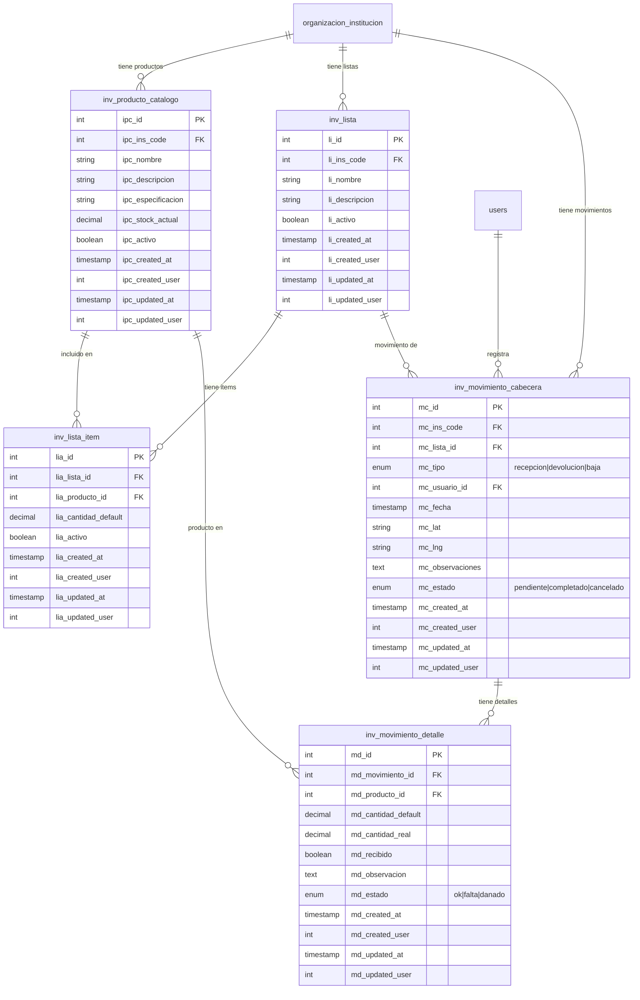

# FASE 1 — Inventario Unificado: Documentación Técnica

> **Estado:** En Progreso  
> **Inicio:** 2026-08-20  
> **Objetivo:** Consolidar las dos jerarquías de inventario en un solo modelo normalizado

---

## 1. Estado Actual del Inventario

### 1.1 Estructura Actual (5 tablas)

```
inv_listas_productos (lp_id)
  ├─ inv_lista_producto_items (lpi_id)  ← Pivot
  │    └─ inv_productos (pr_id)         ← GLOBAL (no por institución)
  ├─ inv_movimientos (mov_id)           ← Cabecera
  │    └─ inv_movimiento_detalles (md_id) ← Detalle
```

### 1.2 Problemas Identificados

| # | Problema | Impacto |
|---|---------|---------|
| 1 | `inv_productos` NO tiene `ins_code` — productos son globales | No se puede filtrar por institución |
| 2 | `mov_tipo` es string libre ("Recepcion", "Devolucion") | No se puede agregar "Baja" sin cambiar código |
| 3 | `pr_stock_actual` existe pero NO se usa en el controller | Stock no se actualiza con movimientos |
| 4 | No hay campo `activo` en productos | No se pueden desactivar productos |
| 5 | No hay auditoría de cambios de stock | No se sabe quién modificó el stock |

### 1.3 Flujo Actual (Backend)

```
1. allListByInst → Lista las listas de una institución con sus productos
2. saveListMov   → Crea movimiento tipo "Recepcion" con detalles
3. finishListMov → Cambia tipo a "Devolucion" (solo actualiza cabecera)
```

---

## 2. Nuevo Esquema Unificado

### 2.1 Diagrama ER (Mermaid)



### 2.2 Tablas Nuevas

#### `inv_producto_catalogo` (reemplaza `inv_productos`)

| Campo | Tipo | PK/FK | Descripción |
|-------|------|-------|-------------|
| `ipc_id` | SERIAL | PK | ID del producto |
| `ipc_ins_code` | INTEGER | FK → organizacion_institucion | Institución propietaria |
| `ipc_nombre` | VARCHAR(255) | | Nombre del producto |
| `ipc_descripcion` | TEXT | | Descripción |
| `ipc_especificacion` | TEXT | | Especificación técnica |
| `ipc_stock_actual` | DECIMAL(10,2) | | Stock calculado (accessor) |
| `ipc_activo` | BOOLEAN | DEFAULT true | Si está activo |
| `ipc_created_at` | TIMESTAMP | | Fecha creación |
| `ipc_created_user` | INTEGER | FK → users | Usuario creador |
| `ipc_updated_at` | TIMESTAMP | | Fecha actualización |
| `ipc_updated_user` | INTEGER | FK → users | Usuario que actualizó |

**Índices:**
- `idx_producto_catalogo_ins` ON (`ipc_ins_code`)
- `idx_producto_catalogo_nombre` ON (`ipc_nombre`)
- `idx_producto_catalogo_activo` ON (`ipc_activo`)

#### `inv_lista` (renombra `inv_listas_productos`)

| Campo | Tipo | PK/FK | Descripción |
|-------|------|-------|-------------|
| `li_id` | SERIAL | PK | ID de la lista |
| `li_ins_code` | INTEGER | FK → organizacion_institucion | Institución |
| `li_nombre` | VARCHAR(255) | | Nombre de la lista |
| `li_descripcion` | TEXT | | Descripción |
| `li_activo` | BOOLEAN | DEFAULT true | Si está activa |
| `li_created_at` | TIMESTAMP | | Fecha creación |
| `li_created_user` | INTEGER | FK → users | Usuario creador |
| `li_updated_at` | TIMESTAMP | | Fecha actualización |
| `li_updated_user` | INTEGER | FK → users | Usuario que actualizó |

**Índices:**
- `idx_lista_ins` ON (`li_ins_code`)
- `idx_lista_activo` ON (`li_activo`)

#### `inv_lista_item` (reemplaza `inv_lista_producto_items`)

| Campo | Tipo | PK/FK | Descripción |
|-------|------|-------|-------------|
| `lia_id` | SERIAL | PK | ID del item |
| `lia_lista_id` | INTEGER | FK → inv_lista | Lista padre |
| `lia_producto_id` | INTEGER | FK → inv_producto_catalogo | Producto |
| `lia_cantidad_default` | DECIMAL(10,2) | | Cantidad estándar |
| `lia_activo` | BOOLEAN | DEFAULT true | Si está activo |
| `lia_created_at` | TIMESTAMP | | Fecha creación |
| `lia_created_user` | INTEGER | FK → users | Usuario creador |
| `lia_updated_at` | TIMESTAMP | | Fecha actualización |
| `lia_updated_user` | INTEGER | FK → users | Usuario que actualizó |

**Índices:**
- `idx_lista_item_lista` ON (`lia_lista_id`)
- `idx_lista_item_producto` ON (`lia_producto_id`)

#### `inv_movimiento_cabecera` (reemplaza `inv_movimientos`)

| Campo | Tipo | PK/FK | Descripción |
|-------|------|-------|-------------|
| `mc_id` | SERIAL | PK | ID del movimiento |
| `mc_ins_code` | INTEGER | FK → organizacion_institucion | Institución |
| `mc_lista_id` | INTEGER | FK → inv_lista | Lista asociada |
| `mc_tipo` | ENUM | | 'recepcion', 'devolucion', 'baja' |
| `mc_usuario_id` | INTEGER | FK → users | Usuario que registra |
| `mc_fecha` | TIMESTAMP | | Fecha del movimiento |
| `mc_lat` | VARCHAR(50) | | Latitud |
| `mc_lng` | VARCHAR(50) | | Longitud |
| `mc_observaciones` | TEXT | | Observaciones |
| `mc_estado` | ENUM | | 'pendiente', 'completado', 'cancelado' |
| `mc_created_at` | TIMESTAMP | | Fecha creación |
| `mc_created_user` | INTEGER | FK → users | Usuario creador |
| `mc_updated_at` | TIMESTAMP | | Fecha actualización |
| `mc_updated_user` | INTEGER | FK → users | Usuario que actualizó |

**Índices:**
- `idx_movimiento_ins` ON (`mc_ins_code`)
- `idx_movimiento_lista` ON (`mc_lista_id`)
- `idx_movimiento_tipo` ON (`mc_tipo`)
- `idx_movimiento_estado` ON (`mc_estado`)
- `idx_movimiento_fecha` ON (`mc_fecha`)

#### `inv_movimiento_detalle` (renombra `inv_movimiento_detalles`)

| Campo | Tipo | PK/FK | Descripción |
|-------|------|-------|-------------|
| `md_id` | SERIAL | PK | ID del detalle |
| `md_movimiento_id` | INTEGER | FK → inv_movimiento_cabecera | Movimiento padre |
| `md_producto_id` | INTEGER | FK → inv_producto_catalogo | Producto |
| `md_cantidad_default` | DECIMAL(10,2) | | Cantidad esperada |
| `md_cantidad_real` | DECIMAL(10,2) | | Cantidad real recibida |
| `md_recibido` | BOOLEAN | DEFAULT false | Si fue recibido |
| `md_observacion` | TEXT | | Observación del producto |
| `md_estado` | ENUM | | 'ok', 'falta', 'danado' |
| `md_created_at` | TIMESTAMP | | Fecha creación |
| `md_created_user` | INTEGER | FK → users | Usuario creador |
| `md_updated_at` | TIMESTAMP | | Fecha actualización |
| `md_updated_user` | INTEGER | FK → users | Usuario que actualizó |

**Índices:**
- `idx_detalle_movimiento` ON (`md_movimiento_id`)
- `idx_detalle_producto` ON (`md_producto_id`)

---

## 3. Plan de Migración

### 3.1 Orden de Ejecución

```
1. Crear tablas nuevas (sin datos)
2. Migrar datos de tablas viejas a nuevas
3. Crear vistas de compatibilidad (opcional)
4. Renombrar tablas viejas a _backup
5. Renombrar tablas nuevas a nombre final
```

### 3.2 Archivos a Crear

| Archivo | Ubicación | Descripción |
|---------|-----------|-------------|
| `2026_08_20_000001_create_inv_producto_catalogo_table.php` | `database/migrations/` | Tabla de productos por institución |
| `2026_08_20_000002_create_inv_lista_table.php` | `database/migrations/` | Tabla de listas |
| `2026_08_20_000003_create_inv_lista_item_table.php` | `database/migrations/` | Tabla de items de lista |
| `2026_08_20_000004_create_inv_movimiento_cabecera_table.php` | `database/migrations/` | Tabla de cabeceras |
| `2026_08_20_000005_create_inv_movimiento_detalle_table.php` | `database/migrations/` | Tabla de detalles |
| `2026_08_20_000006_seed_inv_inventory_data.php` | `database/seeders/` | Seeder de migración de datos |

---

## 4. Implementación Paso a Paso

### Paso 1: Crear migración `inv_producto_catalogo`

**Archivo:** `database/migrations/2026_08_20_000001_create_inv_producto_catalogo_table.php`

```php
<?php

use Illuminate\Database\Migrations\Migration;
use Illuminate\Database\Schema\Blueprint;
use Illuminate\Support\Facades\Schema;

return new class extends Migration
{
    public function up(): void
    {
        Schema::create('inv_producto_catalogo', function (Blueprint $table) {
            $table->id('ipc_id');
            $table->unsignedBigInteger('ipc_ins_code');
            $table->string('ipc_nombre', 255);
            $table->text('ipc_descripcion')->nullable();
            $table->text('ipc_especificacion')->nullable();
            $table->boolean('ipc_activo')->default(true);
            $table->timestamp('ipc_created_at')->useCurrent();
            $table->unsignedBigInteger('ipc_created_user')->nullable();
            $table->timestamp('ipc_updated_at')->useCurrent()->useCurrentOnUpdate();
            $table->unsignedBigInteger('ipc_updated_user')->nullable();

            // Foreign Keys
            $table->foreign('ipc_ins_code')
                  ->references('ins_code')
                  ->on('organizacion_institucion')
                  ->onDelete('cascade');
            $table->foreign('ipc_created_user')
                  ->references('id')
                  ->on('users')
                  ->onDelete('set null');
            $table->foreign('ipc_updated_user')
                  ->references('id')
                  ->on('users')
                  ->onDelete('set null');

            // Índices
            $table->index('ipc_ins_code', 'idx_producto_catalogo_ins');
            $table->index('ipc_nombre', 'idx_producto_catalogo_nombre');
            $table->index('ipc_activo', 'idx_producto_catalogo_activo');
        });
    }

    public function down(): void
    {
        Schema::dropIfExists('inv_producto_catalogo');
    }
};
```

### Paso 2: Crear migración `inv_lista`

**Archivo:** `database/migrations/2026_08_20_000002_create_inv_lista_table.php`

```php
<?php

use Illuminate\Database\Migrations\Migration;
use Illuminate\Database\Schema\Blueprint;
use Illuminate\Support\Facades\Schema;

return new class extends Migration
{
    public function up(): void
    {
        Schema::create('inv_lista', function (Blueprint $table) {
            $table->id('li_id');
            $table->unsignedBigInteger('li_ins_code');
            $table->string('li_nombre', 255);
            $table->text('li_descripcion')->nullable();
            $table->boolean('li_activo')->default(true);
            $table->timestamp('li_created_at')->useCurrent();
            $table->unsignedBigInteger('li_created_user')->nullable();
            $table->timestamp('li_updated_at')->useCurrent()->useCurrentOnUpdate();
            $table->unsignedBigInteger('li_updated_user')->nullable();

            // Foreign Keys
            $table->foreign('li_ins_code')
                  ->references('ins_code')
                  ->on('organizacion_institucion')
                  ->onDelete('cascade');
            $table->foreign('li_created_user')
                  ->references('id')
                  ->on('users')
                  ->onDelete('set null');
            $table->foreign('li_updated_user')
                  ->references('id')
                  ->on('users')
                  ->onDelete('set null');

            // Índices
            $table->index('li_ins_code', 'idx_lista_ins');
            $table->index('li_activo', 'idx_lista_activo');
        });
    }

    public function down(): void
    {
        Schema::dropIfExists('inv_lista');
    }
};
```

### Paso 3: Crear migración `inv_lista_item`

**Archivo:** `database/migrations/2026_08_20_000003_create_inv_lista_item_table.php`

```php
<?php

use Illuminate\Database\Migrations\Migration;
use Illuminate\Database\Schema\Blueprint;
use Illuminate\Support\Facades\Schema;

return new class extends Migration
{
    public function up(): void
    {
        Schema::create('inv_lista_item', function (Blueprint $table) {
            $table->id('lia_id');
            $table->unsignedBigInteger('lia_lista_id');
            $table->unsignedBigInteger('lia_producto_id');
            $table->decimal('lia_cantidad_default', 10, 2)->default(0);
            $table->boolean('lia_activo')->default(true);
            $table->timestamp('lia_created_at')->useCurrent();
            $table->unsignedBigInteger('lia_created_user')->nullable();
            $table->timestamp('lia_updated_at')->useCurrent()->useCurrentOnUpdate();
            $table->unsignedBigInteger('lia_updated_user')->nullable();

            // Foreign Keys
            $table->foreign('lia_lista_id')
                  ->references('li_id')
                  ->on('inv_lista')
                  ->onDelete('cascade');
            $table->foreign('lia_producto_id')
                  ->references('ipc_id')
                  ->on('inv_producto_catalogo')
                  ->onDelete('cascade');
            $table->foreign('lia_created_user')
                  ->references('id')
                  ->on('users')
                  ->onDelete('set null');
            $table->foreign('lia_updated_user')
                  ->references('id')
                  ->on('users')
                  ->onDelete('set null');

            // Índices
            $table->index('lia_lista_id', 'idx_lista_item_lista');
            $table->index('lia_producto_id', 'idx_lista_item_producto');

            // Único: un producto solo una vez por lista
            $table->unique(['lia_lista_id', 'lia_producto_id'], 'uk_lista_producto');
        });
    }

    public function down(): void
    {
        Schema::dropIfExists('inv_lista_item');
    }
};
```

### Paso 4: Crear migración `inv_movimiento_cabecera`

**Archivo:** `database/migrations/2026_08_20_000004_create_inv_movimiento_cabecera_table.php`

```php
<?php

use Illuminate\Database\Migrations\Migration;
use Illuminate\Database\Schema\Blueprint;
use Illuminate\Support\Facades\Schema;

return new class extends Migration
{
    public function up(): void
    {
        Schema::create('inv_movimiento_cabecera', function (Blueprint $table) {
            $table->id('mc_id');
            $table->unsignedBigInteger('mc_ins_code');
            $table->unsignedBigInteger('mc_lista_id');
            $table->enum('mc_tipo', ['recepcion', 'devolucion', 'baja']);
            $table->unsignedBigInteger('mc_usuario_id');
            $table->timestamp('mc_fecha');
            $table->string('mc_lat', 50)->nullable();
            $table->string('mc_lng', 50)->nullable();
            $table->text('mc_observaciones')->nullable();
            $table->enum('mc_estado', ['pendiente', 'completado', 'cancelado'])->default('pendiente');
            $table->timestamp('mc_created_at')->useCurrent();
            $table->unsignedBigInteger('mc_created_user')->nullable();
            $table->timestamp('mc_updated_at')->useCurrent()->useCurrentOnUpdate();
            $table->unsignedBigInteger('mc_updated_user')->nullable();

            // Foreign Keys
            $table->foreign('mc_ins_code')
                  ->references('ins_code')
                  ->on('organizacion_institucion')
                  ->onDelete('cascade');
            $table->foreign('mc_lista_id')
                  ->references('li_id')
                  ->on('inv_lista')
                  ->onDelete('cascade');
            $table->foreign('mc_usuario_id')
                  ->references('id')
                  ->on('users')
                  ->onDelete('cascade');
            $table->foreign('mc_created_user')
                  ->references('id')
                  ->on('users')
                  ->onDelete('set null');
            $table->foreign('mc_updated_user')
                  ->references('id')
                  ->on('users')
                  ->onDelete('set null');

            // Índices
            $table->index('mc_ins_code', 'idx_movimiento_ins');
            $table->index('mc_lista_id', 'idx_movimiento_lista');
            $table->index('mc_tipo', 'idx_movimiento_tipo');
            $table->index('mc_estado', 'idx_movimiento_estado');
            $table->index('mc_fecha', 'idx_movimiento_fecha');
        });
    }

    public function down(): void
    {
        Schema::dropIfExists('inv_movimiento_cabecera');
    }
};
```

### Paso 5: Crear migración `inv_movimiento_detalle`

**Archivo:** `database/migrations/2026_08_20_000005_create_inv_movimiento_detalle_table.php`

```php
<?php

use Illuminate\Database\Migrations\Migration;
use Illuminate\Database\Schema\Blueprint;
use Illuminate\Support\Facades\Schema;

return new class extends Migration
{
    public function up(): void
    {
        Schema::create('inv_movimiento_detalle', function (Blueprint $table) {
            $table->id('md_id');
            $table->unsignedBigInteger('md_movimiento_id');
            $table->unsignedBigInteger('md_producto_id');
            $table->decimal('md_cantidad_default', 10, 2)->default(0);
            $table->decimal('md_cantidad_real', 10, 2)->default(0);
            $table->boolean('md_recibido')->default(false);
            $table->text('md_observacion')->nullable();
            $table->enum('md_estado', ['ok', 'falta', 'danado'])->default('ok');
            $table->timestamp('md_created_at')->useCurrent();
            $table->unsignedBigInteger('md_created_user')->nullable();
            $table->timestamp('md_updated_at')->useCurrent()->useCurrentOnUpdate();
            $table->unsignedBigInteger('md_updated_user')->nullable();

            // Foreign Keys
            $table->foreign('md_movimiento_id')
                  ->references('mc_id')
                  ->on('inv_movimiento_cabecera')
                  ->onDelete('cascade');
            $table->foreign('md_producto_id')
                  ->references('ipc_id')
                  ->on('inv_producto_catalogo')
                  ->onDelete('cascade');
            $table->foreign('md_created_user')
                  ->references('id')
                  ->on('users')
                  ->onDelete('set null');
            $table->foreign('md_updated_user')
                  ->references('id')
                  ->on('users')
                  ->onDelete('set null');

            // Índices
            $table->index('md_movimiento_id', 'idx_detalle_movimiento');
            $table->index('md_producto_id', 'idx_detalle_producto');
        });
    }

    public function down(): void
    {
        Schema::dropIfExists('inv_movimiento_detalle');
    }
};
```

### Paso 6: Crear Seeder de Migración

**Archivo:** `database/seeders/2026_08_20_000006_seed_inv_inventory_data.php`

```php
<?php

namespace Database\Seeders;

use Illuminate\Database\Seeder;
use Illuminate\Support\Facades\DB;
use Illuminate\Support\Facades\Log;

class SeedInvInventoryData extends Seeder
{
    public function run(): void
    {
        $this->command->info('=== Migración de Inventario ===');
        
        // 1. Migrar productos
        $this->migrarProductos();
        
        // 2. Migrar listas
        $this->migrarListas();
        
        // 3. Migrar items de lista
        $this->migrarItems();
        
        // 4. Migrar movimientos
        $this->migrarMovimientos();
        
        // 5. Migrar detalles
        $this->migrarDetalles();
        
        // 6. Actualizar stock
        $this->actualizarStock();
        
        $this->command->info('=== Migración completada ===');
    }

    private function migrarProductos(): void
    {
        $this->command->info('Migrando productos...');
        
        $productos = DB::table('inv_productos')->get();
        $count = 0;
        
        foreach ($productos as $prod) {
            // Los productos originales son globales, los asignamos a todas las instituciones
            // que tengan listas con ese producto
            $instituciones = DB::table('inv_lista_producto_items')
                ->join('inv_listas_productos', 'lpi_lp_id', '=', 'lp_id')
                ->where('lpi_pr_id', $prod->pr_id)
                ->distinct()
                ->pluck('lp_ins_code');
            
            if ($instituciones->isEmpty()) {
                // Si no tiene listas, crear en institución 1 por defecto
                $instituciones = collect([1]);
            }
            
            foreach ($instituciones as $insCode) {
                DB::table('inv_producto_catalogo')->insert([
                    'ipc_ins_code'     => $insCode,
                    'ipc_nombre'       => $prod->pr_nombre,
                    'ipc_descripcion'  => $prod->pr_descripcion,
                    'ipc_especificacion' => $prod->pr_especificacion,
                    'ipc_activo'       => $prod->pr_estado == 1,
                    'ipc_created_at'   => $prod->pr_created_at ?? now(),
                    'ipc_created_user' => $prod->pr_created_user ?? null,
                    'ipc_updated_at'   => $prod->pr_updated_at ?? now(),
                    'ipc_updated_user' => $prod->pr_updated_user ?? null,
                ]);
                $count++;
            }
        }
        
        $this->command->info("  → {$count} productos migrados");
    }

    private function migrarListas(): void
    {
        $this->command->info('Migrando listas...');
        
        $listas = DB::table('inv_listas_productos')->get();
        $count = 0;
        
        foreach ($listas as $lista) {
            DB::table('inv_lista')->insert([
                'li_id'            => $lista->lp_id,
                'li_ins_code'      => $lista->lp_ins_code,
                'li_nombre'        => $lista->lp_nombre,
                'li_descripcion'   => $lista->lp_descripcion,
                'li_activo'        => $lista->lp_estado == 1,
                'li_created_at'    => $lista->lp_created_at ?? now(),
                'li_created_user'  => $lista->lp_created_user ?? null,
                'li_updated_at'    => $lista->lp_updated_at ?? now(),
                'li_updated_user'  => $lista->lp_updated_user ?? null,
            ]);
            $count++;
        }
        
        $this->command->info("  → {$count} listas migradas");
    }

    private function migrarItems(): void
    {
        $this->command->info('Migrando items de lista...');
        
        $items = DB::table('inv_lista_producto_items')->get();
        $count = 0;
        
        foreach ($items as $item) {
            // Buscar el producto en la misma institución de la lista
            $lista = DB::table('inv_listas_productos')
                ->where('lp_id', $item->lpi_lp_id)
                ->first();
            
            if ($lista) {
                $productoCatalogo = DB::table('inv_producto_catalogo')
                    ->where('ipc_ins_code', $lista->lp_ins_code)
                    ->where('ipc_nombre', function($q) use ($item) {
                        $q->select('pr_nombre')
                          ->from('inv_productos')
                          ->where('pr_id', $item->lpi_pr_id);
                    })
                    ->first();
                
                if ($productoCatalogo) {
                    DB::table('inv_lista_item')->insert([
                        'lia_lista_id'          => $item->lpi_lp_id,
                        'lia_producto_id'       => $productoCatalogo->ipc_id,
                        'lia_cantidad_default'  => $item->lpi_cantidad,
                        'lia_activo'            => $item->lpi_estado == 1,
                        'lia_created_at'        => $item->lpi_created_at ?? now(),
                        'lia_created_user'      => $item->lpi_created_user ?? null,
                        'lia_updated_at'        => $item->lpi_updated_at ?? now(),
                        'lia_updated_user'      => $item->lpi_updated_user ?? null,
                    ]);
                    $count++;
                }
            }
        }
        
        $this->command->info("  → {$count} items migrados");
    }

    private function migrarMovimientos(): void
    {
        $this->command->info('Migrando movimientos...');
        
        $movimientos = DB::table('inv_movimientos')->get();
        $count = 0;
        
        foreach ($movimientos as $mov) {
            // Mapear tipo
            $tipo = match(strtolower($mov->mov_tipo)) {
                'recepcion' => 'recepcion',
                'devolucion' => 'devolucion',
                default => 'recepcion',
            };
            
            // Mapear estado
            $estado = match($mov->mov_estado) {
                1 => 'completado',
                0 => 'pendiente',
                default => 'pendiente',
            };
            
            DB::table('inv_movimiento_cabecera')->insert([
                'mc_id'             => $mov->mov_id,
                'mc_ins_code'       => $mov->mov_ins_code,
                'mc_lista_id'       => $mov->mov_lp_id,
                'mc_tipo'           => $tipo,
                'mc_usuario_id'     => $mov->mov_recep_user ?? $mov->mov_devol_user ?? 1,
                'mc_fecha'          => $mov->mov_recep_fecha ?? $mov->mov_devol_fecha ?? now(),
                'mc_lat'            => $mov->mov_recep_lat ?? $mov->mov_devol_lat,
                'mc_lng'            => $mov->mov_recep_lng ?? $mov->mov_devol_lng,
                'mc_observaciones'  => $mov->mov_recep_obsv ?? $mov->mov_devol_obsv,
                'mc_estado'         => $estado,
                'mc_created_at'     => $mov->mov_created_at ?? now(),
                'mc_created_user'   => $mov->mov_created_user ?? null,
                'mc_updated_at'     => $mov->mov_updated_at ?? now(),
                'mc_updated_user'   => $mov->mov_updated_user ?? null,
            ]);
            $count++;
        }
        
        $this->command->info("  → {$count} movimientos migrados");
    }

    private function migrarDetalles(): void
    {
        $this->command->info('Migrando detalles de movimientos...');
        
        $detalles = DB::table('inv_movimiento_detalles')->get();
        $count = 0;
        
        foreach ($detalles as $det) {
            // Buscar el producto catalogo correspondiente
            $movimiento = DB::table('inv_movimiento_cabecera')
                ->where('mc_id', $det->md_mov_id)
                ->first();
            
            if ($movimiento) {
                $productoCatalogo = DB::table('inv_producto_catalogo')
                    ->where('ipc_ins_code', $movimiento->mc_ins_code)
                    ->where('ipc_nombre', function($q) use ($det) {
                        $q->select('pr_nombre')
                          ->from('inv_productos')
                          ->where('pr_id', $det->md_pr_id);
                    })
                    ->first();
                
                if ($productoCatalogo) {
                    $estado = match($det->md_exist) {
                        1 => 'ok',
                        0 => 'falta',
                        default => 'ok',
                    };
                    
                    DB::table('inv_movimiento_detalle')->insert([
                        'md_movimiento_id'     => $det->md_mov_id,
                        'md_producto_id'       => $productoCatalogo->ipc_id,
                        'md_cantidad_default'  => $det->md_cant_asign ?? 0,
                        'md_cantidad_real'     => $det->md_cant_recep ?? 0,
                        'md_recibido'          => $det->md_cant_recep > 0,
                        'md_observacion'       => $det->md_recep_obsv,
                        'md_estado'            => $estado,
                        'md_created_at'        => $det->md_created_at ?? now(),
                        'md_created_user'      => $det->md_created_user ?? null,
                        'md_updated_at'        => $det->md_updated_at ?? now(),
                        'md_updated_user'      => $det->md_updated_user ?? null,
                    ]);
                    $count++;
                }
            }
        }
        
        $this->command->info("  → {$count} detalles migrados");
    }

    private function actualizarStock(): void
    {
        $this->command->info('Actualizando stock actual...');
        
        $productos = DB::table('inv_producto_catalogo')->get();
        $count = 0;
        
        foreach ($productos as $prod) {
            // Calcular stock sumando recepciones y restando devoluciones
            $recepciones = DB::table('inv_movimiento_detalle')
                ->join('inv_movimiento_cabecera', 'md_movimiento_id', '=', 'mc_id')
                ->where('md_producto_id', $prod->ipc_id)
                ->where('mc_tipo', 'recepcion')
                ->where('mc_estado', 'completado')
                ->sum('md_cantidad_real');
            
            $devoluciones = DB::table('inv_movimiento_detalle')
                ->join('inv_movimiento_cabecera', 'md_movimiento_id', '=', 'mc_id')
                ->where('md_producto_id', $prod->ipc_id)
                ->where('mc_tipo', 'devolucion')
                ->where('mc_estado', 'completado')
                ->sum('md_cantidad_real');
            
            $bajas = DB::table('inv_movimiento_detalle')
                ->join('inv_movimiento_cabecera', 'md_movimiento_id', '=', 'mc_id')
                ->where('md_producto_id', $prod->ipc_id)
                ->where('mc_tipo', 'baja')
                ->where('mc_estado', 'completado')
                ->sum('md_cantidad_real');
            
            $stock = $recepciones - $devoluciones - $bajas;
            
            DB::table('inv_producto_catalogo')
                ->where('ipc_id', $prod->ipc_id)
                ->update(['ipc_stock_actual' => max(0, $stock)]);
            
            $count++;
        }
        
        $this->command->info("  → {$count} stocks actualizados");
    }
}
```

---

## 5. Modelos Eloquent Actualizados

### 5.1 `ProductoCatalogo.php`

**Archivo:** `Modules/Administracion/Models/ProductoCatalogo.php`

```php
<?php

namespace Modules\Administracion\Models;

use Illuminate\Database\Eloquent\Model;
use Illuminate\Database\Eloquent\Relations\BelongsTo;
use Illuminate\Database\Eloquent\Relations\BelongsToMany;
use Illuminate\Database\Eloquent\Relations\HasMany;

class ProductoCatalogo extends Model
{
    protected $table = 'inv_producto_catalogo';
    protected $primaryKey = 'ipc_id';
    public $timestamps = false;

    protected $fillable = [
        'ipc_id',
        'ipc_ins_code',
        'ipc_nombre',
        'ipc_descripcion',
        'ipc_especificacion',
        'ipc_activo',
        'ipc_created_at',
        'ipc_created_user',
        'ipc_updated_at',
        'ipc_updated_user',
    ];

    protected $casts = [
        'ipc_activo' => 'boolean',
        'ipc_created_at' => 'datetime',
        'ipc_updated_at' => 'datetime',
    ];

    // Accessor para stock actual
    public function getStockActualAttribute(): float
    {
        $recepciones = $this->detalles()
            ->whereHas('movimiento', function ($q) {
                $q->where('mc_tipo', 'recepcion')
                  ->where('mc_estado', 'completado');
            })
            ->sum('md_cantidad_real');

        $devoluciones = $this->detalles()
            ->whereHas('movimiento', function ($q) {
                $q->where('mc_tipo', 'devolucion')
                  ->where('mc_estado', 'completado');
            })
            ->sum('md_cantidad_real');

        $bajas = $this->detalles()
            ->whereHas('movimiento', function ($q) {
                $q->where('mc_tipo', 'baja')
                  ->where('mc_estado', 'completado');
            })
            ->sum('md_cantidad_real');

        return max(0, $recepciones - $devoluciones - $bajas);
    }

    // Relaciones
    public function institucion(): BelongsTo
    {
        return $this->belongsTo(
            OrganizacionInstitucion::class,
            'ipc_ins_code',
            'ins_code'
        );
    }

    public function listas(): BelongsToMany
    {
        return $this->belongsToMany(
            Lista::class,
            'inv_lista_item',
            'lia_producto_id',
            'lia_lista_id'
        )->withPivot('lia_cantidad_default', 'lia_activo');
    }

    public function detalles(): HasMany
    {
        return $this->hasMany(
            MovimientoDetalle::class,
            'md_producto_id',
            'ipc_id'
        );
    }

    // Scopes
    public function scopeActivos($query)
    {
        return $query->where('ipc_activo', true);
    }

    public function scopePorInstitucion($query, int $insCode)
    {
        return $query->where('ipc_ins_code', $insCode);
    }
}
```

### 5.2 `Lista.php`

**Archivo:** `Modules/Administracion/Models/Lista.php`

```php
<?php

namespace Modules\Administracion\Models;

use Illuminate\Database\Eloquent\Model;
use Illuminate\Database\Eloquent\Relations\BelongsTo;
use Illuminate\Database\Eloquent\Relations\HasMany;

class Lista extends Model
{
    protected $table = 'inv_lista';
    protected $primaryKey = 'li_id';
    public $timestamps = false;

    protected $fillable = [
        'li_id',
        'li_ins_code',
        'li_nombre',
        'li_descripcion',
        'li_activo',
        'li_created_at',
        'li_created_user',
        'li_updated_at',
        'li_updated_user',
    ];

    protected $casts = [
        'li_activo' => 'boolean',
        'li_created_at' => 'datetime',
        'li_updated_at' => 'datetime',
    ];

    // Relaciones
    public function institucion(): BelongsTo
    {
        return $this->belongsTo(
            OrganizacionInstitucion::class,
            'li_ins_code',
            'ins_code'
        );
    }

    public function items(): HasMany
    {
        return $this->hasMany(
            ListaItem::class,
            'lia_lista_id',
            'li_id'
        )->where('lia_activo', true);
    }

    public function productos(): BelongsToMany
    {
        return $this->belongsToMany(
            ProductoCatalogo::class,
            'inv_lista_item',
            'lia_lista_id',
            'lia_producto_id'
        )->withPivot('lia_cantidad_default', 'lia_activo');
    }

    public function movimientos(): HasMany
    {
        return $this->hasMany(
            MovimientoCabecera::class,
            'mc_lista_id',
            'li_id'
        );
    }

    // Scopes
    public function scopeActivas($query)
    {
        return $query->where('li_activo', true);
    }

    public function scopePorInstitucion($query, int $insCode)
    {
        return $query->where('li_ins_code', $insCode);
    }
}
```

### 5.3 `ListaItem.php`

**Archivo:** `Modules/Administracion/Models/ListaItem.php`

```php
<?php

namespace Modules\Administracion\Models;

use Illuminate\Database\Eloquent\Model;
use Illuminate\Database\Eloquent\Relations\BelongsTo;

class ListaItem extends Model
{
    protected $table = 'inv_lista_item';
    protected $primaryKey = 'lia_id';
    public $timestamps = false;

    protected $fillable = [
        'lia_id',
        'lia_lista_id',
        'lia_producto_id',
        'lia_cantidad_default',
        'lia_activo',
        'lia_created_at',
        'lia_created_user',
        'lia_updated_at',
        'lia_updated_user',
    ];

    protected $casts = [
        'lia_cantidad_default' => 'decimal:2',
        'lia_activo' => 'boolean',
        'lia_created_at' => 'datetime',
        'lia_updated_at' => 'datetime',
    ];

    // Relaciones
    public function lista(): BelongsTo
    {
        return $this->belongsTo(
            Lista::class,
            'lia_lista_id',
            'li_id'
        );
    }

    public function producto(): BelongsTo
    {
        return $this->belongsTo(
            ProductoCatalogo::class,
            'lia_producto_id',
            'ipc_id'
        );
    }
}
```

### 5.4 `MovimientoCabecera.php`

**Archivo:** `Modules/Administracion/Models/MovimientoCabecera.php`

```php
<?php

namespace Modules\Administracion\Models;

use Illuminate\Database\Eloquent\Model;
use Illuminate\Database\Eloquent\Relations\BelongsTo;
use Illuminate\Database\Eloquent\Relations\HasMany;

class MovimientoCabecera extends Model
{
    protected $table = 'inv_movimiento_cabecera';
    protected $primaryKey = 'mc_id';
    public $timestamps = false;

    protected $fillable = [
        'mc_id',
        'mc_ins_code',
        'mc_lista_id',
        'mc_tipo',
        'mc_usuario_id',
        'mc_fecha',
        'mc_lat',
        'mc_lng',
        'mc_observaciones',
        'mc_estado',
        'mc_created_at',
        'mc_created_user',
        'mc_updated_at',
        'mc_updated_user',
    ];

    protected $casts = [
        'mc_fecha' => 'datetime',
        'mc_created_at' => 'datetime',
        'mc_updated_at' => 'datetime',
    ];

    // Constantes de tipo
    const TIPO_RECEPCION = 'recepcion';
    const TIPO_DEVOLUCION = 'devolucion';
    const TIPO_BAJA = 'baja';

    // Constantes de estado
    const ESTADO_PENDIENTE = 'pendiente';
    const ESTADO_COMPLETADO = 'completado';
    const ESTADO_CANCELADO = 'cancelado';

    // Relaciones
    public function institucion(): BelongsTo
    {
        return $this->belongsTo(
            OrganizacionInstitucion::class,
            'mc_ins_code',
            'ins_code'
        );
    }

    public function lista(): BelongsTo
    {
        return $this->belongsTo(
            Lista::class,
            'mc_lista_id',
            'li_id'
        );
    }

    public function usuario(): BelongsTo
    {
        return $this->belongsTo(
            \Modules\Acceso\Models\users::class,
            'mc_usuario_id',
            'id'
        );
    }

    public function detalles(): HasMany
    {
        return $this->hasMany(
            MovimientoDetalle::class,
            'md_movimiento_id',
            'mc_id'
        );
    }

    // Scopes
    public function scopePorTipo($query, string $tipo)
    {
        return $query->where('mc_tipo', $tipo);
    }

    public function scopePorEstado($query, string $estado)
    {
        return $query->where('mc_estado', $estado);
    }

    public function scopePorInstitucion($query, int $insCode)
    {
        return $query->where('mc_ins_code', $insCode);
    }

    public function scopeCompletados($query)
    {
        return $query->where('mc_estado', self::ESTADO_COMPLETADO);
    }
}
```

### 5.5 `MovimientoDetalle.php`

**Archivo:** `Modules/Administracion/Models/MovimientoDetalle.php`

```php
<?php

namespace Modules\Administracion\Models;

use Illuminate\Database\Eloquent\Model;
use Illuminate\Database\Eloquent\Relations\BelongsTo;

class MovimientoDetalle extends Model
{
    protected $table = 'inv_movimiento_detalle';
    protected $primaryKey = 'md_id';
    public $timestamps = false;

    protected $fillable = [
        'md_id',
        'md_movimiento_id',
        'md_producto_id',
        'md_cantidad_default',
        'md_cantidad_real',
        'md_recibido',
        'md_observacion',
        'md_estado',
        'md_created_at',
        'md_created_user',
        'md_updated_at',
        'md_updated_user',
    ];

    protected $casts = [
        'md_cantidad_default' => 'decimal:2',
        'md_cantidad_real' => 'decimal:2',
        'md_recibido' => 'boolean',
        'md_created_at' => 'datetime',
        'md_updated_at' => 'datetime',
    ];

    // Constantes de estado
    const ESTADO_OK = 'ok';
    const ESTADO_FALTA = 'falta';
    const ESTADO_DANADO = 'danado';

    // Relaciones
    public function movimiento(): BelongsTo
    {
        return $this->belongsTo(
            MovimientoCabecera::class,
            'md_movimiento_id',
            'mc_id'
        );
    }

    public function producto(): BelongsTo
    {
        return $this->belongsTo(
            ProductoCatalogo::class,
            'md_producto_id',
            'ipc_id'
        );
    }

    // Accessors
    public function getDiferenciaAttribute(): float
    {
        return $this->md_cantidad_real - $this->md_cantidad_default;
    }

    public function getPorcentajeRecibidoAttribute(): float
    {
        if ($this->md_cantidad_default == 0) {
            return 0;
        }
        return round(($this->md_cantidad_real / $this->md_cantidad_default) * 100, 2);
    }
}
```

---

## 6. Controller Actualizado

### 6.1 `InventarioController.php` (Nuevo)

**Archivo:** `Modules/MobileApp/Http/Controllers/InventarioController.php`

```php
<?php

namespace Modules\MobileApp\Http\Controllers;

use App\generalTrait;
use Illuminate\Http\JsonResponse;
use Illuminate\Http\Request;
use Illuminate\Routing\Controller;
use Illuminate\Support\Facades\DB;
use Illuminate\Support\Facades\Validator;
use Modules\Administracion\Models\InvListaProducto;
use Modules\Administracion\Models\InvMovimiento;
use Modules\Administracion\Models\InvMovimientoDetalle;
use Modules\Administracion\Models\Lista;
use Modules\Administracion\Models\ListaItem;
use Modules\Administracion\Models\MovimientoCabecera;
use Modules\Administracion\Models\MovimientoDetalle;
use Modules\Administracion\Models\ProductoCatalogo;
use Modules\Administracion\Models\UserHasInstitucion;

class InventarioController extends Controller
{
    use generalTrait;

    /**
     * Listar listas de inventario por institución
     */
    public function allListByInst(Request $request): JsonResponse
    {
        list($us, $tk) = $this->getSanctumSession($request);
        
        $validator = Validator::make($request->all(), [
            'ins_code' => 'required|integer',
        ]);
        
        if ($validator->fails()) {
            return response()->json(['success' => false, 'errors' => $validator->errors()]);
        }

        // Validar vinculación
        $ins = UserHasInstitucion::where('ui_usu_id', $us->id)
            ->where('ui_ins_code', $request->ins_code)
            ->where('ui_state', 1)
            ->first();
            
        if (!$ins) {
            return $this->message_json('errors', 'Usuario no vinculado a institucion');
        }

        // Obtener listas con productos
        $listas = Lista::with(['items.producto' => function ($q) {
                $q->select([
                    'ipc_id', 'ipc_nombre', 'ipc_descripcion', 
                    'ipc_especificacion', 'ipc_activo'
                ]);
            }])
            ->where('li_ins_code', $request->ins_code)
            ->where('li_activo', true)
            ->get()
            ->map(function ($lista) {
                $lista->setRelation('productos', $lista->items->map(function ($item) {
                    $producto = $item->producto;
                    $producto->cantidad_default = $item->lia_cantidad_default;
                    return $producto;
                }));
                return $lista;
            });

        return response()->json(['listas' => $listas]);
    }

    /**
     * Guardar movimiento de recepción
     */
    public function saveListMov(Request $request): JsonResponse
    {
        list($us, $tk) = $this->getSanctumSession($request);
        
        $validator = Validator::make($request->all(), [
            'ins_code'  => 'required|integer',
            'list_code' => 'required|integer',
            'latitud'   => 'required|string',
            'longitud'  => 'required|string',
            'productos' => 'required|json',
        ]);
        
        if ($validator->fails()) {
            return response()->json(['success' => false, 'errors' => $validator->errors()]);
        }

        // Validar vinculación
        $ins = UserHasInstitucion::where('ui_usu_id', $us->id)
            ->where('ui_ins_code', $request->ins_code)
            ->where('ui_state', 1)
            ->first();
            
        if (!$ins) {
            return $this->message_json('errors', 'Usuario no vinculado a institucion');
        }

        // Verificar que no exista recepción pendiente
        $existe = MovimientoCabecera::where('mc_ins_code', $request->ins_code)
            ->where('mc_lista_id', $request->list_code)
            ->where('mc_tipo', MovimientoCabecera::TIPO_RECEPCION)
            ->where('mc_usuario_id', $us->id)
            ->where('mc_estado', '!=', MovimientoCabecera::ESTADO_CANCELADO)
            ->exists();
            
        if ($existe) {
            return $this->message_json('errors', 'Ya existe una recepción registrada para esta lista');
        }

        DB::beginTransaction();
        try {
            // Crear cabecera
            $movimiento = MovimientoCabecera::create([
                'mc_ins_code'       => $request->ins_code,
                'mc_lista_id'       => $request->list_code,
                'mc_tipo'           => MovimientoCabecera::TIPO_RECEPCION,
                'mc_usuario_id'     => $us->id,
                'mc_fecha'          => now(),
                'mc_lat'            => $request->latitud,
                'mc_lng'            => $request->longitud,
                'mc_estado'         => MovimientoCabecera::ESTADO_COMPLETADO,
                'mc_created_user'   => $us->id,
                'mc_updated_user'   => $us->id,
            ]);

            // Crear detalles
            $productos = json_decode($request->productos);
            
            foreach ($productos as $item) {
                MovimientoDetalle::create([
                    'md_movimiento_id'    => $movimiento->mc_id,
                    'md_producto_id'      => $item->id_producto,
                    'md_cantidad_default' => $item->cantidaddf ?? 0,
                    'md_cantidad_real'    => $item->cantidad ?? 0,
                    'md_recibido'         => ($item->cantidad ?? 0) > 0,
                    'md_observacion'      => $item->nota ?? null,
                    'md_estado'           => MovimientoDetalle::ESTADO_OK,
                    'md_created_user'     => $us->id,
                    'md_updated_user'     => $us->id,
                ]);
            }

            DB::commit();
            
            return response()->json([
                'message' => 'Recepción registrada con éxito',
                'id'      => $movimiento->mc_id,
            ]);

        } catch (\Exception $e) {
            DB::rollBack();
            return $this->message_json('errors', $e->getMessage());
        }
    }

    /**
     * Finalizar movimiento (devolución)
     */
    public function finishListMov(Request $request): JsonResponse
    {
        list($us, $tk) = $this->getSanctumSession($request);
        
        $validator = Validator::make($request->all(), [
            'ins_code'  => 'required|integer',
            'code_mov'  => 'required|integer',
            'latitud'   => 'required|string',
            'longitud'  => 'required|string',
        ]);
        
        if ($validator->fails()) {
            return response()->json(['success' => false, 'errors' => $validator->errors()]);
        }

        // Validar vinculación
        $ins = UserHasInstitucion::where('ui_usu_id', $us->id)
            ->where('ui_ins_code', $request->ins_code)
            ->where('ui_state', 1)
            ->first();
            
        if (!$ins) {
            return $this->message_json('errors', 'Usuario no vinculado a institucion');
        }

        $movimiento = MovimientoCabecera::where('mc_id', $request->code_mov)->first();
        
        if (!$movimiento) {
            return $this->message_json('errors', 'Movimiento no encontrado');
        }

        if ($movimiento->mc_estado === MovimientoCabecera::ESTADO_CANCELADO) {
            return $this->message_json('errors', 'El movimiento está cancelado');
        }

        DB::beginTransaction();
        try {
            // Actualizar cabecera a devolución
            $movimiento->update([
                'mc_tipo'           => MovimientoCabecera::TIPO_DEVOLUCION,
                'mc_estado'         => MovimientoCabecera::ESTADO_COMPLETADO,
                'mc_fecha'          => now(),
                'mc_lat'            => $request->latitud,
                'mc_lng'            => $request->longitud,
                'mc_updated_user'   => $us->id,
            ]);

            DB::commit();
            
            return response()->json([
                'message' => 'Devolución registrada con éxito',
            ]);

        } catch (\Exception $e) {
            DB::rollBack();
            return $this->message_json('errors', $e->getMessage());
        }
    }

    /**
     * Registrar baja de inventario
     */
    public function registrarBaja(Request $request): JsonResponse
    {
        list($us, $tk) = $this->getSanctumSession($request);
        
        $validator = Validator::make($request->all(), [
            'ins_code'  => 'required|integer',
            'list_code' => 'required|integer',
            'latitud'   => 'required|string',
            'longitud'  => 'required|string',
            'productos' => 'required|json',
            'motivo'    => 'required|string',
        ]);
        
        if ($validator->fails()) {
            return response()->json(['success' => false, 'errors' => $validator->errors()]);
        }

        // Validar vinculación
        $ins = UserHasInstitucion::where('ui_usu_id', $us->id)
            ->where('ui_ins_code', $request->ins_code)
            ->where('ui_state', 1)
            ->first();
            
        if (!$ins) {
            return $this->message_json('errors', 'Usuario no vinculado a institucion');
        }

        DB::beginTransaction();
        try {
            // Crear cabecera de baja
            $movimiento = MovimientoCabecera::create([
                'mc_ins_code'       => $request->ins_code,
                'mc_lista_id'       => $request->list_code,
                'mc_tipo'           => MovimientoCabecera::TIPO_BAJA,
                'mc_usuario_id'     => $us->id,
                'mc_fecha'          => now(),
                'mc_lat'            => $request->latitud,
                'mc_lng'            => $request->longitud,
                'mc_observaciones'  => $request->motivo,
                'mc_estado'         => MovimientoCabecera::ESTADO_COMPLETADO,
                'mc_created_user'   => $us->id,
                'mc_updated_user'   => $us->id,
            ]);

            // Crear detalles
            $productos = json_decode($request->productos);
            
            foreach ($productos as $item) {
                MovimientoDetalle::create([
                    'md_movimiento_id'    => $movimiento->mc_id,
                    'md_producto_id'      => $item->id_producto,
                    'md_cantidad_default' => $item->cantidad ?? 0,
                    'md_cantidad_real'    => $item->cantidad ?? 0,
                    'md_recibido'         => false,
                    'md_observacion'      => $item->observacion ?? null,
                    'md_estado'           => MovimientoDetalle::ESTADO_OK,
                    'md_created_user'     => $us->id,
                    'md_updated_user'     => $us->id,
                ]);
            }

            DB::commit();
            
            return response()->json([
                'message' => 'Baja registrada con éxito',
                'id'      => $movimiento->mc_id,
            ]);

        } catch (\Exception $e) {
            DB::rollBack();
            return $this->message_json('errors', $e->getMessage());
        }
    }
}
```

---

## 7. Rutas Actualizadas

**Archivo:** `Modules/MobileApp/Routes/api.php` (actualizar)

```php
// === INVENTARIO UNIFICADO ===
Route::post('/inventario/listbyinst', [InventarioController::class, 'allListByInst']);
Route::post('/inventario/listsave', [InventarioController::class, 'saveListMov']);
Route::post('/inventario/finishsave', [InventarioController::class, 'finishListMov']);
Route::post('/inventario/registrar-baja', [InventarioController::class, 'registrarBaja']);
```

---

## 8. Verificación de Migración

### 8.1 Script de Verificación

**Archivo:** `database/seeders/2026_08_20_000007_verify_inventory_migration.php`

```php
<?php

namespace Database\Seeders;

use Illuminate\Database\Seeder;
use Illuminate\Support\Facades\DB;

class VerifyInventoryMigration extends Seeder
{
    public function run(): void
    {
        $this->command->info('=== Verificación de Migración de Inventario ===');
        
        $this->verificarProductos();
        $this->verificarListas();
        $this->verificarItems();
        $this->verificarMovimientos();
        $this->verificarDetalles();
        $this->verificarStock();
        
        $this->command->info('=== Verificación completada ===');
    }

    private function verificarProductos(): void
    {
        $viejos = DB::table('inv_productos')->count();
        $nuevos = DB::table('inv_producto_catalogo')->count();
        
        $this->command->info("Productos: {$viejos} originales → {$nuevos} migrados");
        
        if ($nuevos < $viejos) {
            $this->command->warn("  ⚠️ Se perdieron productos en la migración");
        }
    }

    private function verificarListas(): void
    {
        $viejas = DB::table('inv_listas_productos')->count();
        $nuevas = DB::table('inv_lista')->count();
        
        $this->command->info("Listas: {$viejas} originales → {$nuevas} migradas");
        
        if ($nuevas != $viejas) {
            $this->command->warn("  ⚠️ Diferencia en cantidad de listas");
        }
    }

    private function verificarItems(): void
    {
        $viejos = DB::table('inv_lista_producto_items')->count();
        $nuevos = DB::table('inv_lista_item')->count();
        
        $this->command->info("Items: {$viejos} originales → {$nuevos} migrados");
        
        if ($nuevos < $viejos) {
            $this->command->warn("  ⚠️ Se perdieron items en la migración");
        }
    }

    private function verificarMovimientos(): void
    {
        $viejos = DB::table('inv_movimientos')->count();
        $nuevos = DB::table('inv_movimiento_cabecera')->count();
        
        $this->command->info("Movimientos: {$viejos} originales → {$nuevos} migrados");
        
        if ($nuevos != $viejos) {
            $this->command->warn("  ⚠️ Diferencia en cantidad de movimientos");
        }
    }

    private function verificarDetalles(): void
    {
        $viejos = DB::table('inv_movimiento_detalles')->count();
        $nuevos = DB::table('inv_movimiento_detalle')->count();
        
        $this->command->info("Detalles: {$viejos} originales → {$nuevos} migrados");
        
        if ($nuevos < $viejos) {
            $this->command->warn("  ⚠️ Se perdieron detalles en la migración");
        }
    }

    private function verificarStock(): void
    {
        $this->command->info("Verificando stock...");
        
        $productos = DB::table('inv_producto_catalogo')
            ->where('ipc_activo', true)
            ->get();
        
        foreach ($productos as $prod) {
            $recepciones = DB::table('inv_movimiento_detalle')
                ->join('inv_movimiento_cabecera', 'md_movimiento_id', '=', 'mc_id')
                ->where('md_producto_id', $prod->ipc_id)
                ->where('mc_tipo', 'recepcion')
                ->where('mc_estado', 'completado')
                ->sum('md_cantidad_real');
            
            $devoluciones = DB::table('inv_movimiento_detalle')
                ->join('inv_movimiento_cabecera', 'md_movimiento_id', '=', 'mc_id')
                ->where('md_producto_id', $prod->ipc_id)
                ->where('mc_tipo', 'devolucion')
                ->where('mc_estado', 'completado')
                ->sum('md_cantidad_real');
            
            $stockCalculado = $recepciones - $devoluciones;
            
            $this->command->info(
                "  {$prod->ipc_nombre}: Stock={$stockCalculado}, Recepciones={$recepciones}, Devoluciones={$devoluciones}"
            );
        }
    }
}
```

---

## 9. Pasos de Implementación (Orden)

1. **Backup de BD** antes de empezar
2. Crear las 5 migraciones nuevas
3. Ejecutar migraciones: `php artisan migrate`
4. Ejecutar seeder de migración: `php artisan db:seed --class=SeedInvInventoryData`
5. Ejecutar verificación: `php artisan db:seed --class=VerifyInventoryMigration`
6. Crear los 5 modelos actualizados
7. Actualizar el controller
8. Actualizar las rutas
9. Probar endpoints
10. Actualizar documentación

---

## 10. Rollback

En caso de error, ejecutar en orden inverso:

```php
// 1. Eliminar tablas nuevas
Schema::dropIfExists('inv_movimiento_detalle');
Schema::dropIfExists('inv_movimiento_cabecera');
Schema::dropIfExists('inv_lista_item');
Schema::dropIfExists('inv_lista');
Schema::dropIfExists('inv_producto_catalogo');

// 2. Renombrar tablas backup (si se renombraron)
Schema::rename('inv_listas_productos_backup', 'inv_listas_productos');
Schema::rename('inv_productos_backup', 'inv_productos');
Schema::rename('inv_lista_producto_items_backup', 'inv_lista_producto_items');
Schema::rename('inv_movimientos_backup', 'inv_movimientos');
Schema::rename('inv_movimiento_detalles_backup', 'inv_movimiento_detalles');
```

---

## 11. Checklist de Verificación

| # | Verificación | Estado |
|---|-------------|--------|
| 1 | Migraciones ejecutan sin errores | ⬜ |
| 2 | Seeder migra todos los registros | ⬜ |
| 3 | Stock se calcula correctamente | ⬜ |
| 4 | Endpoint allListByInst funciona | ⬜ |
| 5 | Endpoint saveListMov funciona | ⬜ |
| 6 | Endpoint finishListMov funciona | ⬜ |
| 7 | Endpoint registrarBaja funciona | ⬜ |
| 8 | Foreign Keys funcionan | ⬜ |
| 9 | Índices creados | ⬜ |
| 10 | Frontend no se rompe | ⬜ |

---

**Documento generado:** 2026-08-20  
**Siguiente paso:** Ejecutar Paso 1 (crear migraciones)
