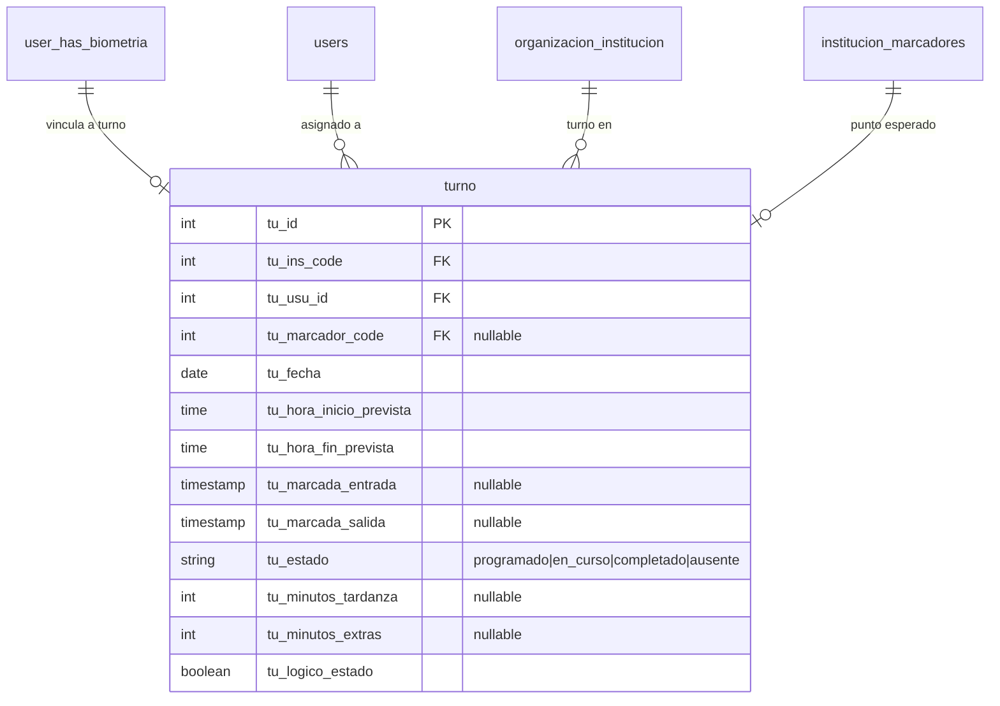

# FASE 3 — Modelo de Turnos y Planificacion

> **Estado:** ✅ Implementación Completada (2026-08-20)
> **Objetivo:** Planificar turnos de guardias; biometria y rondas se vuelven verificacion contra un plan.
> **Dependencias:** Fase 2 (PresenceValidationService)
> **Estimacion:** 3-4 dias

---

## 1. Analisis del Estado Actual

### 1.1 Lo que existe hoy

| Tabla | Funcion | Limitacion |
|-------|---------|------------|
| `user_has_gestions` | Registro de ingreso/egreso del guardia (turno activo) | Solo registra APERTURA/CIERRE de sesion, no tiene planificacion |
| `user_has_biometria` | Marcaciones biometricas (entrada/salida) | Solo log, sin comparar contra un turno esperado |
| `ronda_cabecera` | Rondas ejecutadas | Sin vinculacion a turnos programados |

### 1.2 user_has_gestions (Turno "real" actual)

```
Tabla: user_has_gestions
PK: ug_code
Campos:
  - ug_user_id     -> usuario
  - ug_ingreso     -> timestamp de ingreso
  - ug_egreso      -> timestamp de egreso (nullable)
  - ug_finish      -> boolean (true cuando tiene egreso)
  - ug_state       -> boolean (activo/inactivo)
```

**Problema:** Esto solo registra CUANDO entro/salio el guardia, pero no:
- A que hora DEBIO entrar?
- En que institucion DEBIA estar?
- Cuanto tardo?
- Falto?

### 1.3 user_has_biometria (Marcacion actual)

```
Tabla: user_has_biometria
PK: bio_code
Campos:
  - bio_user_id    -> usuario
  - bio_ins_code   -> institucion (nullable)
  - bio_is_entrada -> 1=entrada, 0=salida
  - bio_lat/lng    -> ubicacion
  - bio_created_at -> timestamp de marcacion
```

**Problema:** No hay vinculacion a un turno planificado. La marcacion es un log aislado.

### 1.4 Flujo actual (sin turnos)

```
Guardia llega -> Login -> Biometria (marca entrada) -> Log en user_has_biometria
Guardia sale  -> Biometria (marca salida)  -> Log en user_has_biometria

 falto?  -> No se sabe
 tardo?  -> No se sabe
Donde debia estar? -> No se sabe
```

---

## 2. Diseno del Nuevo Esquema

### 2.1 Diagrama Entidad-Relacion (Mermaid)



### 2.2 Nueva tabla: turno

Campos clave:
- `tu_fecha` + `tu_hora_inicio_prevista` / `tu_hora_fin_prevista` = el plan
- `tu_bio_entrada_code` / `tu_bio_salida_code` = la realidad (FK a biometria)
- `tu_estado` = ciclo de vida: programado -> en_curso -> completado | ausente
- `tu_minutos_tardanza` = calculado al marcar entrada
- `tu_minutos_extras` = calculado al marcar salida

### 2.3 Relacion con biometria existente

No se modifica la estructura de `user_has_biometria`. Se agregan 2 campos a `turno` que referencian las marcaciones:

```
turno.tu_bio_entrada_code -> user_has_biometria.bio_code (entrada)
turno.tu_bio_salida_code  -> user_has_biometria.bio_code (salida)
```

Y en `user_has_biometria` se agrega un campo nullable:
```
bio_tu_code -> FK a turno (opcional, para vincular la marcacion al turno)
```

---

## 3. Migraciones

### 3.1 Migracion: Crear tabla turno

```php
<?php

use Illuminate\Database\Migrations\Migration;
use Illuminate\Database\Schema\Blueprint;
use Illuminate\Support\Facades\Schema;

class CreateTurnoTable extends Migration
{
    public function up(): void
    {
        Schema::create('turno', function (Blueprint $table) {
            $table->id('tu_id');
            $table->bigInteger('tu_ins_code');
            $table->bigInteger('tu_usu_id');
            $table->bigInteger('tu_marcador_code')->nullable();
            $table->date('tu_fecha');
            $table->time('tu_hora_inicio_prevista');
            $table->time('tu_hora_fin_prevista');

            // Vinculacion con marcaciones reales
            $table->bigInteger('tu_bio_entrada_code')->nullable();
            $table->bigInteger('tu_bio_salida_code')->nullable();
            $table->timestamp('tu_marcada_entrada')->nullable();
            $table->timestamp('tu_marcada_salida')->nullable();

            // Calculos
            $table->integer('tu_minutos_tardanza')->nullable();
            $table->integer('tu_minutos_extras')->nullable();
            $table->text('tu_observaciones')->nullable();

            // Estado del ciclo de vida
            $table->string('tu_estado')->default('programado');
            $table->boolean('tu_estado')->default(true);

            // Auditoria
            $table->bigInteger('tu_created_user')->nullable();
            $table->bigInteger('tu_updated_user')->nullable();
            $table->timestamp('tu_created_at')->nullable();
            $table->timestamp('tu_updated_at')->nullable();

            // Indices
            $table->index(['tu_ins_code', 'tu_fecha']);
            $table->index(['tu_usu_id', 'tu_fecha']);
            $table->index(['tu_estado', 'tu_fecha']);
        });
    }

    public function down(): void
    {
        Schema::dropIfExists('turno');
    }
}
```

### 3.2 Migracion: Agregar FK a biometria

```php
<?php

use Illuminate\Database\Migrations\Migration;
use Illuminate\Database\Schema\Blueprint;
use Illuminate\Support\Facades\Schema;

class AddBioTuCodeToBiometria extends Migration
{
    public function up(): void
    {
        Schema::table('user_has_biometria', function (Blueprint $table) {
            $table->bigInteger('bio_tu_code')->nullable()->after('bio_state');
            $table->index('bio_tu_code');
        });
    }

    public function down(): void
    {
        Schema::table('user_has_biometria', function (Blueprint $table) {
            $table->dropIndex(['bio_tu_code']);
            $table->dropColumn('bio_tu_code');
        });
    }
}
```

---

## 4. Modelo Eloquent

### 4.1 Modelo Turno.php

```php
<?php

namespace Modules\Administracion\Models;

use Carbon\Carbon;
use Illuminate\Database\Eloquent\Factories\HasFactory;
use Illuminate\Database\Eloquent\Model;
use Illuminate\Database\Eloquent\Relations\BelongsTo;
use Modules\Acceso\Models\users;

class Turno extends Model
{
    use HasFactory;

    protected $table = 'turno';
    protected $primaryKey = 'tu_id';

    protected $fillable = [
        'tu_ins_code',
        'tu_usu_id',
        'tu_marcador_code',
        'tu_fecha',
        'tu_hora_inicio_prevista',
        'tu_hora_fin_prevista',
        'tu_bio_entrada_code',
        'tu_bio_salida_code',
        'tu_marcada_entrada',
        'tu_marcada_salida',
        'tu_minutos_tardanza',
        'tu_minutos_extras',
        'tu_observaciones',
        'tu_estado',
        'tu_created_user',
        'tu_updated_user',
    ];

    const CREATED_AT = 'tu_created_at';
    const UPDATED_AT = 'tu_updated_at';

    protected $casts = [
        'tu_fecha' => 'date',
        'tu_estado' => 'string',
        'tu_minutos_tardanza' => 'integer',
        'tu_minutos_extras' => 'integer',
    ];

    // === RELACIONES ===

    public function usuario(): BelongsTo
    {
        return $this->belongsTo(users::class, 'tu_usu_id', 'id');
    }

    public function institucion(): BelongsTo
    {
        return $this->belongsTo(OrganizacionInstitucion::class, 'tu_ins_code', 'ins_code');
    }

    public function marcador(): BelongsTo
    {
        return $this->belongsTo(InstitucionMarcadores::class, 'tu_marcador_code', 'im_code');
    }

    public function bioEntrada(): BelongsTo
    {
        return $this->belongsTo(user_has_biometria::class, 'tu_bio_entrada_code', 'bio_code');
    }

    public function bioSalida(): BelongsTo
    {
        return $this->belongsTo(user_has_biometria::class, 'tu_bio_salida_code', 'bio_code');
    }

    // === SCOPES ===

    public function scopeDelDia($query, $fecha = null)
    {
        $fecha = $fecha ?? Carbon::today()->toDateString();
        return $query->where('tu_fecha', $fecha);
    }

    public function scopeDeInstitucion($query, $insCode)
    {
        return $query->where('tu_ins_code', $insCode);
    }

    public function scopeDeUsuario($query, $userId)
    {
        return $query->where('tu_usu_id', $userId);
    }

    public function scopeProgramados($query)
    {
        return $query->where('tu_estado', 'programado');
    }

    public function scopeAusentes($query)
    {
        return $query->where('tu_estado', 'ausente');
    }

    public function scopeActivos($query)
    {
        return $query->where('tu_estado', true);
    }

    // === ACCESORS ===

    public function getMinutosTardanzaDisplayAttribute(): ?string
    {
        if (is_null($this->tu_minutos_tardanza)) {
            return null;
        }
        $horas = intdiv($this->tu_minutos_tardanza, 60);
        $mins = $this->tu_minutos_tardanza % 60;
        return $horas > 0 ? "{$horas}h {$mins}min" : "{$mins}min";
    }

    public function getEstadoBadgeAttribute(): string
    {
        return match($this->tu_estado) {
            'programado' => 'Programado',
            'en_curso' => 'En Curso',
            'completado' => 'Completado',
            'ausente' => 'Ausente',
            'inasistente' => 'Inasistente',
            default => 'Desconocido',
        };
    }

    public function getMinutosExtrasDisplayAttribute(): ?string
    {
        if (is_null($this->tu_minutos_extras)) {
            return null;
        }
        $horas = intdiv($this->tu_minutos_extras, 60);
        $mins = $this->tu_minutos_extras % 60;
        return $horas > 0 ? "{$horas}h {$mins}min" : "{$mins}min";
    }
}
```

### 4.2 Actualizar user_has_biometria.php

Agregar al modelo existente:

```php
// Agregar a $fillable:
'bio_tu_code',

// Agregar relacion:
public function turno(): BelongsTo
{
    return $this->belongsTo(Turno::class, 'bio_tu_code', 'tu_id');
}
```

---

## 5. Servicio de Turno (TurnoService)

### 5.1 Interfaz

```php
<?php

namespace App\Services;

use Carbon\Carbon;
use Modules\Administracion\Models\Turno;

class TurnoService
{
    /**
     * Buscar turno programado para un usuario/institucion/fecha
     */
    public function buscarTurnoProgramado(
        int $usuarioId,
        int $institucionId,
        Carbon $fecha
    ): ?Turno;

    /**
     * Vincular marcacion de entrada a un turno
     * Calcula tardanza si existe
     */
    public function vincularEntrada(
        Turno $turno,
        int $biometriaCode,
        Carbon $fechaMarcacion
    ): Turno;

    /**
     * Vincular marcacion de salida a un turno
     * Calcula horas extras si aplica
     */
    public function vincularSalida(
        Turno $turno,
        int $biometriaCode,
        Carbon $fechaMarcacion
    ): Turno;

    /**
     * Calcular tardanza en minutos
     * Retorna 0 si marco a tiempo o antes
     */
    public function calcularTardanza(
        string $horaInicioPrevista,
        Carbon $fechaMarcacion
    ): int;

    /**
     * Calcular minutos extras
     * Retorna 0 si salio a tiempo o antes
     */
    public function calcularMinutosExtras(
        string $horaFinPrevista,
        Carbon $fechaMarcacion
    ): int;

    /**
     * Cerrar turnos del dia que no fueron marcados (scheduler)
     */
    public function cerrarTurnosSinMarcacion(int $institucionId): int;
}
```

### 5.2 Implementacion

```php
<?php

namespace App\Services;

use Carbon\Carbon;
use Illuminate\Support\Facades\DB;
use Modules\Administracion\Models\Turno;
use Modules\Administracion\Models\user_has_biometria;

class TurnoService
{
    public function buscarTurnoProgramado(
        int $usuarioId,
        int $institucionId,
        Carbon $fecha
    ): ?Turno {
        return Turno::where('tu_usu_id', $usuarioId)
            ->where('tu_ins_code', $institucionId)
            ->where('tu_fecha', $fecha->toDateString())
            ->where('tu_estado', true)
            ->whereIn('tu_estado', ['programado', 'en_curso'])
            ->first();
    }

    public function vincularEntrada(
        Turno $turno,
        int $biometriaCode,
        Carbon $fechaMarcacion
    ): Turno {
        $turno->tu_bio_entrada_code = $biometriaCode;
        $turno->tu_marcada_entrada = $fechaMarcacion;
        $turno->tu_estado = 'en_curso';
        $turno->tu_minutos_tardanza = $this->calcularTardanza(
            $turno->tu_hora_inicio_prevista,
            $fechaMarcacion
        );
        $turno->save();
        return $turno;
    }

    public function vincularSalida(
        Turno $turno,
        int $biometriaCode,
        Carbon $fechaMarcacion
    ): Turno {
        $turno->tu_bio_salida_code = $biometriaCode;
        $turno->tu_marcada_salida = $fechaMarcacion;
        $turno->tu_estado = 'completado';
        $turno->tu_minutos_extras = $this->calcularMinutosExtras(
            $turno->tu_hora_fin_prevista,
            $fechaMarcacion
        );
        $turno->save();
        return $turno;
    }

    public function calcularTardanza(
        string $horaInicioPrevista,
        Carbon $fechaMarcacion
    ): int {
        $horaInicio = Carbon::parse($horaInicioPrevista);
        $diferencia = $fechaMarcacion->diffInMinutes($horaInicio, false);

        // Si marco antes del inicio, no hay tardanza
        if ($diferencia >= 0) {
            return 0;
        }

        // Retorna minutos de tardanza (valor positivo)
        return abs((int) $diferencia);
    }

    public function calcularMinutosExtras(
        string $horaFinPrevista,
        Carbon $fechaMarcacion
    ): int {
        $horaFin = Carbon::parse($horaFinPrevista);
        $diferencia = $fechaMarcacion->diffInMinutes($horaFin, false);

        // Si salio antes del fin, no hay extras
        if ($diferencia <= 0) {
            return 0;
        }

        return (int) $diferencia;
    }

    public function cerrarTurnosSinMarcacion(int $institucionId): int
    {
        $hoy = Carbon::today()->toDateString();
        $ahora = Carbon::now();

        // Buscar turnos programados del dia que nunca marcaron entrada
        $turnos = Turno::where('tu_ins_code', $institucionId)
            ->where('tu_fecha', $hoy)
            ->where('tu_estado', 'programado')
            ->where('tu_hora_inicio_prevista', '<', $ahora->format('H:i:s'))
            ->get();

        $count = 0;
        foreach ($turnos as $turno) {
            $turno->tu_estado = 'ausente';
            $turno->tu_observaciones = 'Marcado como ausente por sistema - no marco entrada';
            $turno->tu_updated_user = 0; // Sistema
            $turno->save();
            $count++;
        }

        return $count;
    }
}
```

---

## 6. Controlador API (TurnoController)

### 6.1 Endpoints nuevos

```php
<?php

namespace Modules\MobileApp\Http\Controllers;

use App\generalTrait;
use App\Services\TurnoService;
use Carbon\Carbon;
use Illuminate\Http\JsonResponse;
use Illuminate\Http\Request;
use Illuminate\Routing\Controller;
use Illuminate\Support\Facades\Validator;
use Modules\Administracion\Models\Turno;
use Modules\Administracion\Models\UserHasInstitucion;

class TurnoController extends Controller
{
    use generalTrait;

    protected TurnoService $turnoService;

    public function __construct(TurnoService $turnoService)
    {
        $this->turnoService = $turnoService;
    }

    /**
     * GET /api/turnos-del-dia
     * Lista turnos del dia para el usuario autenticado
     */
    public function turnosDelDia(Request $request): JsonResponse
    {
        list($us, $tk) = $this->getSanctumSession($request);

        $validator = Validator::make($request->all(), [
            'ins_code' => 'required|integer',
        ], [
            'ins_code.required' => 'Campo institucion es obligatorio',
        ]);
        if ($validator->fails()) {
            return response()->json(['success' => false, 'errors' => $validator->errors()]);
        }

        $ins = UserHasInstitucion::where('ui_usu_id', $us->id)
            ->where('ui_ins_code', $request->ins_code)
            ->where('ui_state', 1)
            ->first();
        if (!$ins) {
            return $this->message_json('errors', 'Usuario no vinculado a institucion');
        }

        $turnos = Turno::where('tu_usu_id', $us->id)
            ->where('tu_ins_code', $request->ins_code)
            ->where('tu_fecha', Carbon::today()->toDateString())
            ->where('tu_estado', true)
            ->orderBy('tu_hora_inicio_prevista', 'asc')
            ->get();

        $res = [];
        foreach ($turnos as $t) {
            $res[] = [
                'tu_id' => $t->tu_id,
                'tu_hora_inicio_prevista' => $t->tu_hora_inicio_prevista,
                'tu_hora_fin_prevista' => $t->tu_hora_fin_prevista,
                'tu_marcada_entrada' => $t->tu_marcada_entrada,
                'tu_marcada_salida' => $t->tu_marcada_salida,
                'tu_estado' => $t->tu_estado,
                'tu_minutos_tardanza' => $t->tu_minutos_tardanza,
                'tu_minutos_extras' => $t->tu_minutos_extras,
                'minutos_tardanza_display' => $t->minutos_tardanza_display,
                'minutos_extras_display' => $t->minutos_extras_display,
                'marcador' => $t->marcador ? $t->marcador->im_descripcion : null,
            ];
        }

        return response()->json(['turnos' => $res]);
    }

    /**
     * POST /api/turnos-vincular-marcaje
     * Vincula una marcacion biometrica reciente a un turno programado
     */
    public function vincularMarcaje(Request $request): JsonResponse
    {
        list($us, $tk) = $this->getSanctumSession($request);

        $validator = Validator::make($request->all(), [
            'ins_code' => 'required|integer',
            'tu_id' => 'required|integer',
            'tipo' => 'required|in:entrada,salida',
        ], [
            'ins_code.required' => 'Campo institucion es obligatorio',
            'tu_id.required' => 'Campo turno es obligatorio',
            'tipo.required' => 'Campo tipo es obligatorio',
            'tipo.in' => 'Tipo debe ser entrada o salida',
        ]);
        if ($validator->fails()) {
            return response()->json(['success' => false, 'errors' => $validator->errors()]);
        }

        $turno = Turno::where('tu_id', $request->tu_id)
            ->where('tu_usu_id', $us->id)
            ->where('tu_ins_code', $request->ins_code)
            ->where('tu_estado', true)
            ->first();
        if (!$turno) {
            return $this->message_json('errors', 'Turno no encontrado o no pertenece al usuario');
        }

        // Buscar la marcacion biometrica mas reciente del usuario hoy
        $bio = \Modules\Administracion\Models\user_has_biometria::where('bio_user_id', $us->id)
            ->where('bio_ins_code', $request->ins_code)
            ->whereDate('bio_created_at', Carbon::today())
            ->orderBy('bio_code', 'desc')
            ->first();

        if (!$bio) {
            return $this->message_json('errors', 'No se encontro marcacion biometrica reciente');
        }

        if ($request->tipo === 'entrada') {
            if ($turno->tu_bio_entrada_code) {
                return $this->message_json('errors', 'Este turno ya tiene marcacion de entrada vinculada');
            }
            $turno = $this->turnoService->vincularEntrada(
                $turno,
                $bio->bio_code,
                Carbon::parse($bio->bio_created_at)
            );
        } else {
            if ($turno->tu_bio_salida_code) {
                return $this->message_json('errors', 'Este turno ya tiene marcacion de salida vinculada');
            }
            $turno = $this->turnoService->vincularSalida(
                $turno,
                $bio->bio_code,
                Carbon::parse($bio->bio_created_at)
            );
        }

        // Vincular tambien desde el lado de biometria
        $bio->bio_tu_code = $turno->tu_id;
        $bio->save();

        return response()->json([
            'result' => 'success',
            'message' => 'Marcaje vinculado al turno correctamente',
            'turno' => [
                'tu_id' => $turno->tu_id,
                'tu_estado' => $turno->tu_estado,
                'tu_minutos_tardanza' => $turno->tu_minutos_tardanza,
                'tu_minutos_extras' => $turno->tu_minutos_extras,
            ],
        ]);
    }

    /**
     * POST /api/turnos-cumplimiento
     * Vista de cumplimiento (solo para supervisor/admin)
     */
    public function cumplimiento(Request $request): JsonResponse
    {
        list($us, $tk) = $this->getSanctumSession($request);

        $validator = Validator::make($request->all(), [
            'ins_code' => 'required|integer',
            'fecha' => 'nullable|date',
        ], [
            'ins_code.required' => 'Campo institucion es obligatorio',
        ]);
        if ($validator->fails()) {
            return response()->json(['success' => false, 'errors' => $validator->errors()]);
        }

        $fecha = $request->fecha ?? Carbon::today()->toDateString();

        $turnos = Turno::with(['usuario', 'institucion'])
            ->where('tu_ins_code', $request->ins_code)
            ->where('tu_fecha', $fecha)
            ->where('tu_estado', true)
            ->orderBy('tu_hora_inicio_prevista', 'asc')
            ->get();

        $res = [];
        foreach ($turnos as $t) {
            $usuario = $t->usuario;
            $res[] = [
                'tu_id' => $t->tu_id,
                'guardia' => $usuario ? trim($usuario->usu_nmbcom ?? $usuario->usu_nmb1 . ' ' . $usuario->usu_ape1) : 'N/A',
                'cedula' => $usuario->usu_cedula ?? 'N/A',
                'institucion' => $t->institucion->ins_descripcion ?? 'N/A',
                'turno_esperado' => $t->tu_hora_inicio_prevista . ' - ' . $t->tu_hora_fin_prevista,
                'marco_entrada' => $t->tu_marcada_entrada,
                'marco_salida' => $t->tu_marcada_salida,
                'minutos_tardanza' => $t->tu_minutos_tardanza,
                'minutos_extras' => $t->tu_minutos_extras,
                'estado' => $t->tu_estado,
                'estado_badge' => $t->estado_badge,
            ];
        }

        return response()->json(['cumplimiento' => $res]);
    }
}
```

### 6.2 Rutas nuevas (en api.php del MobileApp)

```php
// === TURNOS ===
Route::post('/turnos-del-dia', [TurnoController::class, 'turnosDelDia']);
Route::post('/turnos-vincular-marcaje', [TurnoController::class, 'vincularMarcaje']);
Route::post('/turnos-cumplimiento', [TurnoController::class, 'cumplimiento']);
```

---

## 7. Artisan Command: CerrarTurnosDelDia

### 7.1 Comando

```php
<?php

namespace App\Console\Commands;

use App\Services\TurnoService;
use Carbon\Carbon;
use Illuminate\Console\Command;
use Modules\Administracion\Models\OrganizacionInstitucion;

class CerrarTurnosDelDia extends Command
{
    protected $signature = 'turnos:cerrar-dia';
    protected $description = 'Cierra turnos programados sin marcacion de entrada del dia actual';

    protected TurnoService $turnoService;

    public function __construct(TurnoService $turnoService)
    {
        parent::__construct();
        $this->turnoService = $turnoService;
    }

    public function handle(): int
    {
        $this->info('Cerrando turnos sin marcacion del dia: ' . Carbon::today()->toDateString());

        $instituciones = OrganizacionInstitucion::where('ins_estado', true)->get();
        $totalMarcados = 0;

        foreach ($instituciones as $inst) {
            $marcados = $this->turnoService->cerrarTurnosSinMarcacion($inst->ins_code);
            if ($marcados > 0) {
                $this->info("  Institucion {$inst->ins_descripcion}: {$marcados} turnos marcados como ausente");
            }
            $totalMarcados += $marcados;
        }

        $this->info("Total: {$totalMarcados} turnos marcados como ausente");
        return Command::SUCCESS;
    }
}
```

### 7.2 Scheduler (Kernel.php)

```php
// En app/Console/Kernel.php, dentro del schedule():
$schedule->command('turnos:cerrar-dia')->dailyAt('23:55');
```

---

## 8. Flujo Completo (con turnos)

```
ANTES (sin turnos):
  Guardia llega -> Login -> Biometria (marca entrada) -> Log aislado
  Guardia sale  -> Biometria (marca salida)  -> Log aislado

DESPUES (con turnos):
  Admin crea turno:
    INSERT turno (usuario=X, inst=Y, fecha=hoy, inicio=08:00, fin=20:00)

  Guardia llega a las 08:05:
    1. Login -> Biometria (marca entrada) -> Log en user_has_biometria
    2. Frontend llama POST /turnos-vincular-marcaje
    3. Backend:
       a. Busca turno programado para usuario/inst/fecha
       b. Calcula tardanza: 08:05 - 08:00 = 5 minutos
       c. Actualiza turno: estado=en_curso, marcada_entrada=08:05, tardanza=5

  Guardia sale a las 20:15:
    1. Biometria (marca salida) -> Log en user_has_biometria
    2. Frontend llama POST /turnos-vincular-marcaje
    3. Backend:
       a. Busca turno en curso para usuario/inst/fecha
       b. Calcula extras: 20:15 - 20:00 = 15 minutos
       c. Actualiza turno: estado=completado, marcada_salida=20:15, extras=15

  A las 23:55 (scheduler):
    1. CerrarTurnosDelDia revisa todos los turnos "programado"
    2. Los marca como "ausente"
```

---

## 9. Tests Unitarios

### 9.1 TurnoServiceTest.php

```php
<?php

namespace Tests\Unit;

use App\Services\TurnoService;
use Carbon\Carbon;
use Modules\Administracion\Models\Turno;
use Tests\TestCase;

class TurnoServiceTest extends TestCase
{
    protected TurnoService $service;

    protected function setUp(): void
    {
        parent::setUp();
        $this->service = new TurnoService();
    }

    /** @test */
    public function calcular_tardanza_cuando_llega_tarde()
    {
        $tardanza = $this->service->calcularTardanza('08:00:00', Carbon::parse('2026-08-20 08:15:00'));
        $this->assertEquals(15, $tardanza);
    }

    /** @test */
    public function calcular_tardanza_cuando_llega_a_tiempo()
    {
        $tardanza = $this->service->calcularTardanza('08:00:00', Carbon::parse('2026-08-20 08:00:00'));
        $this->assertEquals(0, $tardanza);
    }

    /** @test */
    public function calcular_tardanza_cuando_llega_antes()
    {
        $tardanza = $this->service->calcularTardanza('08:00:00', Carbon::parse('2026-08-20 07:55:00'));
        $this->assertEquals(0, $tardanza);
    }

    /** @test */
    public function calcular_minutos_extras_cuando_sale_tarde()
    {
        $extras = $this->service->calcularMinutosExtras('20:00:00', Carbon::parse('2026-08-20 20:30:00'));
        $this->assertEquals(30, $extras);
    }

    /** @test */
    public function calcular_minutos_extras_cuando_sale_a_tiempo()
    {
        $extras = $this->service->calcularMinutosExtras('20:00:00', Carbon::parse('2026-08-20 20:00:00'));
        $this->assertEquals(0, $extras);
    }

    /** @test */
    public function calcular_minutos_extras_cuando_sale_antes()
    {
        $extras = $this->service->calcularMinutosExtras('20:00:00', Carbon::parse('2026-08-20 19:50:00'));
        $this->assertEquals(0, $extras);
    }

    /** @test */
    public function cerrar_turnos_sin_marcacion_cambia_estado_a_ausente()
    {
        // Crear turno programado de ayer (sin marcar)
        $turno = Turno::create([
            'tu_ins_code' => 1,
            'tu_usu_id' => 1,
            'tu_fecha' => Carbon::yesterday()->toDateString(),
            'tu_hora_inicio_prevista' => '08:00:00',
            'tu_hora_fin_prevista' => '20:00:00',
            'tu_estado' => 'programado',
        ]);

        $marcados = $this->service->cerrarTurnosSinMarcacion(1);
        $this->assertEquals(1, $marcados);

        $turno->refresh();
        $this->assertEquals('ausente', $turno->tu_estado);
    }

    /** @test */
    public function buscar_turno_programado_encuentra_turno()
    {
        $turno = Turno::create([
            'tu_ins_code' => 1,
            'tu_usu_id' => 1,
            'tu_fecha' => Carbon::today()->toDateString(),
            'tu_hora_inicio_prevista' => '08:00:00',
            'tu_hora_fin_prevista' => '20:00:00',
            'tu_estado' => 'programado',
        ]);

        $encontrado = $this->service->buscarTurnoProgramado(1, 1, Carbon::today());
        $this->assertNotNull($encontrado);
        $this->assertEquals($turno->tu_id, $encontrado->tu_id);
    }
}
```

---

## 10. Plan de Implementacion (Paso a Paso)

### Paso 1: Crear migraciones (20 min)
```bash
php artisan make:migration create_turno_table
php artisan make:migration add_bio_tu_code_to_biometria_table --table=user_has_biometria
```
- Archivos en `database/migrations/`
- Contenido: Ver Seccion 3

### Paso 2: Ejecutar migraciones (5 min)
```bash
php artisan migrate
```

### Paso 3: Crear modelo Turno.php (15 min)
- Archivo: `Modules/Administracion/Models/Turno.php`
- Contenido: Ver Seccion 4.1

### Paso 4: Actualizar modelo user_has_biometria.php (10 min)
- Archivo: `Modules/Administracion/Models/user_has_biometria.php`
- Agregar campo `bio_tu_code` a $fillable
- Agregar relacion `turno()`

### Paso 5: Crear TurnoService (45 min)
```bash
touch app/Services/TurnoService.php
```
- Archivo: `app/Services/TurnoService.php`
- Contenido: Ver Seccion 5

### Paso 6: Crear TurnoController (60 min)
- Archivo: `Modules/MobileApp/Http/Controllers/TurnoController.php`
- Contenido: Ver Seccion 6.1
- Agregar rutas en `Modules/MobileApp/Routes/api.php`

### Paso 7: Crear Artisan Command (20 min)
```bash
php artisan make:command CerrarTurnosDelDia
```
- Archivo: `app/Console/Commands/CerrarTurnosDelDia.php`
- Contenido: Ver Seccion 7.1
- Configurar en Kernel.php

### Paso 8: Crear tests unitarios (45 min)
```bash
php artisan make:test TurnoServiceTest --unit
```
- Archivo: `tests/Unit/TurnoServiceTest.php`
- Contenido: Ver Seccion 9.1

### Paso 9: Ejecutar tests (10 min)
```bash
php artisan test --unit=TurnoServiceTest
```

### Paso 10: Verificar endpoints (15 min)
```bash
# Probar turnos del dia
curl -X POST http://localhost:3031/api/turnos-del-dia \
  -H "Authorization: Bearer {token}" \
  -H "Content-Type: application/json" \
  -d '{"ins_code":1}'

# Probar vincular marcaje
curl -X POST http://localhost:3031/api/turnos-vincular-marcaje \
  -H "Authorization: Bearer {token}" \
  -H "Content-Type: application/json" \
  -d '{"ins_code":1,"tu_id":1,"tipo":"entrada"}'

# Probar cumplimiento
curl -X POST http://localhost:3031/api/turnos-cumplimiento \
  -H "Authorization: Bearer {token}" \
  -H "Content-Type: application/json" \
  -d '{"ins_code":1}'
```

---

## 11. Checklist de Verificacion

| # | Verificacion | Estado |
|---|--------------|--------|
| 1 | Migracion crea tabla `turno` con todos los campos | Pendiente |
| 2 | Migracion agrega `bio_tu_code` a `user_has_biometria` | Pendiente |
| 3 | Modelo `Turno.php` existe con relaciones y scopes | Pendiente |
| 4 | Modelo `user_has_biometria` actualizado con campo `bio_tu_code` | Pendiente |
| 5 | `TurnoService` existe con todos los metodos | Pendiente |
| 6 | `TurnoController` con 3 endpoints funciona | Pendiente |
| 7 | Rutas registradas en `api.php` | Pendiente |
| 8 | Command `CerrarTurnosDelDia` funciona | Pendiente |
| 9 | Scheduler configurado en Kernel.php | Pendiente |
| 10 | Tests unitarios pasan (8+ tests) | Pendiente |
| 11 | Endpoint `turnos-del-dia` retorna turnos | Pendiente |
| 12 | Endpoint `turnos-vincular-marcaje` vincula correctamente | Pendiente |
| 13 | Endpoint `turnos-cumplimiento` retorna datos | Pendiente |
| 14 | Tardanza se calcula correctamente | Pendiente |
| 15 | Minutos extras se calculan correctamente | Pendiente |

---

## 12. Rollback (Plan de Revision)

Si algo falla:

```bash
# 1. Revertir migraciones
php artisan migrate:rollback --step=2

# 2. Restaurar modelo biometria
git checkout -- Modules/Administracion/Models/user_has_biometria.php

# 3. Eliminar archivos nuevos
rm Modules/Administracion/Models/Turno.php
rm app/Services/TurnoService.php
rm Modules/MobileApp/Http/Controllers/TurnoController.php
rm app/Console/Commands/CerrarTurnosDelDia.php
rm tests/Unit/TurnoServiceTest.php

# 4. Eliminar rutas agregadas en api.php
```

---

## 13. Documentos Relacionados

| Archivo | Descripcion |
|---------|-------------|
| `planificacion_pasos.md` | Roadmap general del proyecto |
| `ANALISIS-ESQUEMA-ACTUAL.md` | Diagrama ER y esquema de BD |
| `FASE1-INVENTARIO-UNIFICADO.md` | Documentacion Fase 1 |
| `FASE2-PRESENCE-VALIDATION.md` | Documentacion Fase 2 |
| `FASE3-TURNOS.md` | Este documento |
| `RESUMEN-AVANCE.md` | Resumen para reanudar trabajo |

---

**Ultima actualizacion:** 2026-08-20
