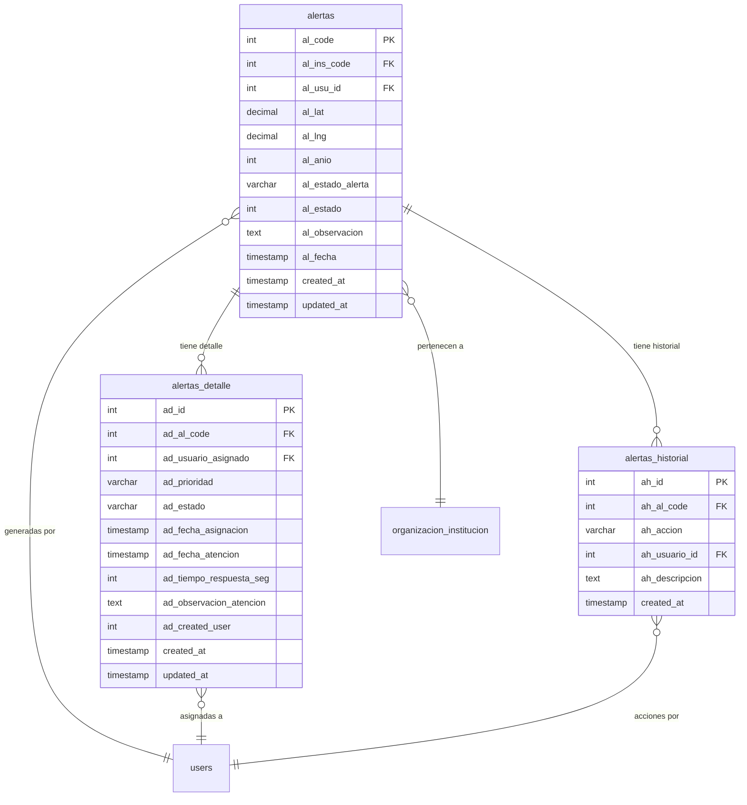

# FASE 4 — Alertas con Flujo de Escalamiento Real

> **Estado:** ✅ Implementación Completada (2026-08-20)  
> **Objetivo:** Convertir el log de alertas en un flujo con tiempos de respuesta y notificación real.  
> **Dependencias:** Ninguna (independiente)  
> **Estimación:** 2-3 días

---

## 1. Estado Actual del Sistema de Alertas

### Tabla `alertas` (existente)

| Campo | Tipo | Descripción |
|-------|------|-------------|
| `al_code` | PK | ID autoincremental |
| `al_ins_code` | FK → `organizacion_institucion.ins_code` | Institución |
| `al_usu_id` | FK → `users.id` | Usuario que genera la alerta |
| `al_lat` | decimal | Latitud GPS |
| `al_lng` | decimal | Longitud GPS |
| `al_anio` | int | Año de la alerta |
| `al_estado_alerta` | string | Estado (pendiente/resuelta) |
| `al_estado` | int | 1=activo, 0=inactivo |
| `al_observacion` | text | Descripción de la alerta |
| `al_created_user` | int | Usuario creador |
| `al_updated_user` | int | Usuario actualizador |
| `al_fecha` | timestamp | Fecha de creación (usado en `today()`) |
| `created_at` | timestamp | Timestamp creación |
| `updated_at` | timestamp | Timestamp actualización |

### Modelo `Alertas.php`

```php
class Alertas extends Model {
    protected $table = 'alertas';
    protected $primaryKey = 'al_code';
    public $timestamps = true;

    protected $fillable = [
        'al_ins_code', 'al_usu_id', 'al_lat', 'al_lng',
        'al_anio', 'al_estado_alerta', 'al_estado',
        'al_observacion', 'al_created_user', 'al_updated_user',
    ];

    public function institucion() {
        return $this->belongsTo(OrganizacionInstitucion::class, 'al_ins_code', 'ins_code');
    }

    public function usuario() {
        return $this->belongsTo(users::class, 'al_usu_id', 'id');
    }
}
```

### Controlador `AlertaController.php`

```php
class AlertaController extends Controller {
    // Endpoint: POST /api/mobile/alert/today
    // Retorna alertas del día activas (al_estado = 1)
    // Si usuario NO tiene rol "Consola Notificacion", filtra por institución
}
```

### Ruta API

```php
Route::post('/alert/today', [AlertaController::class, 'today']);
```

---

## 2. Problemas Identificados

| # | Problema | Impacto |
|---|---------|---------|
| 1 | Sin campo `prioridad` | No se puede distinguir alertas críticas de normales |
| 2 | Sin asignación a supervisor | Nadie es responsable de atender la alerta |
| 3 | Sin tiempo de respuesta | No se mide cuánto tarda en atenderse |
| 4 | Sin escalamiento automático | Si no se atiende, nadie es notificado |
| 5 | Solo listado del día | No hay historial ni estadísticas |
| 6 | Sin eventos/Livewire | No hay notificación en tiempo real |
| 7 | Estados limitados | Solo "pendiente/resuelta", faltan "en_atencion", "cancelada" |

---

## 3. Nuevo Esquema de Alertas

### Diagrama ER Mermaid



### Nuevas Columnas en `alertas`

| Campo | Tipo | Default | Descripción |
|-------|------|---------|-------------|
| `al_prioridad` | enum('baja','media','alta','critica') | 'media' | Nivel de urgencia |
| `al_estado` | enum('pendiente','en_atencion','finalizada','cancelada') | 'pendiente' | Estado ampliado |

### Nueva Tabla `alertas_detalle`

| Campo | Tipo | Descripción |
|-------|------|-------------|
| `ad_id` | PK | ID autoincremental |
| `ad_al_code` | FK → `alertas.al_code` | Alerta asociada |
| `ad_usuario_asignado` | FK → `users.id` | Supervisor asignado |
| `ad_prioridad` | enum | 'baja','media','alta','critica' |
| `ad_estado` | enum | 'asignada','en_revision','resuelta','escalada' |
| `ad_fecha_asignacion` | timestamp | Cuándo se asignó |
| `ad_fecha_atencion` | timestamp | Cuándo se atendió |
| `ad_tiempo_respuesta_seg` | int | Calculado: fecha_atencion - al_fecha |
| `ad_observacion_atencion` | text | Nota del supervisor al atender |
| `ad_created_user` | int | Quien creó el registro |
| `created_at` | timestamp | Timestamp |
| `updated_at` | timestamp | Timestamp |

### Nueva Tabla `alertas_historial`

| Campo | Tipo | Descripción |
|-------|------|-------------|
| `ah_id` | PK | ID autoincremental |
| `ah_al_code` | FK → `alertas.al_code` | Alerta asociada |
| `ah_accion` | varchar | 'creada','asignada','escalada','atendida','cancelada' |
| `ah_usuario_id` | FK → `users.id` | Quien realizó la acción |
| `ah_descripcion` | text | Detalle de la acción |
| `created_at` | timestamp | Timestamp |

---

## 4. Migraciones

### 4.1 Modificar tabla `alertas`

```php
<?php

use Illuminate\Database\Migrations\Migration;
use Illuminate\Database\Schema\Blueprint;
use Illuminate\Support\Facades\Schema;

return new class extends Migration
{
    public function up(): void
    {
        Schema::table('alertas', function (Blueprint $table) {
            // Agregar prioridad
            $table->enum('al_prioridad', ['baja', 'media', 'alta', 'critica'])
                  ->default('media')
                  ->after('al_estado');

            // Modificar estado para soportar nuevos valores
            // Primero agregar columna temporal
            $table->enum('al_estado_nuevo', ['pendiente', 'en_atencion', 'finalizada', 'cancelada'])
                  ->default('pendiente')
                  ->after('al_prioridad');

            // Migrar datos existentes
            DB::statement("
                UPDATE alertas 
                SET al_estado_nuevo = CASE 
                    WHEN al_estado_alerta = 'resuelta' THEN 'finalizada'
                    WHEN al_estado = 1 THEN 'pendiente'
                    ELSE 'cancelada'
                END
            ");

            // Eliminar columna antigua y renombrar
            $table->dropColumn('al_estado_alerta');
            $table->renameColumn('al_estado_nuevo', 'al_estado_alerta');

            // Agregar índice
            $table->index(['al_ins_code', 'al_estado_alerta', 'al_fecha']);
            $table->index(['al_usu_id', 'al_estado_alerta']);
        });
    }

    public function down(): void
    {
        Schema::table('alertas', function (Blueprint $table) {
            $table->dropIndex(['al_ins_code', 'al_estado_alerta', 'al_fecha']);
            $table->dropIndex(['al_usu_id', 'al_estado_alerta']);
            $table->dropColumn('al_prioridad');
            $table->dropColumn('al_estado_alerta');
        });
    }
};
```

### 4.2 Crear tabla `alertas_detalle`

```php
<?php

use Illuminate\Database\Migrations\Migration;
use Illuminate\Database\Schema\Blueprint;
use Illuminate\Support\Facades\Schema;

return new class extends Migration
{
    public function up(): void
    {
        Schema::create('alertas_detalle', function (Blueprint $table) {
            $table->id('ad_id');
            $table->unsignedBigInteger('ad_al_code');
            $table->unsignedBigInteger('ad_usuario_asignado')->nullable();
            $table->enum('ad_prioridad', ['baja', 'media', 'alta', 'critica'])->default('media');
            $table->enum('ad_estado', ['asignada', 'en_revision', 'resuelta', 'escalada'])->default('asignada');
            $table->timestamp('ad_fecha_asignacion')->nullable();
            $table->timestamp('ad_fecha_atencion')->nullable();
            $table->integer('ad_tiempo_respuesta_seg')->default(0);
            $table->text('ad_observacion_atencion')->nullable();
            $table->integer('ad_created_user');
            $table->timestamps();

            // Foreign Keys
            $table->foreign('ad_al_code')->references('al_code')->on('alertas')->onDelete('cascade');
            $table->foreign('ad_usuario_asignado')->references('id')->on('users')->onDelete('set null');

            // Índices
            $table->index(['ad_al_code', 'ad_estado']);
            $table->index(['ad_usuario_asignado', 'ad_estado']);
        });
    }

    public function down(): void
    {
        Schema::dropIfExists('alertas_detalle');
    }
};
```

### 4.3 Crear tabla `alertas_historial`

```php
<?php

use Illuminate\Database\Migrations\Migration;
use Illuminate\Database\Schema\Blueprint;
use Illuminate\Support\Facades\Schema;

return new class extends Migration
{
    public function up(): void
    {
        Schema::create('alertas_historial', function (Blueprint $table) {
            $table->id('ah_id');
            $table->unsignedBigInteger('ah_al_code');
            $table->enum('ah_accion', ['creada', 'asignada', 'escalada', 'atendida', 'cancelada']);
            $table->unsignedBigInteger('ah_usuario_id');
            $table->text('ah_descripcion')->nullable();
            $table->timestamps();

            // Foreign Keys
            $table->foreign('ah_al_code')->references('al_code')->on('alertas')->onDelete('cascade');
            $table->foreign('ah_usuario_id')->references('id')->on('users')->onDelete('cascade');

            // Índices
            $table->index(['ah_al_code', 'ah_accion']);
            $table->index('ah_usuario_id');
        });
    }

    public function down(): void
    {
        Schema::dropIfExists('alertas_historial');
    }
};
```

---

## 5. Modelos Eloquent

### 5.1 Modelo `Alertas.php` (actualizado)

```php
<?php

namespace Modules\Administracion\Models;

use Modules\Acceso\Models\users;
use Illuminate\Database\Eloquent\Factories\HasFactory;
use Illuminate\Database\Eloquent\Model;
use Illuminate\Database\Eloquent\Relations\HasMany;
use Illuminate\Database\Eloquent\Relations\HasOne;

class Alertas extends Model
{
    use HasFactory;

    protected $table = 'alertas';
    protected $primaryKey = 'al_code';
    public $timestamps = true;

    protected $fillable = [
        'al_ins_code',
        'al_usu_id',
        'al_lat',
        'al_lng',
        'al_anio',
        'al_estado_alerta',
        'al_estado',
        'al_prioridad',
        'al_observacion',
        'al_created_user',
        'al_updated_user',
    ];

    protected $casts = [
        'al_lat' => 'float',
        'al_lng' => 'float',
        'al_anio' => 'integer',
        'al_estado' => 'integer',
        'al_fecha' => 'datetime',
    ];

    // === Relaciones ===

    public function institucion()
    {
        return $this->belongsTo(OrganizacionInstitucion::class, 'al_ins_code', 'ins_code');
    }

    public function usuario()
    {
        return $this->belongsTo(users::class, 'al_usu_id', 'id');
    }

    public function detalle(): HasMany
    {
        return $this->hasMany(AlertaDetalle::class, 'ad_al_code', 'al_code');
    }

    public function historial(): HasMany
    {
        return $this->hasMany(AlertaHistorial::class, 'ah_al_code', 'al_code');
    }

    public function asignacionActual(): HasOne
    {
        return $this->hasOne(AlertaDetalle::class, 'ad_al_code', 'al_code')
                    ->latest('ad_fecha_asignacion');
    }

    // === Scopes ===

    public function scopePendientes($query)
    {
        return $query->where('al_estado_alerta', 'pendiente');
    }

    public function scopeEnAtencion($query)
    {
        return $query->where('al_estado_alerta', 'en_atencion');
    }

    public function scopePorInstitucion($query, int $insCode)
    {
        return $query->where('al_ins_code', $insCode);
    }

    public function scopePorPrioridad($query, string $prioridad)
    {
        return $query->where('al_prioridad', $prioridad);
    }

    public function scopeDelDia($query, $fecha = null)
    {
        return $query->whereDate('al_fecha', $fecha ?? now());
    }

    // === Accessors ===

    public function getTiempoRespuestaAttribute(): ?int
    {
        if ($this->al_estado_alerta !== 'finalizada') {
            return null;
        }

        $detalle = $this->detalle()->whereNotNull('ad_fecha_atencion')->first();
        if (!$detalle || !$detalle->ad_fecha_atencion) {
            return null;
        }

        return $this->al_fecha->diffInSeconds($detalle->ad_fecha_atencion);
    }

    public function getEstaRetrasadaAttribute(): bool
    {
        if (in_array($this->al_estado_alerta, ['finalizada', 'cancelada'])) {
            return false;
        }

        $minutosEspera = match($this->al_prioridad) {
            'critica' => 5,
            'alta' => 15,
            'media' => 30,
            'baja' => 60,
            default => 30,
        };

        return $this->al_fecha->diffInMinutes(now()) > $minutosEspera;
    }

    public function getNivelEscalamientoAttribute(): int
    {
        $minutosTranscurridos = $this->al_fecha->diffInMinutes(now());

        return match(true) {
            $minutosTranscurridos >= 60 => 3,  // Escalar a dirección
            $minutosTranscurridos >= 30 => 2,  // Escalar a gerencia
            $minutosTranscurridos >= 15 => 1,  // Escalar a supervisor directo
            default => 0,                       // Sin escalamiento
        };
    }
}
```

### 5.2 Modelo `AlertaDetalle.php` (nuevo)

```php
<?php

namespace Modules\Administracion\Models;

use Illuminate\Database\Eloquent\Factories\HasFactory;
use Illuminate\Database\Eloquent\Model;
use Modules\Acceso\Models\users;

class AlertaDetalle extends Model
{
    use HasFactory;

    protected $table = 'alertas_detalle';
    protected $primaryKey = 'ad_id';
    public $timestamps = true;

    protected $fillable = [
        'ad_al_code',
        'ad_usuario_asignado',
        'ad_prioridad',
        'ad_estado',
        'ad_fecha_asignacion',
        'ad_fecha_atencion',
        'ad_tiempo_respuesta_seg',
        'ad_observacion_atencion',
        'ad_created_user',
    ];

    protected $casts = [
        'ad_fecha_asignacion' => 'datetime',
        'ad_fecha_atencion' => 'datetime',
        'ad_tiempo_respuesta_seg' => 'integer',
    ];

    // === Relaciones ===

    public function alerta()
    {
        return $this->belongsTo(Alertas::class, 'ad_al_code', 'al_code');
    }

    public function usuarioAsignado()
    {
        return $this->belongsTo(users::class, 'ad_usuario_asignado', 'id');
    }

    // === Scopes ===

    public function scopeActivas($query)
    {
        return $query->whereIn('ad_estado', ['asignada', 'en_revision']);
    }

    public function scopeEscaladas($query)
    {
        return $query->where('ad_estado', 'escalada');
    }

    // === Métodos ===

    public function marcarEnRevision(): void
    {
        $this->update(['ad_estado' => 'en_revision']);
    }

    public function marcarResuelta(string $observacion): void
    {
        $this->update([
            'ad_estado' => 'resuelta',
            'ad_fecha_atencion' => now(),
            'ad_tiempo_respuesta_seg' => $this->alerta->al_fecha->diffInSeconds(now()),
            'ad_observacion_atencion' => $observacion,
        ]);

        $this->alerta->update(['al_estado_alerta' => 'finalizada']);
    }
}
```

### 5.3 Modelo `AlertaHistorial.php` (nuevo)

```php
<?php

namespace Modules\Administracion\Models;

use Illuminate\Database\Eloquent\Factories\HasFactory;
use Illuminate\Database\Eloquent\Model;
use Modules\Acceso\Models\users;

class AlertaHistorial extends Model
{
    use HasFactory;

    protected $table = 'alertas_historial';
    protected $primaryKey = 'ah_id';
    public $timestamps = true;

    protected $fillable = [
        'ah_al_code',
        'ah_accion',
        'ah_usuario_id',
        'ah_descripcion',
    ];

    // === Relaciones ===

    public function alerta()
    {
        return $this->belongsTo(Alertas::class, 'ah_al_code', 'al_code');
    }

    public function usuario()
    {
        return $this->belongsTo(users::class, 'ah_usuario_id', 'id');
    }

    // === Método estático para registrar ===

    public static function registrar(
        int $alertaId,
        string $accion,
        int $usuarioId,
        ?string $descripcion = null
    ): self {
        return self::create([
            'ah_al_code' => $alertaId,
            'ah_accion' => $accion,
            'ah_usuario_id' => $usuarioId,
            'ah_descripcion' => $descripcion,
        ]);
    }
}
```

---

## 6. Servicio de Alertas

### `AlertaService.php`

```php
<?php

namespace App\Services;

use Modules\Administracion\Models\Alertas;
use Modules\Administracion\Models\AlertaDetalle;
use Modules\Administracion\Models\AlertaHistorial;
use Modules\Acceso\Models\users;
use Illuminate\Support\Facades\DB;
use Illuminate\Support\Facades\Notification;

class AlertaService
{
    /**
     * Crear una nueva alerta con notificación
     */
    public function crearAlerta(array $datos): Alertas
    {
        return DB::transaction(function () use ($datos) {
            // 1. Crear la alerta
            $alerta = Alertas::create([
                'al_ins_code' => $datos['institucion_id'],
                'al_usu_id' => $datos['usuario_id'],
                'al_lat' => $datos['lat'],
                'al_lng' => $datos['lng'],
                'al_anio' => date('Y'),
                'al_estado_alerta' => 'pendiente',
                'al_estado' => 1,
                'al_prioridad' => $datos['prioridad'] ?? 'media',
                'al_observacion' => $datos['observacion'],
                'al_created_user' => $datos['usuario_id'],
            ]);

            // 2. Registrar en historial
            AlertaHistorial::registrar(
                $alerta->al_code,
                'creada',
                $datos['usuario_id'],
                'Alerta creada por ' . $datos['usuario_id']
            );

            // 3. Asignar automáticamente a supervisor
            $this->asignarASupervisor($alerta);

            // 4. Disparar evento para notificaciones
            event(new \App\Events\AlertaCreada($alerta));

            return $alerta;
        });
    }

    /**
     * Asignar alerta a un supervisor disponible
     */
    public function asignarASupervisor(Alertas $alerta): ?AlertaDetalle
    {
        // Buscar supervisor activo de la institución
        $supervisor = users::whereHas('roles', function ($q) use ($alerta) {
            $q->where('name', 'Supervisor')
              ->where('estado', 1);
        })
        ->whereHas('instituciones', function ($q) use ($alerta) {
            $q->where('ins_code', $alerta->al_ins_code);
        })
        ->first();

        if (!$supervisor) {
            return null;
        }

        $detalle = AlertaDetalle::create([
            'ad_al_code' => $alerta->al_code,
            'ad_usuario_asignado' => $supervisor->id,
            'ad_prioridad' => $alerta->al_prioridad,
            'ad_estado' => 'asignada',
            'ad_fecha_asignacion' => now(),
            'ad_created_user' => $alerta->al_created_user,
        ]);

        // Actualizar estado de alerta
        $alerta->update(['al_estado_alerta' => 'en_atencion']);

        // Registrar en historial
        AlertaHistorial::registrar(
            $alerta->al_code,
            'asignada',
            $alerta->al_created_user,
            "Asignada a supervisor: {$supervisor->name}"
        );

        // Notificar al supervisor
        $this->notificarSupervisor($supervisor, $alerta);

        return $detalle;
    }

    /**
     * Atender una alerta
     */
    public function atenderAlerta(
        Alertas $alerta,
        int $usuarioId,
        string $observacion
    ): AlertaDetalle {
        return DB::transaction(function () use ($alerta, $usuarioId, $observacion) {
            $detalle = $alerta->asignacionActual;

            if (!$detalle) {
                throw new \Exception('La alerta no tiene asignación activa');
            }

            $detalle->marcarResuelta($observacion);

            AlertaHistorial::registrar(
                $alerta->al_code,
                'atendida',
                $usuarioId,
                "Alerta atendida. Tiempo: {$detalle->ad_tiempo_respuesta_seg} segundos"
            );

            return $detalle;
        });
    }

    /**
     * Escalar una alerta
     */
    public function escalarAlerta(
        Alertas $alerta,
        int $usuarioId,
        string $motivo
    ): void {
        DB::transaction(function () use ($alerta, $usuarioId, $motivo) {
            // Marcar como escalada
            $detalle = $alerta->asignacionActual;
            if ($detalle) {
                $detalle->update(['ad_estado' => 'escalada']);
            }

            // Buscar nivel superior
            $nivelActual = $alerta->nivel_escalamiento;
            $nuevoSupervisor = $this->buscarSupervisorPorNivel(
                $alerta->al_ins_code,
                $nivelActual
            );

            if ($nuevoSupervisor) {
                // Crear nueva asignación
                AlertaDetalle::create([
                    'ad_al_code' => $alerta->al_code,
                    'ad_usuario_asignado' => $nuevoSupervisor->id,
                    'ad_prioridad' => $alerta->al_prioridad,
                    'ad_estado' => 'asignada',
                    'ad_fecha_asignacion' => now(),
                    'ad_created_user' => $usuarioId,
                ]);

                AlertaHistorial::registrar(
                    $alerta->al_code,
                    'escalada',
                    $usuarioId,
                    "Escalada a nivel {$nivelActual}: {$motivo}"
                );

                $this->notificarSupervisor($nuevoSupervisor, $alerta);
            }
        });
    }

    /**
     * Cancelar una alerta
     */
    public function cancelarAlerta(
        Alertas $alerta,
        int $usuarioId,
        string $motivo
    ): void {
        DB::transaction(function () use ($alerta, $usuarioId, $motivo) {
            $alerta->update(['al_estado_alerta' => 'cancelada']);

            AlertaHistorial::registrar(
                $alerta->al_code,
                'cancelada',
                $usuarioId,
                $motivo
            );
        });
    }

    /**
     * Obtener alertas activas de una institución
     */
    public function obtenerAlertasActivas(int $insCode): \Illuminate\Database\Eloquent\Collection
    {
        return Alertas::porInstitucion($insCode)
            ->whereIn('al_estado_alerta', ['pendiente', 'en_atencion'])
            ->with(['usuario', 'asignacionActual.usuarioAsignado'])
            ->orderBy('al_prioridad', 'desc')
            ->orderBy('al_fecha', 'asc')
            ->get();
    }

    /**
     * Obtener estadísticas de alertas
     */
    public function obtenerEstadisticas(int $insCode, string $periodo = 'hoy'): array
    {
        $query = Alertas::porInstitucion($insCode);

        $query = match($periodo) {
            'hoy' => $query->delDia(),
            'semana' => $query->whereBetween('al_fecha', [now()->startOfWeek(), now()->endOfWeek()]),
            'mes' => $query->whereMonth('al_fecha', now()->month),
            default => $query->delDia(),
        };

        return [
            'total' => $query->count(),
            'pendientes' => (clone $query)->pendientes()->count(),
            'en_atencion' => (clone $query)->enAtencion()->count(),
            'finalizadas' => (clone $query)->where('al_estado_alerta', 'finalizada')->count(),
            'por_prioridad' => [
                'critica' => (clone $query)->porPrioridad('critica')->count(),
                'alta' => (clone $query)->porPrioridad('alta')->count(),
                'media' => (clone $query)->porPrioridad('media')->count(),
                'baja' => (clone $query)->porPrioridad('baja')->count(),
            ],
            'tiempo_respuesta_promedio' => $this->calcularTiempoRespuestaPromedio($insCode, $periodo),
        ];
    }

    // === Métodos privados ===

    private function notificarSupervisor(users $supervisor, Alertas $alerta): void
    {
        // Notificación push
        $tokens = $supervisor->pushTokens->pluck('upt_token')->toArray();
        if (!empty($tokens)) {
            // TODO: Integrar con Firebase Cloud Messaging
            // Notification::send($supervisor, new AlertaPushNotification($alerta));
        }
    }

    private function buscarSupervisorPorNivel(int $insCode, int $nivel): ?users
    {
        // Nivel 0: Supervisor directo
        // Nivel 1: Gerente
        // Nivel 2: Dirección
        $rolNivel = match($nivel) {
            1 => 'Gerente',
            2 => 'Director',
            default => 'Supervisor',
        };

        return users::whereHas('roles', function ($q) use ($rolNivel) {
            $q->where('name', $rolNivel)->where('estado', 1);
        })
        ->whereHas('instituciones', function ($q) use ($insCode) {
            $q->where('ins_code', $insCode);
        })
        ->first();
    }

    private function calcularTiempoRespuestaPromedio(int $insCode, string $periodo): float
    {
        $query = Alertas::porInstitucion($insCode)
            ->where('al_estado_alerta', 'finalizada');

        $query = match($periodo) {
            'hoy' => $query->delDia(),
            'semana' => $query->whereBetween('al_fecha', [now()->startOfWeek(), now()->endOfWeek()]),
            'mes' => $query->whereMonth('al_fecha', now()->month),
            default => $query->delDia(),
        };

        $alertas = $query->get();

        if ($alertas->isEmpty()) {
            return 0;
        }

        $totalSegundos = $alertas->sum(function ($alerta) {
            $detalle = $alerta->detalle()->whereNotNull('ad_fecha_atencion')->first();
            return $detalle ? $detalle->ad_tiempo_respuesta_seg : 0;
        });

        return $totalSegundos / $alertas->count();
    }
}
```

---

## 7. Evento y Listener

### `AlertaCreada.php`

```php
<?php

namespace App\Events;

use Illuminate\Broadcasting\Channel;
use Illuminate\Broadcasting\InteractsWithSockets;
use Illuminate\Contracts\Broadcasting\ShouldBroadcast;
use Illuminate\Foundation\Events\Dispatchable;
use Illuminate\Queue\SerializesModels;
use Modules\Administracion\Models\Alertas;

class AlertaCreada implements ShouldBroadcast
{
    use Dispatchable, InteractsWithSockets, SerializesModels;

    public Alertas $alerta;

    public function __construct(Alertas $alerta)
    {
        $this->alerta = $alerta;
    }

    public function broadcastOn(): array
    {
        return [
            new Channel('alertas.institucion.' . $this->alerta->al_ins_code),
        ];
    }

    public function broadcastAs(): string
    {
        return 'alerta.creada';
    }

    public function broadcastWith(): array
    {
        return [
            'id' => $this->alerta->al_code,
            'prioridad' => $this->alerta->al_prioridad,
            'observacion' => $this->alerta->al_observacion,
            'usuario' => $this->alerta->usuario->name ?? 'Desconocido',
            'created_at' => $this->alerta->created_at->toISOString(),
        ];
    }
}
```

### `NotificarAlertaPendiente.php` (Job para escalamiento periódico)

```php
<?php

namespace App\Jobs;

use App\Services\AlertaService;
use Illuminate\Bus\Queueable;
use Illuminate\Contracts\Queue\ShouldQueue;
use Illuminate\Foundation\Bus\Dispatchable;
use Illuminate\Queue\InteractsWithQueue;
use Illuminate\Queue\SerializesModels;
use Modules\Administracion\Models\Alertas;

class NotificarAlertaPendiente implements ShouldQueue
{
    use Dispatchable, InteractsWithQueue, Queueable, SerializesModels;

    public function __construct(
        private Alertas $alerta,
        private AlertaService $alertaService
    ) {}

    public function handle(): void
    {
        // Verificar si la alerta sigue pendiente
        if ($this->alerta->al_estado_alerta !== 'pendiente') {
            return;
        }

        // Escalar automáticamente
        $this->alertaService->escalarAlerta(
            $this->alerta,
            $this->alerta->al_created_user,
            'Escalamiento automático por tiempo de espera excedido'
        );
    }
}
```

---

## 8. Controlador Actualizado

### `AlertaController.php` (refactorizado)

```php
<?php

namespace Modules\MobileApp\Http\Controllers;

use App\generalTrait;
use App\Services\AlertaService;
use Illuminate\Http\JsonResponse;
use Illuminate\Http\Request;
use Illuminate\Routing\Controller;
use Illuminate\Support\Facades\Validator;
use Modules\Administracion\Models\Alertas;
use Modules\Administracion\Models\user_has_roles;

class AlertaController extends Controller
{
    use generalTrait;

    public function __construct(
        private AlertaService $alertaService
    ) {}

    protected array $todayRules = [
        'rules' => [
            'ins' => 'required',
        ],
        'messages' => [
            'ins.required' => 'Campo institucion es obligatorio',
        ]
    ];

    protected array $crearRules = [
        'rules' => [
            'ins' => 'required|integer',
            'lat' => 'required|numeric',
            'lng' => 'required|numeric',
            'observacion' => 'required|string|max:1000',
            'prioridad' => 'nullable|in:baja,media,alta,critica',
        ],
        'messages' => [
            'ins.required' => 'Campo institucion es obligatorio',
            'lat.required' => 'Latitud es obligatoria',
            'lng.required' => 'Longitud es obligatoria',
            'observacion.required' => 'Observación es obligatoria',
            'prioridad.in' => 'Prioridad no válida',
        ]
    ];

    /**
     * Obtener alertas del día
     */
    public function today(Request $request): JsonResponse
    {
        list($us, $tk) = $this->getSanctumSession($request);

        $validator = Validator::make($request->all(), $this->todayRules['rules'], $this->todayRules['messages']);
        if ($validator->fails()) {
            return response()->json(['success' => false, 'errors' => $validator->errors()]);
        }

        $uR = user_has_roles::where('user_id', $us->id)
            ->whereHas('roles', function ($q) {
                $q->where('estado', 1)
                  ->where('name', 'Consola Notificacion');
            })
            ->with('roles')
            ->first();

        $alerts = $this->alertaService->obtenerAlertasActivas($request->ins);

        // Si no tiene rol de consola, filtrar por institución del usuario
        if (!$uR) {
            $alerts = $alerts->filter(function ($alerta) use ($request) {
                return $alerta->al_ins_code == $request->ins;
            });
        }

        return response()->json([
            'success' => true,
            'alerts' => $alerts,
            'console' => $uR ? 1 : 0,
        ]);
    }

    /**
     * Crear nueva alerta
     */
    public function crear(Request $request): JsonResponse
    {
        list($us, $tk) = $this->getSanctumSession($request);

        $validator = Validator::make($request->all(), $this->crearRules['rules'], $this->crearRules['messages']);
        if ($validator->fails()) {
            return response()->json(['success' => false, 'errors' => $validator->errors()]);
        }

        try {
            $alerta = $this->alertaService->crearAlerta([
                'institucion_id' => $request->ins,
                'usuario_id' => $us->id,
                'lat' => $request->lat,
                'lng' => $request->lng,
                'observacion' => $request->observacion,
                'prioridad' => $request->prioridad ?? 'media',
            ]);

            return response()->json([
                'success' => true,
                'message' => 'Alerta creada correctamente',
                'alert' => $alerta,
            ], 201);
        } catch (\Exception $e) {
            return response()->json([
                'success' => false,
                'message' => 'Error al crear alerta',
                'error' => $e->getMessage(),
            ], 500);
        }
    }

    /**
     * Atender una alerta
     */
    public function atender(Request $request, int $alertaId): JsonResponse
    {
        list($us, $tk) = $this->getSanctumSession($request);

        $validator = Validator::make($request->all(), [
            'observacion' => 'required|string|max:1000',
        ], [
            'observacion.required' => 'Observación de atención es obligatoria',
        ]);

        if ($validator->fails()) {
            return response()->json(['success' => false, 'errors' => $validator->errors()]);
        }

        try {
            $alerta = Alertas::findOrFail($alertaId);
            $detalle = $this->alertaService->atenderAlerta($alerta, $us->id, $request->observacion);

            return response()->json([
                'success' => true,
                'message' => 'Alerta atendida correctamente',
                'detalle' => $detalle,
            ]);
        } catch (\Exception $e) {
            return response()->json([
                'success' => false,
                'message' => 'Error al atender alerta',
                'error' => $e->getMessage(),
            ], 404);
        }
    }

    /**
     * Obtener estadísticas de alertas
     */
    public function estadisticas(Request $request): JsonResponse
    {
        list($us, $tk) = $this->getSanctumSession($request);

        $validator = Validator::make($request->all(), [
            'ins' => 'required|integer',
            'periodo' => 'nullable|in:hoy,semana,mes',
        ]);

        if ($validator->fails()) {
            return response()->json(['success' => false, 'errors' => $validator->errors()]);
        }

        $estadisticas = $this->alertaService->obtenerEstadisticas(
            $request->ins,
            $request->periodo ?? 'hoy'
        );

        return response()->json([
            'success' => true,
            'estadisticas' => $estadisticas,
        ]);
    }

    /**
     * Obtener historial de una alerta
     */
    public function historial(Request $request, int $alertaId): JsonResponse
    {
        list($us, $tk) = $this->getSanctumSession($request);

        $alerta = Alertas::with(['historial.usuario', 'detalle.usuarioAsignado'])
            ->findOrFail($alertaId);

        return response()->json([
            'success' => true,
            'alerta' => $alerta,
        ]);
    }
}
```

---

## 9. Rutas API Actualizadas

```php
<?php

use Illuminate\Support\Facades\Route;
use Modules\MobileApp\Http\Controllers\AlertaController;

Route::prefix('mobile')->group(function () {
    // Alertas
    Route::post('/alert/today', [AlertaController::class, 'today']);
    Route::post('/alert/crear', [AlertaController::class, 'crear']);
    Route::post('/alert/{id}/atender', [AlertaController::class, 'atender']);
    Route::post('/alert/{id}/cancelar', [AlertaController::class, 'cancelar']);
    Route::get('/alert/{id}/historial', [AlertaController::class, 'historial']);
    Route::post('/alert/estadisticas', [AlertaController::class, 'estadisticas']);
});
```

---

## 10. Frontend — Cambios Necesarios

### `AlertasScreen.tsx` (actualizaciones)

```typescript
// Agregar estados de filtro
const [filtroPrioridad, setFiltroPrioridad] = useState<string>('todas');
const [filtroEstado, setFiltroEstado] = useState<string>('activas');

// Nuevos campos en la interfaz
interface Alerta {
  al_code: number;
  al_prioridad: 'baja' | 'media' | 'alta' | 'critica';
  al_estado_alerta: 'pendiente' | 'en_atencion' | 'finalizada' | 'cancelada';
  al_observacion: string;
  al_fecha: string;
  al_lat: number;
  al_lng: number;
  usuario: { name: string };
  asignacion_actual?: {
    usuario_asignado: { name: string };
    ad_tiempo_respuesta_seg: number;
  };
}

// Badge de prioridad con colores
const getPrioridadColor = (prioridad: string) => {
  switch (prioridad) {
    case 'critica': return '#DC2626'; // Rojo
    case 'alta': return '#EA580C';    // Naranja
    case 'media': return '#CA8A04';   // Amarillo
    case 'baja': return '#16A34A';    // Verde
    default: return '#6B7280';        // Gris
  }
};

// Indicador de tiempo de respuesta
const getTiempoRespuesta = (alerta: Alerta) => {
  if (alerta.al_estado_alerta === 'finalizada') {
    return `${alerta.asignacion_actual?.ad_tiempo_respuesta_seg || 0}s`;
  }
  
  const minutosEspera = {
    critica: 5,
    alta: 15,
    media: 30,
    baja: 60,
  };
  
  const tiempo = minutosEspera[alerta.al_prioridad as keyof typeof minutosEspera] || 30;
  const transcurrido = Math.floor((Date.now() - new Date(alerta.al_fecha).getTime()) / 60000);
  
  return `${transcurrido}/${tiempo} min`;
};
```

---

## 11. Tests Unitarios

### `AlertaServiceTest.php`

```php
<?php

namespace Tests\Unit;

use App\Services\AlertaService;
use Modules\Administracion\Models\Alertas;
use Modules\Administracion\Models\AlertaDetalle;
use Modules\Administracion\Models\AlertaHistorial;
use Modules\Administracion\Models\UserHasInstitucion;
use Modules\Acceso\Models\users;
use Tests\TestCase;
use Illuminate\Foundation\Testing\RefreshDatabase;

class AlertaServiceTest extends TestCase
{
    use RefreshDatabase;

    private AlertaService $alertaService;

    protected function setUp(): void
    {
        parent::setUp();
        $this->alertaService = app(AlertaService::class);
    }

    public function test_crear_alerta_con_detalle(): void
    {
        $institucion = OrganizacionInstitucion::factory()->create();
        $usuario = users::factory()->create();
        UserHasInstitucion::factory()->create([
            'usuario_id' => $usuario->id,
            'ins_code' => $institucion->ins_code,
        ]);

        $alerta = $this->alertaService->crearAlerta([
            'institucion_id' => $institucion->ins_code,
            'usuario_id' => $usuario->id,
            'lat' => -33.4489,
            'lng' => -70.6693,
            'observacion' => 'Intruso detectado en zona sur',
            'prioridad' => 'alta',
        ]);

        $this->assertNotNull($alerta);
        $this->assertEquals('alta', $alerta->al_prioridad);
        $this->assertEquals('pendiente', $alerta->al_estado_alerta);
        $this->assertDatabaseHas('alertas_historial', [
            'ah_al_code' => $alerta->al_code,
            'ah_accion' => 'creada',
        ]);
    }

    public function test_asignar_alerta_a_supervisor(): void
    {
        $institucion = OrganizacionInstitucion::factory()->create();
        $supervisor = users::factory()->create();
        $supervisor->roles()->attach(['name' => 'Supervisor', 'estado' => 1]);
        
        $alerta = Alertas::factory()->create([
            'al_ins_code' => $institucion->ins_code,
        ]);

        $detalle = $this->alertaService->asignarASupervisor($alerta);

        $this->assertNotNull($detalle);
        $this->assertEquals($supervisor->id, $detalle->ad_usuario_asignado);
        $this->assertEquals('asignada', $detalle->ad_estado);
        $this->assertEquals('en_atencion', $alerta->fresh()->al_estado_alerta);
    }

    public function test_calcular_tiempo_respuesta(): void
    {
        $alerta = Alertas::factory()->create([
            'al_estado_alerta' => 'finalizada',
            'al_fecha' => now()->subMinutes(10),
        ]);

        $detalle = AlertaDetalle::factory()->create([
            'ad_al_code' => $alerta->al_code,
            'ad_fecha_atencion' => now()->subMinutes(5),
            'ad_tiempo_respuesta_seg' => 300,
        ]);

        $this->assertEquals(300, $alerta->tiempo_respuesta);
    }

    public function test_escalado_automatico_por_tiempo(): void
    {
        $institucion = OrganizacionInstitucion::factory()->create();
        $supervisor = users::factory()->create();
        $supervisor->roles()->attach(['name' => 'Supervisor', 'estado' => 1]);
        
        $alerta = Alertas::factory()->create([
            'al_ins_code' => $institucion->ins_code,
            'al_prioridad' => 'media',
            'al_estado_alerta' => 'pendiente',
            'al_fecha' => now()->subMinutes(35),
        ]);

        $nivel = $alerta->nivel_escalamiento;

        $this->assertGreaterThanOrEqual(1, $nivel);
    }

    public function test_estadisticas_institucion(): void
    {
        $institucion = OrganizacionInstitucion::factory()->create();
        
        Alertas::factory()->count(3)->create([
            'al_ins_code' => $institucion->ins_code,
            'al_estado_alerta' => 'pendiente',
        ]);
        Alertas::factory()->count(2)->create([
            'al_ins_code' => $institucion->ins_code,
            'al_estado_alerta' => 'finalizada',
        ]);

        $estadisticas = $this->alertaService->obtenerEstadisticas($institucion->ins_code, 'hoy');

        $this->assertEquals(5, $estadisticas['total']);
        $this->assertEquals(3, $estadisticas['pendientes']);
        $this->assertEquals(2, $estadisticas['finalizadas']);
    }
}
```

---

## 12. Plan de Implementación

| Paso | Tarea | Tiempo |
|------|-------|--------|
| 1 | Crear migraciones (3 archivos) | 30 min |
| 2 | Ejecutar `php artisan migrate` | 5 min |
| 3 | Crear modelos (AlertaDetalle, AlertaHistorial) | 30 min |
| 4 | Actualizar modelo Alertas | 30 min |
| 5 | Crear AlertaService | 1 hora |
| 6 | Crear evento AlertaCreada | 30 min |
| 7 | Actualizar AlertaController | 1 hora |
| 8 | Actualizar rutas API | 15 min |
| 9 | Tests unitarios | 1 hora |
| 10 | Frontend (opcional) | 2 horas |
| **Total** | | **~7 horas** |

---

## 13. Checklist de Verificación

- [ ] Migraciones ejecutan sin errores
- [ ] Modelos crean registros correctamente
- [ ] AlertaService crea alerta con historial
- [ ] Asignación automática a supervisor funciona
- [ ] Tiempo de respuesta se calcula correctamente
- [ ] Escalamiento automático se dispara por tiempo
- [ ] Evento AlertaCreada se emite
- [ ] Estadísticas retornan valores correctos
- [ ] Tests pasan al 100%
- [ ] Rollback funciona correctamente

---

## 14. Rollback

```php
// En caso de error, ejecutar en orden inverso:

// 1. Eliminar tablas nuevas
Schema::dropIfExists('alertas_historial');
Schema::dropIfExists('alertas_detalle');

// 2. Revertir cambios en alertas
Schema::table('alertas', function (Blueprint $table) {
    $table->dropColumn('al_prioridad');
    // Restaurar columnas originales
});
```
