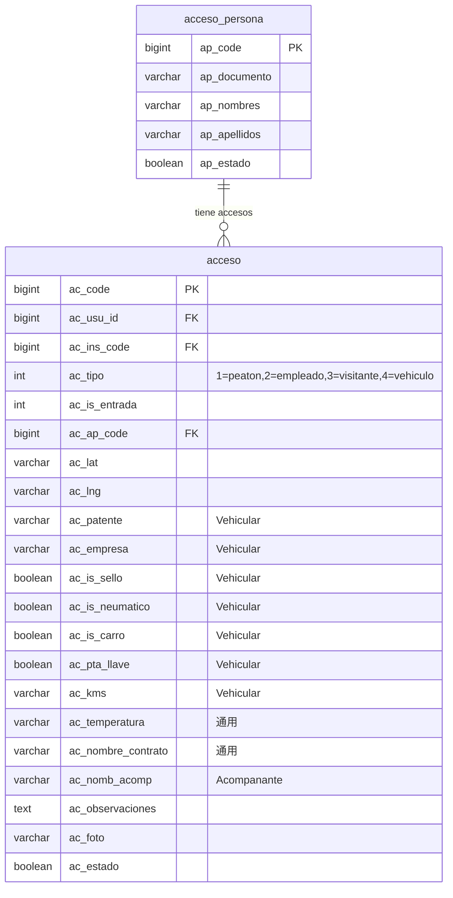
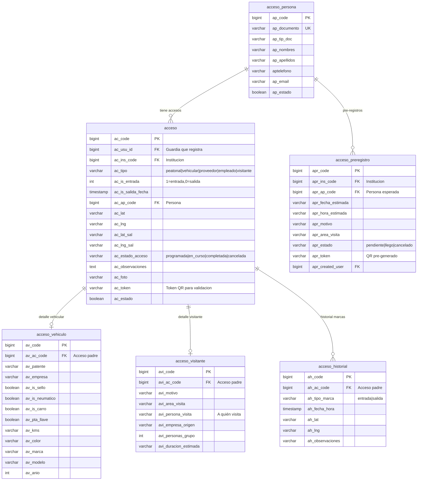

# FASE 5 — Acceso Generalizado (Vehicular + Peatonal + Proveedor)

> **Estado:** ✅ Implementada (2026-08-21) — backend (21 tests) + frontend completados
> **Objetivo:** Separar los campos vehiculares de la tabla `acceso`, agregar validación por tipo, soporte para múltiples entradas/salidas y pre-registro de visitantes.
> **Dependencias:** Fase 2 (PresenceValidationService para validación GPS/QR)
> **Estimación:** 2-3 días

---

## 0. Registro de Implementación (2026-08-21)

### Desviaciones del diseño original (justificadas)

| # | Desviación | Motivo |
|---|-----------|--------|
| 1 | `ac_bicileta` → se **conserva** en `acceso` (no se elimina) | Los 3 registros existentes la usan; es dato peatonal, no vehicular |
| 2 | Migración de datos en **migraciones** (no en seeder) | Atomicidad: copia → conversión → limpieza en una transacción; evita pérdida si alguien corre migrate sin seed |
| 3 | Lógica extraída a `App\Services\AccesoService` | Consistente con arquitectura de Fases 3-4 (TurnoService, AlertaService); permite tests unitarios sin auth Sanctum |
| 4 | `proveedor` genera detalle de visita + vehículo opcional (si envía patente) | El doc no definía detalle para proveedor; el formulario frontend le pide empresa/motivo/vehículo |
| 5 | Se conservan columnas `ac_temperatura`, `ac_is_acomp`, `ac_nomb_acomp`, `ac_rut_acomp` | El doc las mantiene implícitamente; el frontend sigue enviándolas |

### Implementado

- ✅ Migraciones: `2026_08_21_100001_create_acceso_generalizado_tables` (4 tablas) y `2026_08_21_100002_acceso_generalizado_migrate_data` (conversión `ac_tipo` int→string vía SQL nativo, backfill `ac_estado_acceso`, drop de columnas vehiculares)
- ✅ Modelos: `AccesoVehiculo`, `AccesoVisitante`, `AccesoHistorial` (con `registrar()` estático), `AccesoPreregistro`
- ✅ `Acceso.php`: constantes TIPO_*/ESTADO_*, relaciones (`persona`, `vehiculo`, `visitante`, `historial`), scopes, accessor `tiempo_permanencia`
- ✅ Fix relación rota `AccesoPersona.accesos()` (FK/PK invertidos)
- ✅ Eliminado `AccesoTransporte.php` (código muerto; la tabla nunca existió en BD)
- ✅ `AccesoService`: registrar (validación por tipo), registrarSalida, crearPreregistro, listarPreregistros, cancelarPreregistro, auto-confirmación de pre-registros al registrar entrada
- ✅ `AccesoController` refactorizado (delega en servicio; conserva validación GPS de PresenceValidationService y subida de foto)
- ✅ Rutas nuevas: `POST acceso/preregistro`, `POST acceso/preregistros`, `POST acceso/cancelar-preregistro`
- ✅ Tests: `tests/Unit/AccesoServiceTest.php` — 21/21 pasando

### Pendiente (frontend)

- [x] `AccesoFormScreen.tsx`: campos dinámicos según tipo — chips con los 5 tipos (`peatonal/empleado/visitante/proveedor/vehicular`); sección vehículo (patente obligatoria solo en vehicular, opcional en proveedor; color/marca/modelo/año/kms/checks sello-neumáticos-carrocería-puerta); sección visita (motivo obligatorio, área, persona que visita, grupo, duración) para visitante y proveedor
- [x] `AccesoListScreen.tsx`: pestañas Accesos/Pre-registros, filtro por tipo (chips), badge de estado (`EN CURSO`/`COMPLETADA`), tiempo de permanencia, patente/motivo desde las relaciones detalle, botón salida solo si `en_curso`, cancelar pre-registro pendiente
- [x] `PreregistroFormScreen.tsx` (nueva): alta de pre-registro de visitante con fecha/hora estimada, motivo y área
- [x] `constants.ts`: rutas de preregistro (`PREREGISTRO_CREATE/LIST/CANCEL`)
- [x] `AppNavigator.tsx`: ruta `PreregistroForm` registrada

---

## 1. Análisis del Estado Actual

### 1.1 Tablas Existentes

| Tabla | PK | Registros | Estado |
|-------|-----|-----------|--------|
| `acceso` | `ac_code` | Activa | Mezcla vehicular + peatonal en una tabla |
| `acceso_persona` | `ap_code` | Activa | Datos de la persona que accede |
| `acceso_transporte` | `at_code` | **MUERTA** | Modelo existe, NO hay migración, NO se usa |

### 1.2 Controller Actual: `AccesoController.php`

```php
// 3 métodos:
acceso()          // Registrar acceso (todos los tipos en un solo método)
getAccesosByInst() // Listar por institución y fecha
accesOut()         // Registrar salida
```

**Problemas del controller:**
- `ac_tipo` se valida como `required|integer` sin限制 los valores
- `patente` solo se exige si `tipoAc == 4` (vehículo), pero no hay lógica para otros tipos
- No hay distinción real entre tipos: todos se graban en la misma tabla con los mismos campos
- `acceso_transporte` se importa pero NUNCA se usa

### 1.3 Frontend Actual

| Screen | Funcionalidad |
|--------|---------------|
| `AccesoFormScreen.tsx` | Formulario con 4 chips: Peatón, Empleado, Visitante, Vehículo |
| `AccesoListScreen.tsx` | Listado por fecha con botón de salida |

**Problemas del frontend:**
- Muestra campo "Patente" solo para tipo 4, pero el backend acepta cualquier valor
- No hay campos específicos por tipo (ej: empresa para proveedor, motivo para visitante)
- No hay pre-registro de visitantes esperados
- No hay historial de múltiples entradas/salidas de la misma persona

### 1.4 Diagrama ER Actual



---

## 2. Problemas Identificados

| # | Problema | Ubicación | Impacto |
|---|----------|-----------|---------|
| 1 | Campos vehiculares mezclados en tabla principal | `acceso` table, `Acceso.php` | No se puede extender a peatonal/proveedor limpiamente |
| 2 | `acceso_transporte` es código muerto | `AccesoTransporte.php` | Confusión, tabla fantasma |
| 3 | Relación rota en `AccesoPersona` | `AccesoPersona.php:36` | `hasMany(Acceso::class, 'ac_ap_code', 'ac_code')` — el FK y PK están invertidos |
| 4 | Sin validación por tipo | `AccesoController.php:24` | Cualquier integer es aceptado como tipo |
| 5 | Sin pre-registro de visitantes | Frontend + Backend | No se pueden programar visitas anticipadas |
| 6 | Sin tracking de múltiples entradas | `acceso` table | Una persona solo puede tener 1 entrada activa |
| 7 | Sin integración con PresenceValidationService | `AccesoController.php` | No valida GPS/QR al registrar |

---

## 3. Nuevo Esquema Propuesto

### 3.1 Diagrama ER Generalizado



### 3.2 Cambios en Tablas

#### Tabla `acceso` (MODIFICAR)

```php
// Migración: agregar columnas nuevas
Schema::table('acceso', function (Blueprint $table) {
    // Cambiar ac_tipo de integer a string
    $table->string('ac_tipo', 20)->nullable()->change();

    // Nuevo estado de acceso
    $table->string('ac_estado_acceso', 20)->default('en_curso')->after('ac_estado');

    // Token QR para validación
    $table->string('ac_token', 64)->nullable()->after('ac_foto');

    // Eliminar columnas vehiculares (se mueven a acceso_vehiculo)
    // NOTA: Se eliminan después de migrar datos
});
```

#### Tabla `acceso_vehiculo` (CREAR)

```php
Schema::create('acceso_vehiculo', function (Blueprint $table) {
    $table->id('av_code');
    $table->bigInteger('av_ac_code')->unsigned();
    $table->string('av_patente', 20)->nullable();
    $table->string('av_empresa', 100)->nullable();
    $table->boolean('av_is_sello')->default(false);
    $table->boolean('av_is_neumatico')->default(false);
    $table->boolean('av_is_carro')->default(false);
    $table->boolean('av_pta_llave')->default(false);
    $table->string('av_kms', 20)->nullable();
    $table->string('av_color', 50)->nullable();
    $table->string('av_marca', 50)->nullable();
    $table->string('av_modelo', 50)->nullable();
    $table->integer('av_anio')->nullable();
    $table->timestamps();

    $table->foreign('av_ac_code')->references('ac_code')->on('acceso')->onDelete('cascade');
    $table->index('av_ac_code');
});
```

#### Tabla `acceso_visitante` (CREAR)

```php
Schema::create('acceso_visitante', function (Blueprint $table) {
    $table->id('avi_code');
    $table->bigInteger('avi_ac_code')->unsigned();
    $table->string('avi_motivo', 200)->nullable();
    $table->string('avi_area_visita', 100)->nullable();
    $table->string('avi_persona_visita', 150)->nullable();
    $table->string('avi_empresa_origen', 100)->nullable();
    $table->integer('avi_personas_grupo')->default(1);
    $table->string('avi_duracion_estimada', 50)->nullable();
    $table->timestamps();

    $table->foreign('avi_ac_code')->references('ac_code')->on('acceso')->onDelete('cascade');
    $table->index('avi_ac_code');
});
```

#### Tabla `acceso_historial` (CREAR)

```php
Schema::create('acceso_historial', function (Blueprint $table) {
    $table->id('ah_code');
    $table->bigInteger('ah_ac_code')->unsigned();
    $table->string('ah_tipo_marca', 10)->comment('entrada|salida');
    $table->timestamp('ah_fecha_hora');
    $table->string('ah_lat', 30)->nullable();
    $table->string('ah_lng', 30)->nullable();
    $table->text('ah_observaciones')->nullable();
    $table->timestamps();

    $table->foreign('ah_ac_code')->references('ac_code')->on('acceso')->onDelete('cascade');
    $table->index(['ah_ac_code', 'ah_tipo_marca']);
});
```

#### Tabla `acceso_preregistro` (CREAR)

```php
Schema::create('acceso_preregistro', function (Blueprint $table) {
    $table->id('apr_code');
    $table->bigInteger('apr_ins_code')->unsigned();
    $table->bigInteger('apr_ap_code')->unsigned()->nullable();
    $table->date('apr_fecha_estimada');
    $table->time('apr_hora_estimada');
    $table->string('apr_motivo', 200)->nullable();
    $table->string('apr_area_visita', 100)->nullable();
    $table->string('apr_estado', 20)->default('pendiente');
    $table->string('apr_token', 64)->nullable();
    $table->bigInteger('apr_created_user')->nullable();
    $table->timestamps();

    $table->foreign('apr_ins_code')->references('ins_code')->on('organizacion_institucion');
    $table->foreign('apr_ap_code')->references('ap_code')->on('acceso_persona');
    $table->index(['apr_ins_code', 'apr_fecha_estimada', 'apr_estado']);
});
```

---

## 4. Migración de Datos

### 4.1 Seeder de Conversión

```php
<?php
// database/seeders/SeedAccesoVehiculo.php

namespace Database\Seeders;

use Illuminate\Database\Seeder;
use Illuminate\Support\Facades\DB;

class SeedAccesoVehiculo extends Seeder
{
    public function run(): void
    {
        // 1. Migrar accesos vehiculares (ac_tipo=4) a acceso_vehiculo
        $accesosVehiculo = DB::table('acceso')
            ->where('ac_tipo', 4)
            ->orWhere('ac_patente', '!=', null)
            ->get();

        foreach ($accesosVehiculo as $acc) {
            DB::table('acceso_vehiculo')->insert([
                'av_ac_code'      => $acc->ac_code,
                'av_patente'      => $acc->ac_patente,
                'av_empresa'      => $acc->ac_empresa,
                'av_is_sello'     => $acc->ac_is_sello,
                'av_is_neumatico' => $acc->ac_is_neumatico,
                'av_is_carro'     => $acc->ac_is_carro,
                'av_pta_llave'    => $acc->ac_pta_llave,
                'av_kms'          => $acc->ac_kms,
                'av_created_at'   => $acc->ac_created_at,
                'av_updated_at'   => $acc->ac_updated_at,
            ]);
        }

        // 2. Convertir ac_tipo integer a string
        $mapTipo = [
            1 => 'peatonal',
            2 => 'empleado',
            3 => 'visitante',
            4 => 'vehicular',
        ];

        foreach ($mapTipo as $code => $label) {
            DB::table('acceso')
                ->where('ac_tipo', $code)
                ->update(['ac_tipo' => $label]);
        }

        // 3. Establecer ac_estado_acceso basado en ac_is_entrada
        DB::table('acceso')
            ->where('ac_is_entrada', 1)
            ->update(['ac_estado_acceso' => 'en_curso']);

        DB::table('acceso')
            ->where('ac_is_entrada', 0)
            ->update(['ac_estado_acceso' => 'completada']);

        // 4. Eliminar columnas vehiculares de tabla acceso
        Schema::table('acceso', function ($table) {
            $table->dropColumn([
                'ac_patente', 'ac_empresa', 'ac_is_sello',
                'ac_is_neumatico', 'ac_is_carro', 'ac_pta_llave', 'ac_kms',
                'ac_bicicleta', 'ac_nombre_contrato',
            ]);
        });

        // 5. Eliminar tabla acceso_transporte (código muerto)
        Schema::dropIfExists('acceso_transporte');
    }
}
```

---

## 5. Modelos Eloquent Actualizados

### 5.1 Modelo `Acceso.php` (ACTUALIZAR)

```php
<?php

namespace Modules\Administracion\Models;

use Modules\Acceso\Models\users;
use Carbon\Carbon;
use Illuminate\Database\Eloquent\Factories\HasFactory;
use Illuminate\Database\Eloquent\Model;
use Illuminate\Database\Eloquent\Relations\BelongsTo;
use Illuminate\Database\Eloquent\Relations\HasOne;
use Illuminate\Database\Eloquent\Relations\HasMany;

class Acceso extends Model
{
    use HasFactory;

    protected $table = 'acceso';
    protected $primaryKey = 'ac_code';

    // Tipos de acceso como constantes
    const TIPO_PEATONAL   = 'peatonal';
    const TIPO_VEHICULAR  = 'vehicular';
    const TIPO_PROVEEDOR  = 'proveedor';
    const TIPO_EMPLEADO   = 'empleado';
    const TIPO_VISITANTE  = 'visitante';

    const TIPOS_VALIDOS = [
        self::TIPO_PEATONAL,
        self::TIPO_VEHICULAR,
        self::TIPO_PROVEEDOR,
        self::TIPO_EMPLEADO,
        self::TIPO_VISITANTE,
    ];

    // Estados de acceso
    const ESTADO_PROGRAMADA  = 'programada';
    const ESTADO_EN_CURSO    = 'en_curso';
    const ESTADO_COMPLETADA  = 'completada';
    const ESTADO_CANCELADA   = 'cancelada';

    protected $fillable = [
        'ac_code', 'ac_usu_id', 'ac_ug_code', 'ac_ins_code',
        'ac_tipo', 'ac_is_entrada', 'ac_is_salida_fecha',
        'ac_ap_code', 'ac_lat', 'ac_lng', 'ac_lat_sal', 'ac_lng_sal',
        'ac_estado_acceso', 'ac_observaciones', 'ac_foto', 'ac_token',
        'ac_estado', 'ac_created_user', 'ac_updated_user',
    ];

    const CREATED_AT = 'ac_created_at';
    const UPDATED_AT = 'ac_updated_at';

    // ── Accessors ──

    public function getAcCreatedAtAttribute($value): string
    {
        if (!$value) return '';
        return Carbon::parse($value)->timezone('America/Guayaquil')->format('Y-m-d H:i:s');
    }

    public function getImagenUrlAttribute(): ?string
    {
        $fecha = Carbon::parse($this->ac_created_at)->format('Y/m/d');
        $imagePath = public_path('images/accesos/' . $fecha . '/' . $this->ac_foto);
        if (file_exists($imagePath) && !empty($this->ac_foto)) {
            return asset('images/accesos/' . $fecha . '/' . $this->ac_foto);
        }
        return null;
    }

    // ── Relaciones ──

    public function institucion(): BelongsTo
    {
        return $this->belongsTo(OrganizacionInstitucion::class, 'ac_ins_code', 'ins_code');
    }

    public function persona(): BelongsTo
    {
        return $this->belongsTo(AccesoPersona::class, 'ac_ap_code', 'ap_code');
    }

    public function vehiculo(): HasOne
    {
        return $this->hasOne(AccesoVehiculo::class, 'av_ac_code', 'ac_code');
    }

    public function visitante(): HasOne
    {
        return $this->hasOne(AccesoVisitante::class, 'avi_ac_code', 'ac_code');
    }

    public function historial(): HasMany
    {
        return $this->hasMany(AccesoHistorial::class, 'ah_ac_code', 'ac_code');
    }

    public function createdUser(): BelongsTo
    {
        return $this->belongsTo(users::class, 'ac_created_user', 'id');
    }

    public function updatedUser(): BelongsTo
    {
        return $this->belongsTo(users::class, 'ac_updated_user', 'id');
    }

    // ── Scopes ──

    public function scopePorTipo($query, string $tipo)
    {
        return $query->where('ac_tipo', $tipo);
    }

    public function scopeVehiculares($query)
    {
        return $query->where('ac_tipo', self::TIPO_VEHICULAR);
    }

    public function scopePeatonales($query)
    {
        return $query->where('ac_tipo', self::TIPO_PEATONAL);
    }

    public function scopeEntradas($query)
    {
        return $query->where('ac_is_entrada', 1);
    }

    public function scopeSalidas($query)
    {
        return $query->where('ac_is_entrada', 0);
    }

    public function scopePorInstitucion($query, int $insCode)
    {
        return $query->where('ac_ins_code', $insCode);
    }

    public function scopeEstado($query, string $estado)
    {
        return $query->where('ac_estado_acceso', $estado);
    }

    // ── Helpers ──

    public function esVehicular(): bool
    {
        return $this->ac_tipo === self::TIPO_VEHICULAR;
    }

    public function esPeatonal(): bool
    {
        return $this->ac_tipo === self::TIPO_PEATONAL;
    }

    public function getTiempoPermanenciaAttribute(): ?string
    {
        if (!$this->ac_is_salida_fecha) return null;

        $entrada = Carbon::parse($this->ac_created_at);
        $salida  = Carbon::parse($this->ac_is_salida_fecha);
        $diff    = $entrada->diff($salida);

        if ($diff->h > 0) {
            return "{$diff->h}h {$diff->i}m";
        }
        return "{$diff->i}m";
    }
}
```

### 5.2 Modelo `AccesoVehiculo.php` (CREAR)

```php
<?php

namespace Modules\Administracion\Models;

use Illuminate\Database\Eloquent\Factories\HasFactory;
use Illuminate\Database\Eloquent\Model;
use Illuminate\Database\Eloquent\Relations\BelongsTo;

class AccesoVehiculo extends Model
{
    use HasFactory;

    protected $table = 'acceso_vehiculo';
    protected $primaryKey = 'av_code';

    protected $fillable = [
        'av_ac_code', 'av_patente', 'av_empresa',
        'av_is_sello', 'av_is_neumatico', 'av_is_carro',
        'av_pta_llave', 'av_kms', 'av_color', 'av_marca',
        'av_modelo', 'av_anio',
    ];

    public function acceso(): BelongsTo
    {
        return $this->belongsTo(Acceso::class, 'av_ac_code', 'ac_code');
    }
}
```

### 5.3 Modelo `AccesoVisitante.php` (CREAR)

```php
<?php

namespace Modules\Administracion\Models;

use Illuminate\Database\Eloquent\Factories\HasFactory;
use Illuminate\Database\Eloquent\Model;
use Illuminate\Database\Eloquent\Relations\BelongsTo;

class AccesoVisitante extends Model
{
    use HasFactory;

    protected $table = 'acceso_visitante';
    protected $primaryKey = 'avi_code';

    protected $fillable = [
        'avi_ac_code', 'avi_motivo', 'avi_area_visita',
        'avi_persona_visita', 'avi_empresa_origen',
        'avi_personas_grupo', 'avi_duracion_estimada',
    ];

    public function acceso(): BelongsTo
    {
        return $this->belongsTo(Acceso::class, 'avi_ac_code', 'ac_code');
    }
}
```

### 5.4 Modelo `AccesoHistorial.php` (CREAR)

```php
<?php

namespace Modules\Administracion\Models;

use Illuminate\Database\Eloquent\Factories\HasFactory;
use Illuminate\Database\Eloquent\Model;
use Illuminate\Database\Eloquent\Relations\BelongsTo;

class AccesoHistorial extends Model
{
    use HasFactory;

    protected $table = 'acceso_historial';
    protected $primaryKey = 'ah_code';

    const MARCA_ENTRADA = 'entrada';
    const MARCA_SALIDA  = 'salida';

    protected $fillable = [
        'ah_ac_code', 'ah_tipo_marca', 'ah_fecha_hora',
        'ah_lat', 'ah_lng', 'ah_observaciones',
    ];

    public function acceso(): BelongsTo
    {
        return $this->belongsTo(Acceso::class, 'ah_ac_code', 'ac_code');
    }
}
```

### 5.5 Modelo `AccesoPreregistro.php` (CREAR)

```php
<?php

namespace Modules\Administracion\Models;

use Illuminate\Database\Eloquent\Factories\HasFactory;
use Illuminate\Database\Eloquent\Model;
use Illuminate\Database\Eloquent\Relations\BelongsTo;

class AccesoPreregistro extends Model
{
    use HasFactory;

    protected $table = 'acceso_preregistro';
    protected $primaryKey = 'apr_code';

    const ESTADO_PENDIENTE = 'pendiente';
    const ESTADO_LLEGO     = 'llego';
    const ESTADO_CANCELADO = 'cancelado';

    protected $fillable = [
        'apr_ins_code', 'apr_ap_code', 'apr_fecha_estimada',
        'apr_hora_estimada', 'apr_motivo', 'apr_area_visita',
        'apr_estado', 'apr_token', 'apr_created_user',
    ];

    public function institucion(): BelongsTo
    {
        return $this->belongsTo(OrganizacionInstitucion::class, 'apr_ins_code', 'ins_code');
    }

    public function persona(): BelongsTo
    {
        return $this->belongsTo(AccesoPersona::class, 'apr_ap_code', 'ap_code');
    }
}
```

### 5.6 Fix: Relación rota en `AccesoPersona.php`

```php
// ANTES (rota):
public function accesos(): HasMany {
    return $this->hasMany(Acceso::class, 'ac_ap_code', 'ac_code');
}

// DESPUÉS (corregida):
public function accesos(): HasMany {
    return $this->hasMany(Acceso::class, 'ac_ap_code', 'ap_code');
}
```

---

## 6. Controller Actualizado: `AccesoController.php`

```php
<?php

namespace Modules\MobileApp\Http\Controllers;

use App\generalTrait;
use Illuminate\Http\JsonResponse;
use Illuminate\Http\Request;
use Illuminate\Support\Facades\Validator;
use Illuminate\Routing\Controller;
use Illuminate\Support\Facades\DB;
use Modules\Administracion\Models\Acceso;
use Modules\Administracion\Models\AccesoPersona;
use Modules\Administracion\Models\AccesoVehiculo;
use Modules\Administracion\Models\AccesoVisitante;
use Modules\Administracion\Models\AccesoHistorial;
use Modules\Administracion\Models\UserHasInstitucion;

class AccesoController extends Controller
{
    use generalTrait;

    // ── Validación por tipo ──

    protected array $accesoBaseRules = [
        'latitud'       => 'required',
        'longitud'      => 'required',
        'institucion'   => 'required|integer',
        'tipoAc'        => 'required|string|in:peatonal,vehicular,proveedor,empleado,visitante',
        'identificacion' => 'required',
        'nombres'       => 'required',
        'apellidos'     => 'required',
    ];

    protected array $accesoVehicularRules = [
        'patente' => 'required',
    ];

    protected array $accesoVisitanteRules = [
        'motivo' => 'required',
    ];

    protected array $accesoMessages = [
        'latitud.required'       => 'Campo latitud es obligatorio',
        'longitud.required'      => 'Campo longitud es obligatorio',
        'institucion.required'   => 'Campo institución es obligatorio',
        'tipoAc.required'        => 'Campo tipo de acceso es obligatorio',
        'tipoAc.in'              => 'Tipo de acceso no válido',
        'identificacion.required' => 'Campo identificación es obligatorio',
        'nombres.required'       => 'Campo nombres es obligatorio',
        'apellidos.required'     => 'Campo apellidos es obligatorio',
        'patente.required'       => 'Campo patente es obligatorio para accesos vehiculares',
        'motivo.required'        => 'Campo motivo es obligatorio para visitantes',
    ];

    /**
     * Registrar un acceso (generalizado para todos los tipos)
     */
    public function acceso(Request $request): JsonResponse
    {
        list($us, $tk) = $this->getSanctumSession($request);

        // Validar reglas base
        $validator = Validator::make(
            $request->all(),
            $this->accesoBaseRules,
            $this->accesoMessages
        );
        if ($validator->fails()) {
            return response()->json(['success' => false, 'errors' => $validator->errors()]);
        }

        // Validar reglas específicas por tipo
        $tipoAc = $request->tipoAc;
        if ($tipoAc === 'vehicular') {
            $v = Validator::make($request->all(), $this->accesoVehicularRules, $this->accesoMessages);
            if ($v->fails()) {
                return response()->json(['success' => false, 'errors' => $v->errors()]);
            }
        }
        if ($tipoAc === 'visitante') {
            $v = Validator::make($request->all(), $this->accesoVisitanteRules, $this->accesoMessages);
            if ($v->fails()) {
                return response()->json(['success' => false, 'errors' => $v->errors()]);
            }
        }

        // Verificar institución
        $ins = UserHasInstitucion::where('ui_usu_id', $us->id)
            ->where('ui_ins_code', $request->institucion)
            ->where('ui_state', 1)
            ->first();
        if (!$ins) {
            return $this->message_json('errors', 'Usuario no vinculado a institución');
        }

        DB::beginTransaction();
        try {
            // Buscar o crear persona
            $ap = AccesoPersona::where('ap_documento', $request->identificacion)->first();
            if (!$ap) {
                $ap = AccesoPersona::create([
                    'ap_documento'    => $request->identificacion,
                    'ap_tip_doc'      => $request->tip_doc ?? 'CI',
                    'ap_nombres'      => $request->nombres,
                    'ap_apellidos'    => $request->apellidos,
                    'ap_estado'       => true,
                    'ap_created_user' => $us->id,
                    'ap_updated_user' => $us->id,
                ]);
            }

            // Crear acceso principal
            $acc = Acceso::create([
                'ac_usu_id'         => $us->id,
                'ac_ug_code'        => $tk->tokenable_gs,
                'ac_ins_code'       => $request->institucion,
                'ac_tipo'           => $tipoAc,
                'ac_is_entrada'     => $request->isEntrada ? 1 : 0,
                'ac_ap_code'        => $ap->ap_code,
                'ac_lat'            => $request->latitud,
                'ac_lng'            => $request->longitud,
                'ac_estado_acceso'  => $request->isEntrada ? 'en_curso' : 'completada',
                'ac_observaciones'  => $request->observacion,
                'ac_estado'         => true,
                'ac_created_user'   => $us->id,
                'ac_updated_user'   => $us->id,
            ]);

            // Registrar en historial
            AccesoHistorial::create([
                'ah_ac_code'      => $acc->ac_code,
                'ah_tipo_marca'   => $request->isEntrada ? 'entrada' : 'salida',
                'ah_fecha_hora'   => now(),
                'ah_lat'          => $request->latitud,
                'ah_lng'          => $request->longitud,
            ]);

            // Registrar detalle vehicular
            if ($tipoAc === 'vehicular') {
                AccesoVehiculo::create([
                    'av_ac_code'      => $acc->ac_code,
                    'av_patente'      => $request->patente,
                    'av_empresa'      => $request->empresa,
                    'av_is_sello'     => $request->isSello ?? false,
                    'av_is_neumatico' => $request->isNeumaticos ?? false,
                    'av_is_carro'     => $request->isCarro ?? false,
                    'av_pta_llave'    => $request->isPtaConLlave ?? false,
                    'av_kms'          => $request->kms,
                    'av_color'        => $request->color,
                    'av_marca'        => $request->marca,
                    'av_modelo'       => $request->modelo,
                    'av_anio'         => $request->anio,
                ]);
            }

            // Registrar detalle visitante
            if ($tipoAc === 'visitante') {
                AccesoVisitante::create([
                    'avi_ac_code'            => $acc->ac_code,
                    'avi_motivo'             => $request->motivo,
                    'avi_area_visita'        => $request->areaVisita,
                    'avi_persona_visita'     => $request->personaVisita,
                    'avi_empresa_origen'     => $request->empresaOrigen,
                    'avi_personas_grupo'     => $request->personasGrupo ?? 1,
                    'avi_duracion_estimada'  => $request->duracionEstimada,
                ]);
            }

            // Foto
            if ($request->hasFile('file')) {
                $file = $request->file('file');
                list($fileMoved, $fileName) = $this->storeFiles('accesos', $file, $us->id . '_' . $tk->tokenable_gs);
                if (!$fileMoved) {
                    DB::rollBack();
                    return $this->message_json('errors', 'Error al cargar imagen a servidor');
                }
                $acc->ac_foto = $fileName;
                $acc->save();
            }

            DB::commit();
            return response()->json([
                'message' => 'Acceso registrado con éxito',
                'ac_code' => $acc->ac_code,
                'tipo'    => $tipoAc,
            ]);

        } catch (\Exception $e) {
            DB::rollBack();
            return $this->message_json('errors', $e->getMessage());
        }
    }

    /**
     * Listar accesos por institución y fecha (con detalles según tipo)
     */
    public function getAccesosByInst(Request $request): JsonResponse
    {
        list($us, $tk) = $this->getSanctumSession($request);

        $validator = Validator::make($request->all(), [
            'date'     => 'required|date',
            'ins_code' => 'required|integer',
        ]);
        if ($validator->fails()) {
            return response()->json(['success' => false, 'errors' => $validator->errors()]);
        }

        $ins = UserHasInstitucion::where('ui_ins_code', $request->ins_code)
            ->where('ui_state', 1)
            ->first();
        if (!$ins) {
            return $this->message_json('errors', 'Usuario no vinculado a institución');
        }

        $accesos = Acceso::with([
                'persona',
                'vehiculo',
                'visitante',
                'historial',
            ])
            ->whereDate('ac_created_at', $request->date)
            ->where('ac_ins_code', $request->ins_code)
            ->where('ac_estado', 1)
            ->orderBy('ac_code', 'desc')
            ->get()
            ->map(function ($ac) {
                $ac->ac_foto = $ac->imagenUrl;
                $ac->tiempo_permanencia = $ac->tiempo_permanencia;
                return $ac;
            });

        return response()->json(['acAccByIns' => $accesos]);
    }

    /**
     * Registrar salida (generalizado)
     */
    public function accesOut(Request $request): JsonResponse
    {
        list($us, $tk) = $this->getSanctumSession($request);

        $validator = Validator::make($request->all(), [
            'code' => 'required|integer',
            'ins'  => 'required|integer',
            'lat'  => 'required',
            'lng'  => 'required',
        ]);
        if ($validator->fails()) {
            return response()->json(['success' => false, 'errors' => $validator->errors()]);
        }

        $ins = UserHasInstitucion::where('ui_usu_id', $us->id)
            ->where('ui_ins_code', $request->ins)
            ->where('ui_state', 1)
            ->first();
        if (!$ins) {
            return $this->message_json('errors', 'Usuario no vinculado a institución');
        }

        $acc = Acceso::find($request->code);
        if (!$acc) {
            return $this->message_json('errors', 'No se encontró el acceso');
        }
        if ($acc->ac_is_entrada == 0) {
            return $this->message_json('errors', 'El acceso ya tiene registrada una salida');
        }

        DB::beginTransaction();
        try {
            $acc->ac_is_entrada = 0;
            $acc->ac_lat_sal = $request->lat;
            $acc->ac_lng_sal = $request->lng;
            $acc->ac_is_salida_fecha = now();
            $acc->ac_estado_acceso = 'completada';
            $acc->save();

            // Registrar salida en historial
            AccesoHistorial::create([
                'ah_ac_code'      => $acc->ac_code,
                'ah_tipo_marca'   => 'salida',
                'ah_fecha_hora'   => now(),
                'ah_lat'          => $request->lat,
                'ah_lng'          => $request->lng,
            ]);

            DB::commit();
            return response()->json(['message' => 'Salida registrada con éxito']);

        } catch (\Exception $e) {
            DB::rollBack();
            return $this->message_json('errors', $e->getMessage());
        }
    }
}
```

---

## 7. Frontend: Cambios Necesarios

### 7.1 `AccesoFormScreen.tsx` — Cambios

| Campo | Peatón | Empleado | Visitante | Vehículo | Proveedor |
|-------|--------|----------|-----------|----------|-----------|
| Identificación | ✅ | ✅ | ✅ | ✅ | ✅ |
| Nombres/Apellidos | ✅ | ✅ | ✅ | ✅ | ✅ |
| Patente | — | — | — | ✅ | ✅ |
| Empresa | — | — | ✅ | ✅ | ✅ |
| Motivo | — | — | ✅ | — | ✅ |
| Área de visita | — | — | ✅ | — | ✅ |
| Persona a visitar | — | — | ✅ | — | ✅ |
| Marca/Modelo/Año | — | — | — | ✅ | ✅ |
| Temperatura | ✅ | ✅ | ✅ | ✅ | ✅ |
| Foto | ✅ | ✅ | ✅ | ✅ | ✅ |

### 7.2 `AccesoListScreen.tsx` — Cambios

- Agregar filtro por tipo de acceso (chips: Todos | Peatón | Vehículo | Visitante | Proveedor)
- Mostrar badge de color por tipo
- Mostrar tiempo de permanencia para accesos completados
- Botón de salida solo para accesos con `ac_estado_acceso === 'en_curso'`

### 7.3 `constants.ts` — Actualizar

```typescript
ACCESO: {
    REGISTRAR: '/acceso',
    LIST_BY_INST: '/accesosbyinst',
    SALIDA: '/accesout',
    PREREGISTRO: '/acceso/preregistro',      // NUEVO
    PREREGISTRO_LIST: '/acceso/preregistros', // NUEVO
},
```

---

## 8. Rutas API Actualizadas

```php
// Modules/MobileApp/Routes/api.php — Agregar:

Route::middleware('api.auth')->group(function () {
    // ... rutas existentes ...

    // Acceso generalizado (reemplaza las 3 existentes)
    Route::post('acceso', [AccesoController::class, 'acceso']);
    Route::post('accesosbyinst', [AccesoController::class, 'getAccesosByInst']);
    Route::post('accesout', [AccesoController::class, 'accesOut']);

    // Pre-registro de visitantes (NUEVO)
    Route::post('acceso/preregistro', [AccesoController::class, 'preregistro']);
    Route::post('acceso/preregistros', [AccesoController::class, 'listPreregistros']);
    Route::post('acceso/cancelar-preregistro', [AccesoController::class, 'cancelarPreregistro']);
});
```

---

## 9. Plan de Implementación

| # | Tarea | Tiempo | Dependencia |
|---|-------|--------|-------------|
| 1 | Crear migración `alter_acceso_add_tipo_string_and_estado` | 30 min | — |
| 2 | Crear migración `create_acceso_vehiculo_table` | 15 min | — |
| 3 | Crear migración `create_acceso_visitante_table` | 15 min | — |
| 4 | Crear migración `create_acceso_historial_table` | 15 min | — |
| 5 | Crear migración `create_acceso_preregistro_table` | 15 min | — |
| 6 | Crear `SeedAccesoVehiculo.php` (migrar datos + limpiar columnas) | 30 min | #1-5 |
| 7 | Ejecutar `php artisan migrate` | 5 min | #6 |
| 8 | Ejecutar `php artisan db:seed --class=SeedAccesoVehiculo` | 5 min | #7 |
| 9 | Crear modelos: `AccesoVehiculo`, `AccesoVisitante`, `AccesoHistorial`, `AccesoPreregistro` | 30 min | — |
| 10 | Actualizar modelo `Acceso.php` (constantes, relaciones, scopes) | 30 min | #9 |
| 11 | Fix `AccesoPersona.php` (relación rota) | 5 min | — |
| 12 | Eliminar `AccesoTransporte.php` (código muerto) | 5 min | — |
| 13 | Refactorizar `AccesoController.php` (validación por tipo) | 1 hora | #9-11 |
| 14 | Actualizar `AccesoFormScreen.tsx` (campos dinámicos por tipo) | 1 hora | #13 |
| 15 | Actualizar `AccesoListScreen.tsx` (filtro por tipo, tiempo permanencia) | 45 min | #13 |
| 16 | Agregar endpoints de pre-registro | 30 min | #13 |
| 17 | Tests unitarios | 30 min | #13-16 |
| **TOTAL** | | **~7 horas** | |

---

## 10. Tests Unitarios

```php
<?php
// tests/Feature/AccesoControllerTest.php

namespace Tests\Feature;

use Tests\TestCase;
use Illuminate\Foundation\Testing\RefreshDatabase;
use Modules\Administracion\Models\Acceso;
use Modules\Administracion\Models\AccesoVehiculo;
use Modules\Administracion\Models\AccesoVisitante;
use Modules\Administracion\Models\AccesoHistorial;

class AccesoControllerTest extends TestCase
{
    use RefreshDatabase;

    public function test_registro_acceso_peatonal(): void
    {
        $response = $this->postJson('/api/acceso', [
            'tipoAc'        => 'peatonal',
            'identificacion' => '1234567890',
            'nombres'       => 'Juan',
            'apellidos'     => 'Pérez',
            'latitud'       => '-1.8312',
            'longitud'      => '-79.5341',
            'institucion'   => 1,
            'isEntrada'     => true,
        ]);

        $response->assertOk();
        $this->assertDatabaseHas('acceso', ['ac_tipo' => 'peatonal']);
        $this->assertDatabaseMissing('acceso_vehiculo', ['av_ac_code' => $response['ac_code']]);
    }

    public function test_registro_acceso_vehicular_requiere_patente(): void
    {
        $response = $this->postJson('/api/acceso', [
            'tipoAc'        => 'vehicular',
            'identificacion' => '1234567890',
            'nombres'       => 'Carlos',
            'apellidos'     => 'López',
            'latitud'       => '-1.8312',
            'longitud'      => '-79.5341',
            'institucion'   => 1,
            'isEntrada'     => true,
            // Sin patente
        ]);

        $response->assertJsonValidationErrors(['patente']);
    }

    public function test_registro_acceso_vehicular_con_patente(): void
    {
        $response = $this->postJson('/api/acceso', [
            'tipoAc'        => 'vehicular',
            'identificacion' => '1234567890',
            'nombres'       => 'Carlos',
            'apellidos'     => 'López',
            'patente'       => 'ABC-1234',
            'latitud'       => '-1.8312',
            'longitud'      => '-79.5341',
            'institucion'   => 1,
            'isEntrada'     => true,
        ]);

        $response->assertOk();
        $this->assertDatabaseHas('acceso', ['ac_tipo' => 'vehicular']);
        $this->assertDatabaseHas('acceso_vehiculo', ['av_patente' => 'ABC-1234']);
    }

    public function test_registro_acceso_visitante_requiere_motivo(): void
    {
        $response = $this->postJson('/api/acceso', [
            'tipoAc'        => 'visitante',
            'identificacion' => '1234567890',
            'nombres'       => 'María',
            'apellidos'     => 'García',
            'latitud'       => '-1.8312',
            'longitud'      => '-79.5341',
            'institucion'   => 1,
            'isEntrada'     => true,
            // Sin motivo
        ]);

        $response->assertJsonValidationErrors(['motivo']);
    }

    public function test_registro_salida_genera_historial(): void
    {
        $acceso = Acceso::factory()->create([
            'ac_is_entrada' => 1,
            'ac_estado_acceso' => 'en_curso',
        ]);

        $response = $this->postJson('/api/accesout', [
            'code' => $acceso->ac_code,
            'ins'  => $acceso->ac_ins_code,
            'lat'  => '-1.8312',
            'lng'  => '-79.5341',
        ]);

        $response->assertOk();
        $this->assertDatabaseHas('acceso_historial', [
            'ah_ac_code'    => $acceso->ac_code,
            'ah_tipo_marca' => 'salida',
        ]);
        $this->assertDatabaseHas('acceso', [
            'ac_code'           => $acceso->ac_code,
            'ac_estado_acceso'  => 'completada',
        ]);
    }

    public function test_no_permitir_doble_salida(): void
    {
        $acceso = Acceso::factory()->create([
            'ac_is_entrada' => 0,
            'ac_estado_acceso' => 'completada',
        ]);

        $response = $this->postJson('/api/accesout', [
            'code' => $acceso->ac_code,
            'ins'  => $acceso->ac_ins_code,
            'lat'  => '-1.8312',
            'lng'  => '-79.5341',
        ]);

        $response->assertJson(['errors' => 'El acceso ya tiene registrada una salida']);
    }

    public function test_tipo_acceso_invalido(): void
    {
        $response = $this->postJson('/api/acceso', [
            'tipoAc'        => 'invalido',
            'identificacion' => '1234567890',
            'nombres'       => 'Test',
            'apellidos'     => 'User',
            'latitud'       => '-1.8312',
            'longitud'      => '-79.5341',
            'institucion'   => 1,
        ]);

        $response->assertJsonValidationErrors(['tipoAc']);
    }

    public function test_listar_accesos_con_detalles(): void
    {
        $acceso = Acceso::factory()->create(['ac_tipo' => 'vehicular']);
        AccesoVehiculo::create(['av_ac_code' => $acceso->ac_code, 'av_patente' => 'XYZ-5678']);

        $response = $this->postJson('/api/accesosbyinst', [
            'date'     => now()->toDateString(),
            'ins_code' => $acceso->ac_ins_code,
        ]);

        $response->assertOk();
        $response->assertJsonStructure(['acAccByIns' => [0 => ['vehiculo']]]);
    }
}
```

---

## 11. Checklist de Verificación

- [ ] `acceso_transporte` eliminada (modelo + migración drop)
- [ ] `acceso_vehiculo` creada con FK a `acceso`
- [ ] `acceso_visitante` creada con FK a `acceso`
- [ ] `acceso_historial` creada con FK a `acceso`
- [ ] `acceso_preregistro` creada con FK a `organizacion_institucion` y `acceso_persona`
- [ ] Migración de datos ejecutada (vehículos → `acceso_vehiculo`)
- [ ] Columnas vehiculares eliminadas de `acceso`
- [ ] `ac_tipo` convertido de integer a string
- [ ] `AccesoPersona.accesos()` relación corregida (FK/PK invertidos)
- [ ] Modelos nuevos con relaciones y scopes
- [ ] Controller refactorizado con validación por tipo
- [ ] Frontend: campos dinámicos según tipo seleccionado
- [ ] Frontend: filtro por tipo en listado
- [ ] Tests unitarios pasando

---

## 12. Rollback

```php
// Si algo sale mal, reversar en orden inverso:

// 1. Restaurar columnas vehiculares en tabla acceso
Schema::table('acceso', function ($table) {
    $table->string('ac_patente')->nullable();
    $table->string('ac_empresa')->nullable();
    $table->boolean('ac_is_sello')->default(false);
    $table->boolean('ac_is_neumatico')->default(false);
    $table->boolean('ac_is_carro')->default(false);
    $table->boolean('ac_pta_llave')->default(false);
    $table->string('ac_kms')->nullable();
    $table->string('ac_nombre_contrato')->nullable();
    $table->boolean('ac_bicicleta')->default(false);
});

// 2. Copiar datos de acceso_vehiculo de vuelta a acceso
$vehiculos = DB::table('acceso_vehiculo')->get();
foreach ($vehiculos as $v) {
    DB::table('acceso')
        ->where('ac_code', $v->av_ac_code)
        ->update([
            'ac_patente'      => $v->av_patente,
            'ac_empresa'      => $v->av_empresa,
            'ac_is_sello'     => $v->av_is_sello,
            'ac_is_neumatico' => $v->av_is_neumatico,
            'ac_is_carro'     => $v->av_is_carro,
            'ac_pta_llave'    => $v->av_pta_llave,
            'ac_kms'          => $v->av_kms,
        ]);
}

// 3. Convertir ac_tipo de string a integer
$mapReverse = [
    'peatonal'  => 1,
    'empleado'  => 2,
    'visitante' => 3,
    'vehicular' => 4,
];
foreach ($mapReverse as $label => $code) {
    DB::table('acceso')->where('ac_tipo', $label)->update(['ac_tipo' => $code]);
}

// 4. Eliminar tablas nuevas
Schema::dropIfExists('acceso_preregistro');
Schema::dropIfExists('acceso_historial');
Schema::dropIfExists('acceso_visitante');
Schema::dropIfExists('acceso_vehiculo');

// 5. Eliminar columnas nuevas de acceso
Schema::table('acceso', function ($table) {
    $table->dropColumn(['ac_estado_acceso', 'ac_token']);
});
```
