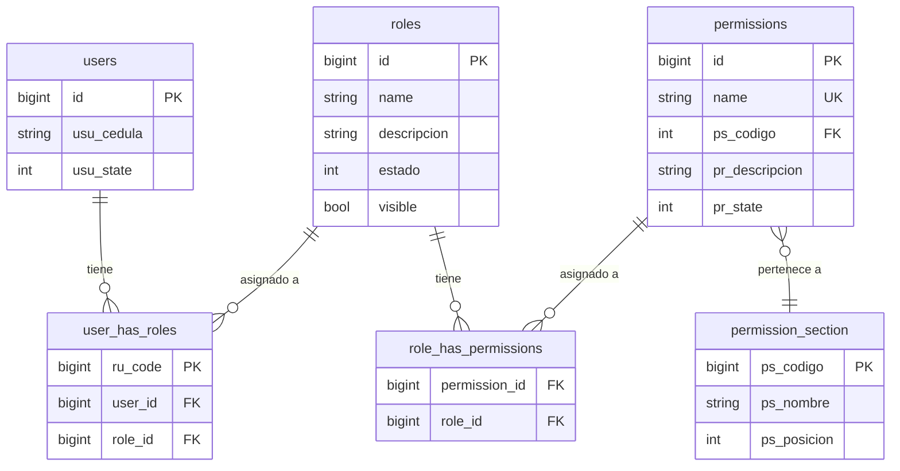

# FASE 6 — RBAC Granular (Reemplazo de Perfiles Fijos)

> **Estado:** 📋 Documentación Completada (2026-08-20)
> **Objetivo:** Reemplazar los roles hardcodeados por permisos por acción/módulo usando Spatie Permission.
> **Dependencias:** Fase 0 (esquema actual documentado)
> **Estimación:** 3-4 días

---

## 1. Estado Actual del Sistema RBAC

### 1.1 Tablas Existentes

| Tabla | Origen | Descripción |
|-------|--------|-------------|
| `roles` | Spatie + custom | Roles del sistema (id, name, descripcion, estado, visible) |
| `permissions` | Spatie + custom | Permisos (id, name, ps_codigo, pr_descripcion, pr_subdescripcion, pr_icono, pr_posicion, pr_state) |
| `role_has_permissions` | Spatie | Pivot role↔permission |
| `user_has_roles` | Spatie + custom | Pivot user↔role (con ru_code secuencial) |
| `user_has_permissions` | Spatie | Pivot user↔permission (NO USADO) |
| `permission_section` | Custom | Agrupa permisos por módulo del admin web |

### 1.2 Modelos Existentes (duplicados)

| Modelo | Namespace | Tipo | Estado |
|--------|-----------|------|--------|
| `Role` | `Modules\Acceso\Models` | Spatie RoleContract | ✅ Activo |
| `roles` | `Modules\Acceso\Models` | Model simple | ⚠️ Duplicado |
| `Permission` | `Modules\Acceso\Models` | Spatie PermissionContract | ✅ Activo |
| `permissions` | `Modules\Acceso\Models` | Model simple | ⚠️ Duplicado |
| `role_has_permissions` | `Modules\Acceso\Models` | Model simple | ⚠️ Constructor vacío |
| `user_has_roles` | `Modules\Acceso\Models` | Model simple | ✅ Activo |
| `permission_section` | `Modules\Acceso\Models` | Model simple | ✅ Activo |

### 1.3 Permisos Actuales (Solo admin web, NO app móvil)

```
administracion/persona.index  → Sección: Administración (ps_codigo=1)
formularios/epicrisis.index   → Sección: Formularios (ps_codigo=2)
formularios/referencia.index  → Sección: Formularios (ps_codigo=2)
```

### 1.4 Roles Actuales

```
Supervisor  → Todos los 3 permisos
Vigilante   → Solo administracion/persona.index
```

### 1.5 Problemas Críticos

| # | Problema | Ubicación | Impacto |
|---|---------|-----------|---------|
| 1 | Sin permisos para módulos móvil | DatabaseSeeder | Cualquier autenticado accede a todo |
| 2 | API sin verificación de permisos | `api.php`, `ApiAuthenticate.php` | Solo valida token |
| 3 | ProfileSelectionScreen roto | Frontend | Llama endpoints inexistentes |
| 4 | Roles hardcodeados | `LoginController.php:69`, `users.php:48` | Cadena fija |
| 5 | Modelos duplicados | `Modules/Acceso/Models/` | `Role` vs `roles` |
| 6 | role_has_permissions vacío | `role_has_permissions.php` | Sin relaciones |
| 7 | Sin filtro por institución | Todos controllers | Sin aislamiento de datos |
| 8 | permission_section hardcodeado MySQL | Migración | `$connection='mysql'` en PostgreSQL |
| 9 | Abilities = nombres de rol | `MobileApp/LoginController.php:100` | No granular |
| 10 | Filament hardcodeado | `users.php:48` | Lista fija de roles |

---

## 2. Diagrama ER — Sistema RBAC



---

## 3. Permisos Propuestos para App Móvil

### 3.1 Lista de Permisos

| Módulo | Permiso | Descripción |
|--------|---------|-------------|
| Rondas | `rondas.ver` | Ver listado de rondas |
| Rondas | `rondas.crear` | Crear nueva ronda |
| Rondas | `rondas.gestionar` | Iniciar/finalizar rondas |
| Rondas | `rondas.scannear_qr` | Escanear QR |
| Rondas | `rondas.ver_detalle` | Ver detalle de ronda |
| Rondas | `rondas.ver_historial` | Ver historial |
| Acceso | `acceso.ver` | Ver listado |
| Acceso | `acceso.registrar` | Registrar entrada/salida |
| Acceso | `acceso.ver_historial` | Ver historial |
| Acceso | `acceso.registrar_vehiculo` | Acceso vehicular |
| Acceso | `acceso.registrar_visitante` | Acceso visitante |
| Novedades | `novedades.ver` | Ver listado |
| Novedades | `novedades.crear` | Crear novedad |
| Novedades | `novedades.ver_detalle` | Ver detalle |
| Inventario | `inventario.ver` | Ver listas |
| Inventario | `inventario.ver_detalle` | Ver detalle lista |
| Inventario | `inventario.registrar` | Registrar movimientos |
| Inventario | `inventario.finalizar` | Finalizar inventario |
| Alertas | `alertas.ver` | Ver alertas del día |
| Alertas | `alertas.atender` | Atender alerta |
| Alertas | `alertas.crear` | Crear alerta manual |
| Alertas | `alertas.ver_historial` | Ver historial |
| Alertas | `alertas.ver_estadisticas` | Ver estadísticas |
| Biometría | `biometria.marcar` | Registrar marcaje |
| Biometría | `biometria.ver_historial` | Ver historial |
| Perfil | `perfil.ver` | Ver perfil propio |
| Perfil | `perfil.editar` | Editar perfil |
| Instituciones | `instituciones.seleccionar` | Seleccionar institución |
| Instituciones | `instituciones.ver` | Ver datos |
| Notificaciones | `notificaciones.ver` | Ver notificaciones |
| Notificaciones | `notificaciones.registrar` | Registrar push |

### 3.2 Asignación por Rol

**Vigilante** (21 permisos):
`rondas.ver`, `rondas.gestionar`, `rondas.scannear_qr`, `rondas.ver_detalle`, `acceso.ver`, `acceso.registrar`, `acceso.ver_historial`, `novedades.ver`, `novedades.crear`, `inventario.ver`, `inventario.ver_detalle`, `inventario.registrar`, `alertas.ver`, `alertas.atender`, `biometria.marcar`, `biometria.ver_historial`, `perfil.ver`, `instituciones.seleccionar`, `instituciones.ver`, `notificaciones.ver`, `notificaciones.registrar`

**Supervisor** (31 permisos): Todos los del Vigilante + `rondas.crear`, `rondas.ver_historial`, `acceso.registrar_vehiculo`, `acceso.registrar_visitante`, `novedades.ver_detalle`, `inventario.finalizar`, `alertas.crear`, `alertas.ver_historial`, `alertas.ver_estadisticas`, `perfil.editar`

---

## 4. Archivos a Crear/Modificar

### 4.1 Migración: Seed permisos app móvil

**Archivo:** `database/migrations/2026_08_20_000002_seed_mobile_permissions.php`

- Crea 9 secciones en `permission_section` (ps_codigo 10-18)
- Crea 31 permisos en `permissions`
- Asigna permisos a roles Vigilante y Supervisor

### 4.2 Middleware: CheckPermission

**Archivo:** `app/Http/Middleware/CheckPermission.php`

```php
<?php
namespace App\Http\Middleware;

use Closure;
use Illuminate\Http\Request;

class CheckPermission
{
    public function handle(Request $request, Closure $next, string $permission)
    {
        $user = auth('sanctum')->user();
        if (!$user) {
            return response()->json(['message' => 'Unauthenticated'], 401);
        }
        if (!$user->hasPermissionTo($permission)) {
            return response()->json([
                'message' => 'No tiene permiso para esta acción',
                'required_permission' => $permission,
            ], 403);
        }
        return $next($request);
    }
}
```

### 4.3 Registro en Kernel.php

```php
// Agregar a $routeMiddleware:
'permission.api' => \App\Http\Middleware\CheckPermission::class,
```

### 4.4 Rutas con Permisos

**Archivo:** `Modules/MobileApp/Routes/api.php` (modificado)

Cada ruta recibe su middleware de permiso:
- `biometria` → `permission.api:biometria.marcar`
- `acceso` → `permission.api:acceso.registrar`
- `rondas` → `permission.api:rondas.ver`
- `rondas_gestion` → `permission.api:rondas.gestionar`
- etc.

### 4.5 PerfilController (nuevo)

**Archivo:** `Modules/MobileApp/Http/Controllers/PerfilController.php`

- `POST /api/seleccionar_perfil` → Retorna roles del usuario
- `POST /api/procesar_perfil` → Retorna permisos del rol seleccionado

### 4.6 Trait BelongsToInstitution

**Archivo:** `app/Traits/BelongsToInstitution.php`

Scope `forInstitution($query, $institutionId)` para filtrar datos por institución.

### 4.7 Frontend: ProfileSelectionScreen.tsx (reescrito)

- Llama `POST /api/seleccionar_perfil` (ya no `/acceso/seleccionar_perfil`)
- Llama `POST /api/procesar_perfil` (ya no `/acceso/procesar_perfil`)
- Tipado TypeScript correcto
- Sin caracteres corruptos

---

## 5. Flujo Completo

```
Login → Token Sanctum con abilities=["Supervisor"]
  ↓
POST /api/seleccionar_perfil → [{id:1, nombre:"Supervisor"}, {id:2, nombre:"Vigilante"}]
  ↓
POST /api/procesar_perfil {id:1} → {perfil:{...}, permisos:[{name:"rondas.ver", ...}, ...]}
  ↓
Frontend almacena permisos → Muestra/oculta módulos según permisos
  ↓
Cada llamada API → middleware permission.api:X verifica contra BD
```

---

## 6. Checklist de Implementación

- [ ] 1. Crear migración `seed_mobile_permissions.php`
- [ ] 2. Ejecutar `php artisan migrate`
- [ ] 3. Crear `app/Http/Middleware/CheckPermission.php`
- [ ] 4. Registrar middleware en `Kernel.php`
- [ ] 5. Crear `app/Traits/BelongsToInstitution.php`
- [ ] 6. Crear `Modules/MobileApp/Http/Controllers/PerfilController.php`
- [ ] 7. Actualizar `Modules/MobileApp/Routes/api.php` con permisos
- [ ] 8. Aplicar `BelongsToInstitution` a modelos: ronda_cabecera, Alertas, Novedad, acceso, InvMovimiento
- [ ] 9. Reescr `ProfileSelectionScreen.tsx`
- [ ] 10. Limpiar modelos duplicados (roles, permissions, role_has_permissions)
- [ ] 11. Actualizar `MobileApp/LoginController.php` para retornar abilities correctos
- [ ] 12. Verificar que `users` model tiene `use HasRoles` y `use HasApiTokens`
- [ ] 13. Tests: Vigilante no puede acceder a `alertas.crear`
- [ ] 14. Tests: Supervisor puede acceder a todos sus permisos
- [ ] 15. Tests: Sin token → 401, Con token sin permiso → 403

---

## 7. Rollback

```bash
# Eliminar permisos mobile
php artisan migrate:rollback --path=database/migrations/2026_08_20_000002_seed_mobile_permissions.php

# Eliminar middleware
rm app/Http/Middleware/CheckPermission.php
# Quitar línea de Kernel.php

# Eliminar controller
rm Modules/MobileApp/Http/Controllers/PerfilController.php

# Eliminar trait
rm app/Traits/BelongsToInstitution.php
```

---

## 8. Estimación de Tiempo

| Paso | Tiempo |
|------|--------|
| Migración permisos | 1h |
| Middleware CheckPermission | 0.5h |
| PerfilController | 1h |
| Trait + InstitutionHelper | 1h |
| Actualizar rutas api.php | 1h |
| Refactorizar LoginController abilities | 0.5h |
| ProfileSelectionScreen.tsx | 1h |
| Aplicar BelongsToInstitution a modelos | 1h |
| Tests | 2h |
| **Total** | **~9h (1.5 días)** |
