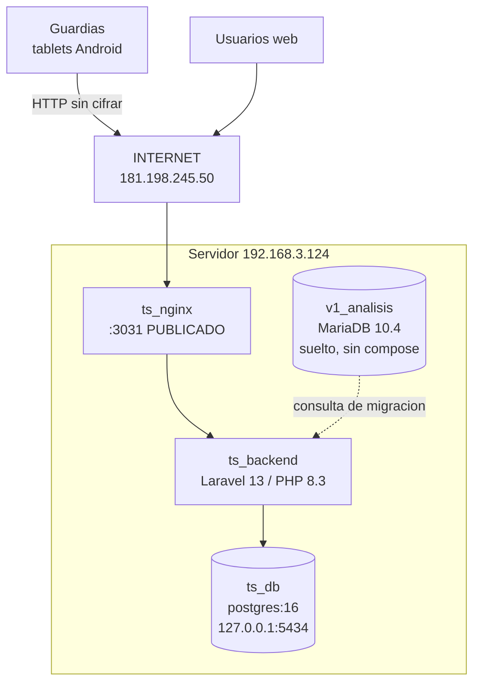

# Arquitectura

## Stack

| Capa | Tecnologia | Version |
|---|---|---|
| Backend | **Laravel** | ^13.0 |
| PHP | | ^8.3 |
| Modularidad | `nwidart/laravel-modules` | ^13.0 |
| Autenticacion API | `laravel/sanctum` | ^4.0 |
| Roles y permisos | `spatie/laravel-permission` | ^8.0 |
| PDF | `barryvdh/laravel-dompdf` | ^3.1 |
| HTML | `spatie/laravel-html` | ^3.13 |
| Base de datos | **PostgreSQL 16-alpine** | 57 tablas |
| Servidor web | nginx:alpine | |
| **Movil** | React Native + Expo (TypeScript) | app 1.0.2 |
| Legado | MariaDB 10.4 (`v1_analisis`) | fuera de soporte |

## Diagrama

⚠️ **El unico sistema del servidor alcanzable desde internet**, y por HTTP
plano. Ver SEC-01.

## Modulos Laravel

Los cuatro activos (`modules_statuses.json`):

    Acceso           control de accesos de personas y vehiculos
    Administracion   gestion, catalogos, usuarios
    MobileApp        API que consume la app de los guardias
    PortalApi        API del portal

La separacion en modulos es la decision de arquitectura mas relevante: permite
que la API movil evolucione sin arrastrar al portal.

## El contenedor suelto `v1_analisis`

MariaDB 10.4 creado el **2026-09-07**, **sin proyecto compose**: no aparece en
ningun `docker-compose.yml` del servidor.

**Consecuencias:**

- No se recrea con `docker compose up`; si se borra, hay que recrearlo a mano.
- **No entra en ningun respaldo** basado en los compose.
- Nadie que lea los archivos del proyecto sabra que existe.

Su proposito aparente es consultar la base V1 durante la migracion
(`ANALISIS-MIGRACION-V1.md`, `ROADMAP-MIGRACION.md`, `coredt360_bk.sql` de
32 MB, `datos-v1/2025.rar` de 83 MB).

**Definir si la migracion concluyo** es una decision pendiente con efecto
directo sobre el respaldo y sobre la superficie del servidor.

## Despliegue previsto vs desplegado

El proyecto tiene **dos composiciones**:

| | `docker-compose.yml` (en uso) | `docker-compose.prod.yml` |
|---|---|---|
| nginx | `nginx:alpine`, puerto 3031 | **`nginx:1.27-alpine`, puertos 80 y 443** |
| TLS | no | **certbot incluido** |

**La version con HTTPS ya esta escrita y no se activo.** Ver SEC-01: la
solucion al hallazgo mas grave de este proyecto ya existe en el repositorio.

## Componentes que NO existen

Sin Redis, colas, workers ni websockets. La app movil sincroniza contra la API.
