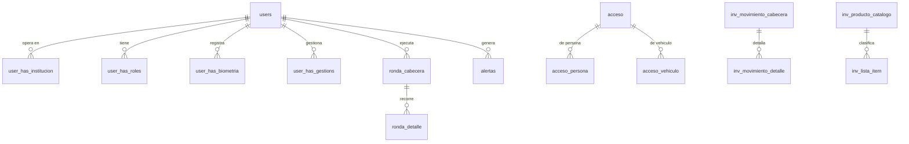

# Modelo de datos

| | |
|---|---|
| Motor | **PostgreSQL 16-alpine** |
| Base | `coredt360` |
| **Tablas** | **57** |
| Exposicion | `127.0.0.1:5434` ✅ solo local |
| Migraciones | Laravel (`php artisan migrate`) |

## Volumen real

Conteos **exactos** (`count(*)`):

| Tabla | Filas |
|---|---|
| `user_has_biometria` | **12.664** |
| `acceso` | **9.769** |
| `ronda_cabecera` | **8.667** |
| `users` | **880** |
| `alertas` | **278** |

Estimaciones de `pg_stat_user_tables`, **a confirmar con `count(*)`**:

| Tabla | ~Filas |
|---|---|
| `user_has_institucion` | ~38.247 |
| `ronda_detalle` | ~37.617 |
| `inv_movimiento_detalle` | ~23.790 |
| `inv_movimiento_cabecera` | ~11.879 |
| `acceso_vehiculo` | ~8.993 |
| `acceso_persona` | ~1.636 |
| `user_has_roles` | ~923 |
| `user_has_gestions` | ~888 |
| `inv_producto_catalogo` | ~532 |
| `inv_lista_item` | ~526 |

> Las estimaciones de `pg_stat_user_tables` resultaron **muy imprecisas** en
> otros proyectos de este servidor. Se marcan como tales a proposito.

## Bloques funcionales

> **Diagrama por nombres de tabla, no por claves foraneas verificadas.** Con 57
> tablas, documentar el modelo completo excede esta auditoria. Las relaciones
> reales estan en las migraciones de Laravel.

Cuatro bloques: **identidad y permisos** (`users`, `user_has_*`), **accesos**
(`acceso*`), **rondas** (`ronda_*`) e **inventario** (`inv_*`), mas alertas.

## `user_has_institucion`: ~43 vinculos por usuario

~38.247 filas para 880 usuarios. El sistema es **multi-institucion** y un mismo
usuario opera en muchas.

**Consecuencia de seguridad:** el aislamiento entre instituciones es una regla
critica y no verificada. Ver SEC-05.

## Biometria — el dato mas sensible del servidor

**12.664 registros** en `user_has_biometria`. Que contienen exactamente
(plantilla, imagen, hash) **no se inspecciono**: `NO DETERMINADO`, y
deliberadamente, por tratarse de datos personales sensibles.

Es informacion que **no se puede cambiar si se filtra**, a diferencia de una
contrasena. Determina la gravedad de SEC-01.

## Base legada V1 (MariaDB)

Contenedor `v1_analisis`, MariaDB 10.4, **fuera de todo compose**. Contenido:
`NO DETERMINADO`. Relacionado con `coredt360_bk.sql` (32 MB) y
`datos-v1/2025.rar` (83 MB).

## Documentacion faltante

Las 57 tablas **no estan documentadas una por una**. Es el trabajo pendiente
mas grande de este proyecto y exige una sesion dedicada. Lo cubierto aqui es la
estructura, el volumen y los bloques funcionales.
